# Weak Session IDs

A session ID (or session token) is a unique identifier that a server assigns to a user when they start a session (e.g., after logging in). It’s like a temporary digital name tag that says: "This is User X — they’ve already authenticated." Once assigned, the session ID allows the user to make authenticated requests without logging in again for every interaction.

if that session ID is able to be calculated or easily guessed, then an attacker will have an easy way to gain access to user accounts without having to brute force passwords or find other vulnerabilities such as Cross-Site Scripting.

---

## Low Difficulty
> Note: Since this challenge does not provide feedback or access control based on session IDs, we were not able to demonstrate actual exploitation or hijacking. The challenge focuses only on analyzing and predicting how session IDs are generated.

In this challenge, a new cookie will be generated each time the button is clicked:

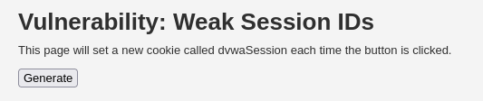  

The session ID is very simple that it starts with 1 and keep incrementing when the button is clicked, which make the session ID very predictable. We can see that after being clicked 8 time, the value is now 8:

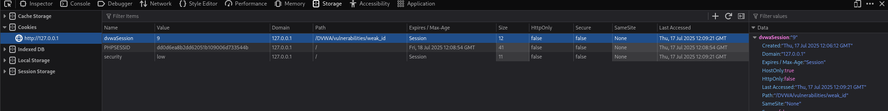  

We can insert different number and access to that particular session:

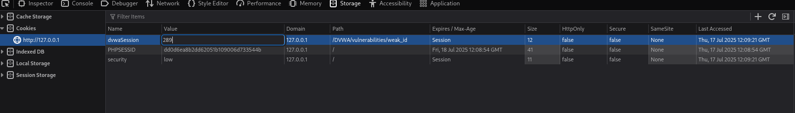  

If we click generate again, it will go back to counting, in this case it’s 10. (The 9th has become what we had entered just now):

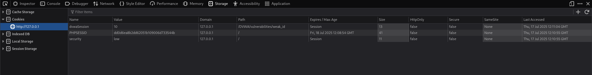  

Since this challenge does not return any feedback based on the session ID, so we are not able to demonstrate account stealing with the weak session ID vulnerability.

---

## Medium Difficulty

In this difficulty, we can see that the session ID value is become more complex.

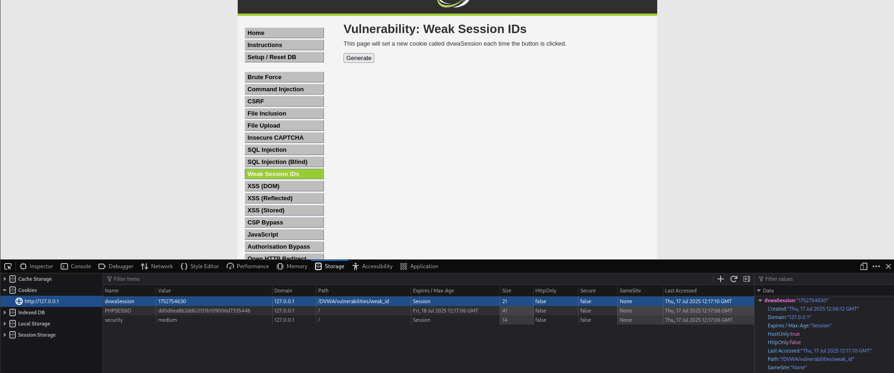  

### Analyze Request

Let's use Burp Suite to intercept the request and see if we can find anything interesting:

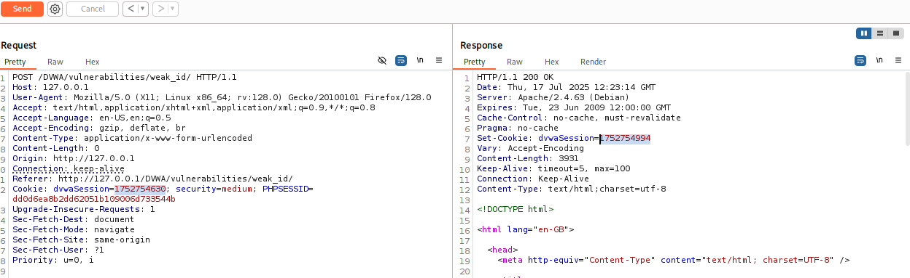

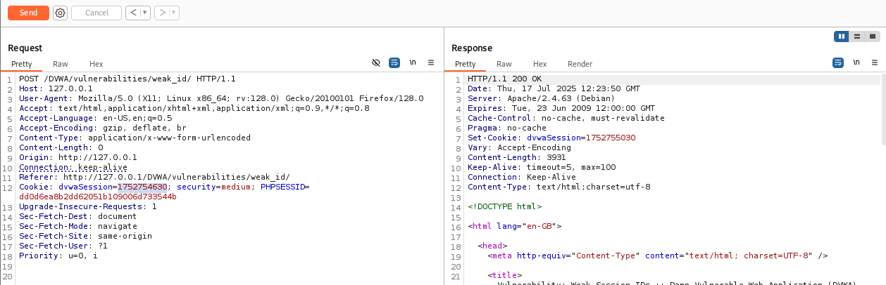

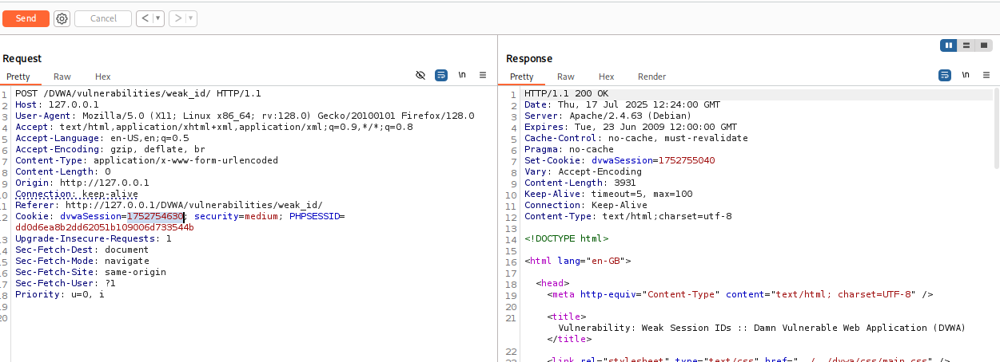  

if we send to repeater and keep sending a request, we can see the `dvwaSession` value on the Response is increasing slowly. After doing some research, it is actually Epoch timestamp.

### Epoch Timestamp

Epoch Unix time (also called Unix time, POSIX time, or epoch timestamp) is the number of seconds that have passed since a specific reference point (e.g, `00:00:00` UTC on January 1, 1970) That moment is called the "Unix Epoch". Let's say the current Unix time is `1721211294`, that means `1,721,211,294` seconds have passed since Jan 1, 1970 UTC.

If we take the dvwaSession value to an online Epoch & Unix timestamp converter tool, the converted timestamp is exactly when the session ID was generated:

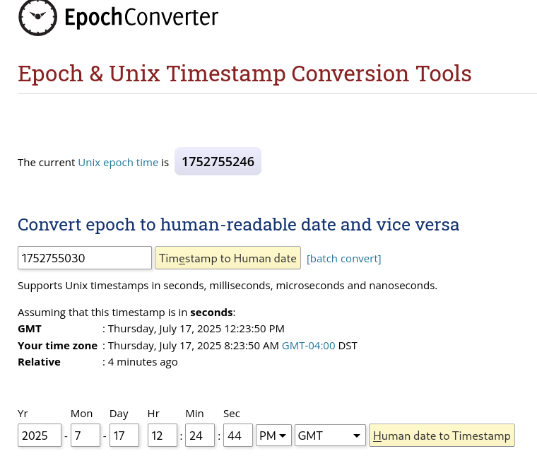

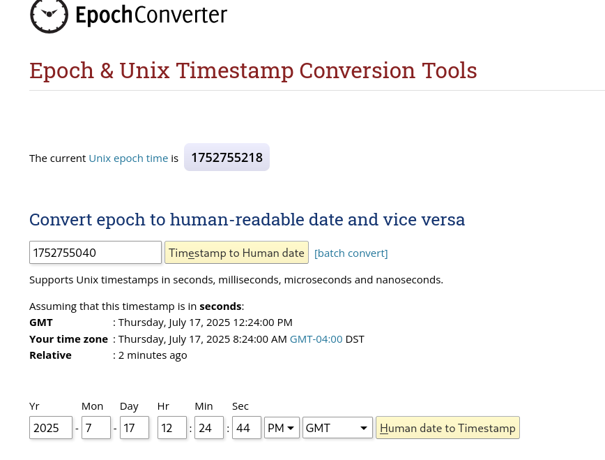

Thus, we have successfully decoded how the session ID was generated in this difficulty.
  

---

## High Difficulty

In High difficulty, the session value is more unpredictable. By just looking at its structure, it is likely a hash algorithm:

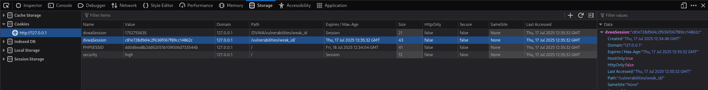  

To identify the algorithm, we can go to website like `crackstation.net` to crack the hash easily. The result show a MD5 type hash and the value is 2:

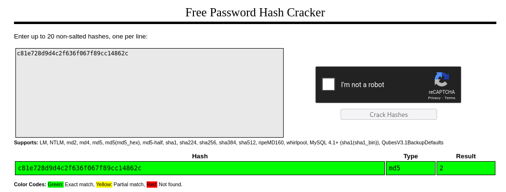  

Based on the result, we can guess the next cracked hash value should be 3 if we click on generate again:

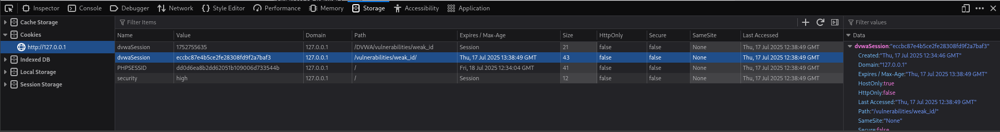

We have proved that the session is being hashed using MD5 algorithm and the value will increase by one each time the generate button is being clicked. Just like how the session ID was generated on Low difficulty except that they are hashed this time.

---

## Conclusion

This challenge highlights that how predictable or poorly designed session IDs can undermine the security of an application. In all three difficulty levels, the session IDs could be reverse-engineered or guessed due to weak generation mechanisms:
- Low difficulty used a simple incrementing number.
- Medium difficulty used Epoch timestamps, which are time-based and predictable.
- High difficulty masked the values using MD5 hashing, but the underlying pattern (sequential numbers) still remained.

Even with hash functions like MD5, if the input is predictable, the session ID can still be easily guessed, which defeating the purpose of session security.

---

### Skills Applied:
- Understanding session management and how session IDs are used
- Identifying weak or predictable session generation patterns
- Using Burp Suite to intercept and analyze cookie values
- Recognizing Epoch timestamp values and converting them to human-readable time
- Using tools like CrackStation to identify MD5 hashes and reverse simple hashed values
