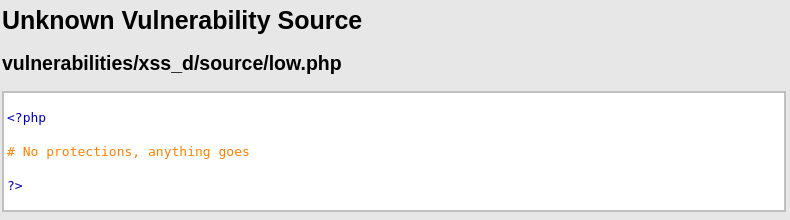
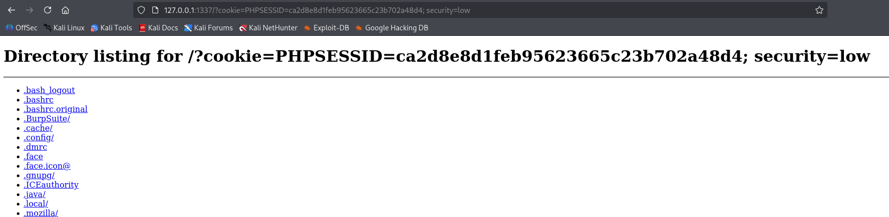
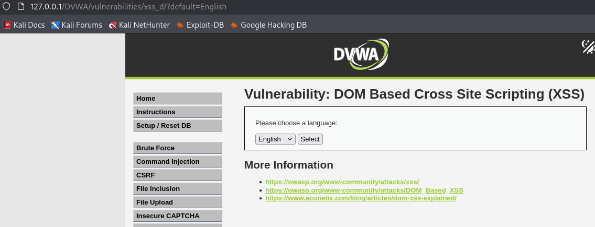

# DOM XSS

We have learned that XSS (Cross-Site Scripting) is a type of injection attack where malicious scripts are injected into trusted websites, compromising the security of users. XSS vulnerabilities occur when a web application uses user input in the output without properly validating or encoding it. This opens the door for attackers to execute harmful scripts in the context of a trusted site, which can then be used to steal cookies, session tokens, and other sensitive data from unsuspecting users.

While XSS attacks are generally understood to target the server or the page content, did you know that there are different types of XSS? These include Reflected, Stored, and DOM-based XSS. In this challenge, we’ll focus on DOM-based XSS, a unique form of XSS that exploits the client-side processing of web pages.

## What is the DOM?

To understand DOM-based XSS, it's important to first understand what the DOM is. DOM stands for **Document Object Model**. It is a structured, programming-friendly representation of a web page that your browser creates when it loads a website. Think of it like a tree of elements (headings, paragraphs, forms, buttons, etc.) that JavaScript can access, change, or manipulate in real-time. For example, when you click a button and something changes on the page without reloading, that is the JavaScript interacting with the DOM.

## What is DOM-Based XSS?

DOM-based XSS is a specific type of Cross-Site Scripting attack that occurs entirely within the browser, using the DOM, without involving the web server in the injection or execution process.

Unlike traditional XSS (Stored or Reflected), where the malicious input might be processed and reflected by the server, DOM-based XSS happens when client-side JavaScript takes untrusted user input (like from the URL) and writes it into the page's DOM without proper validation or encoding.

This allows an attacker to craft a malicious input such as a URL with embedded JavaScript and trick a user into opening it. The website’s JavaScript then reads the malicious input and injects it directly into the DOM. The browser will think that the script comes from a trusted source and thus executes the code. As a result, the attacker can gain access to sensitive information, manipulate the page content, or perform actions on behalf of the user.

This type of attack is particularly stealthy because the malicious code is hidden in the URL or user input, and it’s executed on the client-side. Web Application Firewalls (WAFs) and other security mechanisms that scan the server-side content often miss these attacks, making DOM-based XSS harder to detect and mitigate.

## How Does DOM-Based XSS Work?

1. **Injection via URL/Client-Side Input**: The attacker injects malicious JavaScript code into the URL or another user input field that is processed by the client-side JavaScript.
2. **Execution in the Browser**: The malicious script is then executed in the user's browser because the JavaScript running on the page dynamically manipulates the DOM based on that input.
3. **Exploiting the Trust of the User**: Since the script appears to come from a trusted source (the website itself), the browser has no reason to block or warn the user, leading to potential data theft or manipulation.

#### Example
A malicious URL might look like this:
```url
https://victimsite.com/?name=<script>alert('XSS')</script>
```

If the web application dynamically inserts the name parameter into the page's DOM without sanitizing it, the browser will execute the injected script when the page is loaded, triggering the alert.

---

## Low Difficulty

In Low difficulty, we are given to choose several languages here:


<br><br>

Looking at the source code, there is no protection at all:

<br><br>

If we choose a specific language, the URL will append a `default=(selected language)` value to it:


<br><br>

### Exploit

Since there is no protection at all, we can freely insert any Javascript into the URL just like the screenshots below, `<script>alert(“anything”)</script>` show a message box, as well as `<script>alert(document.cookie)</script>` to show the user’s session ID:


<br><br>

### Cookie Exfiltration

If we simulate the real life scenario, just simply doing this won’t benefit us as the attacker perspective, as it only reflects the message back to user. Instead, we can set up a HTTP server and insert a Javascript that will send the requested information to the server to actually steal the cookie:

<br><br>

After setting up the HTTP server, We can then craft a URL that include a Javascript with `window.location` to specifiy the server URL and return the user cookie to the server:

<br><br>

Let’s assume that this DVWA URL is a real URL like `Facebook.com`, and we send the victim with this link but with `Faceb00k.com` instead to trick victim into clicking on it. They will then receive a message like this and might be in confused, return to the previous page like nothing happened, but little did they know their Facebook cookie has been stolen:

<br><br>

As a general idea, the cookie will be sent to the server and grabbed by attacker to access whatever website the victim is browsing, and attacker will manage to log into it. Obviously, don’t do that to anybody, it is illegal and will be more security protections in place:

<br><br>

---

## Medium Difficulty

In Medium difficulty, the code will now check if there are any input that start with `<script`, if found, it will block and set the URL back to default:

<br><br>

We can see that the previous method will not work now. The URL returns to normal and nothing pops out:


<br><br>

### Solution

Since the code is blocking any input that starts with `<script>` only, we can use different script tag to bypass this. In this case, I went to PortSwigger's XSS cheatsheet to find `img > onerror` since the current DVWA challenge is designed not to load image:


<br><br>

Before we inject the script, we have to add a `</select>` here to break out the select statement with a script inside, it can be seen in the page source, or else it won’t execute the img script we tend to insert:


<br><br>

---

## High Difficulty

In High difficulty, the code is now set to allow selected languages only, any other than those will be reset to `default=English`:

<br><br>

Thus, we have to find a way to run our code without it going to the server. The server-side code checks if the value is valid (i.e., it matches a predefined language in the whitelist like "English", "French", etc.). Since `<script>alert(document.cookie)</script>` is not on the whitelist, the server would either:
- Ignore it (if no output is rendered based on `$_GET`).
- Or redirect the user to a safe default, like `default=English`, via the line header (`"location: ?default=English"`).
  
Hence, the script doesn't get passed to the client-side JavaScript code for execution:


<br><br>

### Solution

Here's where things change. In URLs, the hash fragment `#` is used to identify a specific section of the page and does not get sent to the server. This means the part of the URL after the `#` is handled entirely on the client-side (browser), not the server. Therefore, the `$_GET` array on the server will not contain the query parameter because everything after the `#` is ignored by the server:

<br><br>

By using the Hash (`#`), the server never sees the parameter `default=<script>alert(document.cookie)</script>` because it’s part of the URL fragment, not the query string. Now, since the parameter is part of the URL fragment, client-side JavaScript (running on the browser) can potentially read it using `window.location.hash`. JavaScript on the page may extract this hash and inject it into the DOM without sanitization, which could trigger DOM-based XSS if the page does not properly escape user inputs before rendering them:

<br><br>

### Why Does the Hash (#) Matter?

- The main difference is that everything before the hash (`?default=English`) is processed by the server, while everything after the hash (`#?default=<script>alert(document.cookie)</script>`) is purely client-side, handled by JavaScript in the browser.
  
- When we use the hash, the data after the hash symbol (`#`) is passed to the JavaScript environment. If the page doesn't properly sanitize or escape the hash value, it can lead to the execution of malicious scripts.

#### Without `#`

<br><br>

#### With `#`

<br><br>

---

## Conclusion

DOM-based XSS occurs entirely on the client-side by exploiting how JavaScript interacts with the DOM. Unlike stored or reflected XSS, the server plays little or no role in injecting or reflecting the malicious payload, it's the browser’s JavaScript logic responsible for rendering the script into the page.

Through this challenge, we explored how:

- Low difficulty had no input validation at all, allowing immediate script execution.
- Medium difficulty attempted to filter `<script>` tags but could be bypassed using alternate vectors like ``.
- High difficulty used a strict server-side whitelist, but the client-side still processed `window.location.hash`, making it vulnerable to DOM XSS when a malicious payload is placed after a `#` in the URL.

This type of attack shows how client-side JavaScript can introduce serious vulnerabilities even if the server is secure. Web developers must sanitize and validate all user input, even those that don’t reach the server.

---

### Skills Applied:

- Understanding the DOM (Document Object Model) and client-side processing
- Differentiating between Reflected, Stored, and DOM-based XSS
- Bypassing basic filters using alternate payloads (``, event handlers)
- Using URL fragments (`#`) to bypass server-side validation in High difficulty
- Simulating real-world attacks like cookie exfiltration using malicious scripts and listener servers
- Utilize tools like Burp Suite and XSS cheat sheets for effective payload construction
