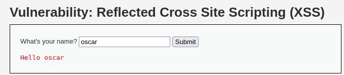

# Reflected XSS

Reflected XSS is a type of Cross-Site Scripting vulnerability where an attacker injects malicious script code into a web application. This injected code is reflected off the web server, meaning it’s immediately executed in the user’s browser without being stored on the server.

In a reflected XSS attack:
1.	The attacker crafts a URL with a malicious payload (usually a script) embedded in it.
2.	The user clicks the link or the attacker forces the user to visit that URL.
3.	The web server processes the request and reflects the malicious payload back in the HTTP response.
4.	The payload gets executed in the user’s browser as if it came from a trusted source (the vulnerable site).

The key point here is that the malicious code is not stored on the server. It is instead reflected off the server in the response, which makes it a non-persistent or reflected attack.
  

## Comparison of DOM XSS and Reflected XSS

| DOM-Based XSS | Reflected XSS |
|---------------|---------------|
| **Where it happens**: Client-side (in the browser). | **Where it happens**: Server-side (on the web server). |
| **How the attack works**: Malicious payload is inserted into the page dynamically by client-side JavaScript | **How the attack works**: Malicious payload is reflected by the server and executed as part of the HTTP response. |
| **Example**: JavaScript on the client reads untrusted data from the URL and injects it directly into the DOM, leading to execution. | **Example**: The server takes untrusted input from the URL, reflects it back in the HTML response, and the script executes when the response is rendered by the browser. |
| **No need for user interaction with the server.** Attack is entirely on the client-side. | **Requires user to click on a malicious link** that contains the payload. |

---

### A More Simple Way to Think About It

DOM-Based XSS: 
- The attack happens in the browser. The malicious JavaScript relies on how the page's JavaScript handles input and updates the DOM.
- The victim doesn’t need to click anything special, they just need to visit a URL where the page’s JavaScript is insecure.

Reflected XSS:
- The attack happens through the server. The attacker crafts a malicious URL with a payload and tricks the victim into clicking it.
- The server then reflects the malicious payload back in its response, which the browser executes.

---

## Low Difficulty

In Low difficulty, the code will not check the requested input before including it to be used in the output text:

  

### Typing a Name

  

### Injecting Javascript

  

We can see that from the above examples, the user input has been reflected to the page without any sanitization, that means we can insert anything directly into the web page code by checking on the page source.

### Cookie Exfiltration

Like the previous challenge, we can use the same script `` to steal the cookie and send it to our hosting server:

  

---

## Medium Difficulty

In Medium difficulty, the code has now sanitized the user input by removing the exact string ``. Since the code is only designed to remove lowercase ``

If we use the previous tag injection method, the whole Javascript will be removed as it matches the pattern:

  

### Solution

Since the regular expression is focused on remove `<script>` tag only, we can still use other tag like `` that we used on previous challenge to bypass this:

  

---

## Conclusion

Reflected XSS occurs when user input is immediately echoed by the server in the HTTP response without proper sanitization or encoding. Unlike DOM-based XSS, this type of attack involves server-side reflection, making it exploitable only when a user clicks a specially crafted link containing a malicious script.

In this challenge, we observed:
- Low difficulty had no sanitization, allowing raw JavaScript injection via the query string.
- Medium difficulty attempted to strip exact `<script>` tags but failed to account for uppercase, alternate encodings, or tag-splitting techniques.
- High difficulty implemented a more sophisticated regex filter targeting variations of the `<script>` tag, but it still allowed script execution using alternate HTML elements like `` and event handlers (`onerror`).

Even with regex-based filtering, incomplete sanitization still left room for bypasses using creative payloads, which demonstrates how XSS defenses require context-aware output encoding rather than blacklist-based filtering.

---

### Skills Applied:

- Exploiting unsanitized query parameters with `<script>` tags
- Bypassing string filters using
  - Case-insensitive tags (`<SCRIPT>`)
  - Tag-splitting (`<scr<script>ipt>`)
  - Alternate XSS vectors (``)
- Understanding server-side sanitization via regular expressions
- Analyzing PHP source code logic (preg_replace, htmlspecialchars)
- Comparing client-side (DOM) vs server-side (Reflected) XSS behavior
