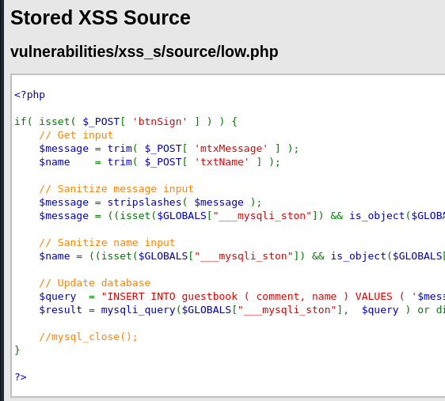
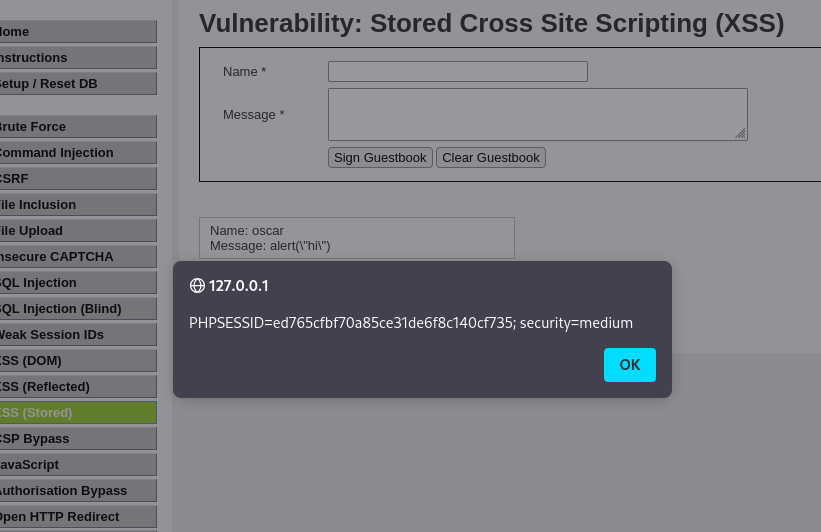

# Stored XSS

Stored XSS is a type of XSS vulnerability where malicious scripts are permanently stored on the target server, typically in a database, comment field, message board, etc. Whenever a user loads a page that displays this stored data, the malicious script executes in the context of their browser.

This is more dangerous than other forms of XSS because:
- It doesn’t require the attacker to trick the victim into clicking a malicious link.
- It affects every user who views the infected content.

## Stored XSS vs Reflected vs DOM-based XSS

| Type | Payload Location | Execution Trigger | Server Involvement |
|------|------------------|-------------------|--------------------|
| Stored | Stored in database or file | Page load | Yes (saves and reflects) |
| Reflected | In URL or form input | On page load after request | Yes (reflects directly) |
| DOM-based | In client-side script | Handled by Javascript | No (purely on client side) |

## Example Differences:
- Stored: Attacker posts `` as a comment. Anyone viewing the comment sees the popup.
- Reflected: Attacker sends a link like `?name=`. User clicks the link, and the script runs.
- DOM-based: Script on page takes URL hash `(#xss=` from previous challenge:

  

Here we need to inspect the page element and change the max length for message box so our script can fit inside:

  

If we go to another page and went back here, the page will automatically redirect us to the specify URL and send the cookie to the server:

  

---

## Medium Difficulty

> Note: If you can’t go back to the Stored XSS challenge page, remember to set the difficulty to Impossible and clear the guestbook, then set back to Medium again.

In Medium difficulty, the code will now strip the whole ``. (Remember to change the max length in the inspect page element):

  

The Javascript has been successfully stored in the database and executed. We can do the same cookie exfiltration like previous low difficulty that hosting a HTTP server and redirect victim to the page that will steal the cookie and send to the server:

  

---

## High Difficulty

Just like the previous Reflected XSS challenge, now the high difficulty of Stored XSS challenge also use `preg_replace` to remove all the element that can match to `<script>`. As usual, we can use other tag like `` to bypass this, but this time let’s try to use different one since we’ve been using `` for quite a while:

  

We can use the `a` tag and `onclick` event script, can be found on the cheatsheet website as well:

  

Now we can bypass the `<script>` tag protection on name input, so it is should be stored in the database. We can see that our name has become `test` and is clickable:

  

If we click on it, the script will be executed, and each time the page is loaded, the name can be clicked:

  

We can try other event handler such as `oncopy`, `ondraggable`, `oncut` and more. Feel free to explore more on the PortSwigger XSS cheatsheet.

---

## Conclusion

Stored XSS is one of the most dangerous forms of Cross-Site Scripting because the malicious payload is permanently saved in the backend database and delivered to all users who visit the affected page. This makes it more scalable and impactful than Reflected or DOM-based XSS, as no user interaction or special link is required, just simply visiting the infected page is enough.

In this challenge, we have learned that:
- Low difficulty allowed raw JavaScript to be saved and executed directly with no sanitization, affecting all users who visited the guestbook.
- Medium difficulty attempted to filter `<script>` tags but still allowed bypasses on `name` input via case manipulation, tag splitting, and alternative encodings.
- High difficulty used regular expressions to block `<script>` but remained vulnerable to event handler-based attacks using other HTML tags like `<a onclick=...>`, proving that partial filtering is not a reliable defense.

Across all levels, once the payload was successfully stored, it was repeatedly triggered upon each page load or user interaction and this shows a powerful demonstration of how stored XSS can lead to impactful exploitation.

---

### Skills Applied:

- Understanding the difference between Stored, Reflected, and DOM-based XSS
- Identifying where user input is stored and reflected in output
- Exploiting unsanitized input fields to inject persistent JavaScript
- Bypassing basic filters using:
  - Case-insensitive tags (`<SCRIPT>`, `<S  C  R  I  P  T>`)
  - Tag-splitting (`<scr<script>ipt>`)
  - HTML event handlers (`onclick, onerror`)
