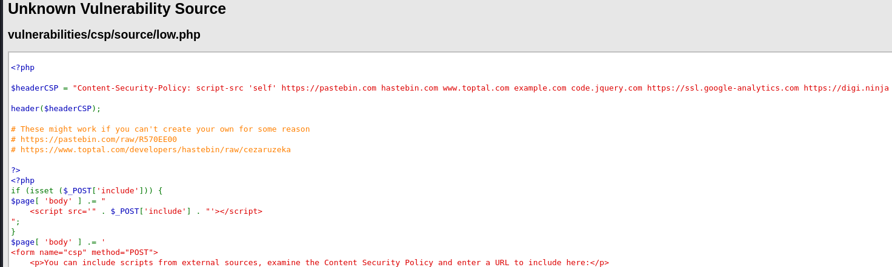
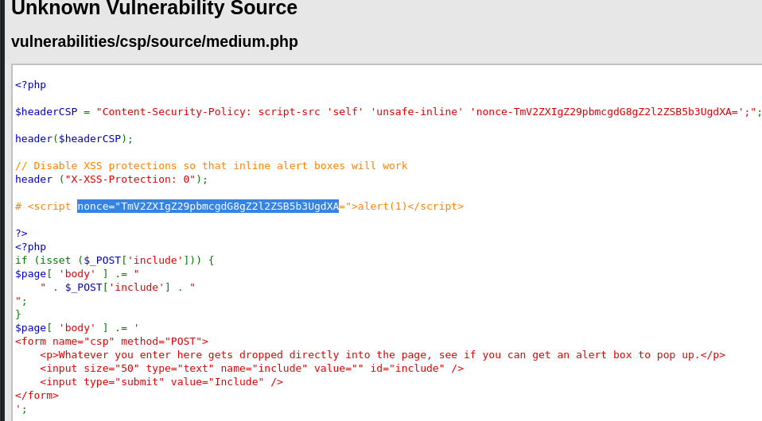

# CSP Bypass

CSP stands for **Content Security Policy**, it is a browser security mechanism designed to prevent attacks like XSS, Data Injection, Clickjacking and more. It does this by controlling which content (JavaScript, images, CSS, fonts, etc.) the browser is allowed to load and execute. This policy is set using the Content-Security-Policy HTTP header.

For example:

`Content-Security-Policy: script-src 'self' https://trusted.com;`

This means: “Only allow JavaScript from the current domain and `trusted.com.`”
<br><br>

So what is a CSP Bypass?

A CSP bypass is any technique that allows an attacker to execute JavaScript or load a malicious script, even when a CSP is in place that’s supposed to prevent that. Bypassing CSP usually involves:
- Finding allowed domains in the script-src directive
- Finding misconfigured or poorly enforced headers
- Abusing servers that return JS but with incorrect MIME or content headers

---

## Low Difficulty

There are some scripts provided for us to determine which will work and will not work, let’s figure out together:

<br><br>

### Source Code

Looking at the source code, only scripts from the listed domains are allowed. JavaScript `<script src="...">` tags are allowed only from the following:

<br><br>

JavaScript `<script src="...">` tags are allowed only from the following:
- Current site ('self')
- `https://pastebin.com`
- `hastebin.com`
- `www.toptal.com`
- `example.com`
- `code.jquery.com`
- `https://ssl.google-analytics.com`
- `https://digi.ninja`
  
So if the `<script>` comes from one of these domains, it passes CSP checks. 
<br><br>

### But CSP is only one part of the story

For a script to be executed by the browser, the response must have the correct MIME type, for instance, `Content-Type: application/javascript`. If the script is served as something else, like `text/plain`, the browser refuses to execute it, even if CSP allows it.

Another condition is a script won't execute if the server tells the browser to treat it as a download, such as using the `Content-Disposition: attachment` header.
<br><br>

### Testing Scripts

Now let's try the scripts one by one:

#### 1.	`https://digi.ninja/dvwa/alert.js`


> Inspect -> Network

This script will **work** because:
- Allowed by CSP (from `https://digi.ninja`)
- Served with correct `Content-Type: text/javascript`
- No download headers

Result: Executes properly, an alert will show up.
<br><br>

#### 2.	`https://digi.ninja/dvwa/alert.txt`


<br><br>

This script will **not work** because:
- Even though CSP allows it (from same domain)
- It served as `Content-Type: text/plain` due to `.txt` extension
- Browsers won’t execute it as Javascript

Result: Fails to execute. Even though the content is valid JS, it’s not treated as such due to MIME type.
<br><br>

#### 3.	`https://digi.ninja/dvwa/cookie.js`


<br><br>

This script will **work** because:
- CSP OK
- Correct `content type: text/javascript`
- Designed to `alert(document.cookie)`

Result: Executes properly, shows cookie in an alert.
<br><br>

#### 4.	`https://digi.ninja/dvwa/forced_download.js`


<br><br>

This script will **not work** because:
- CSP OK
- But the server sends `Content-Disposition: attachment`
- Browser downloads instead of executing

Result: Fails to execute.
<br><br>

#### 5.	`https://digi.ninja/dvwa/wrong_content_type.js`


<br><br>

This script will **not work** because:
- CSP OK
- But served with incorrect `Content-Type: text/plain` even though it ends in `.js`
- Won’t be treated as JavaScript

Result: Fails to execute.
<br><br>

### Summary

| Script | CSP Allowed | Content-Type | Download Header | Executes | Why |
|--------|-------------|--------------|-----------------|----------|-----|
| `alert.js` | Yes | `text/javascript` | No | Yes | All correct |
| `alert.txt` | Yes | `text/plain` | No | No | Wrong MIME type |
| `cookie.js` | Yes | `text/javascript` | No | Yes | All correct |
| `forced_download.js` | Yes | `Content-Disposition: attachment` | Yes | No | Forced download |
| `wrong_content_type.js` | Yes | `text/plain` | No | No | Wrong MIME type |

In short, to allow a script to be executed:
- Domain is allowed by CSP
- `Content-Type` is javascript
- No `Content-Disposition: attachment`

Only then will the browser include and execute the script.

---

## Medium Difficulty

In Medium difficulty, the CSP policy tries to use a nonce to prevent inline scripts from being added by attackers:

<br><br>

### What is a CSP Nonce?

Nonce stands for **Number used once**. In CSP, a nonce is a special random string added to a script tag and the CSP policy. It is used to tell the browser: "This script is safe to run."

For example, if a server send a CSP header, `Content-Security-Policy: script-src 'self' 'nonce-abc123'`; with the HTML content of:
```html
<script nonce="abc123">
  alert('This script is safe');
</script>
```
Because the script’s `nonce="abc123"` matches the nonce in the CSP header, the browser allows the script to run. Without a nonce, the browser blocks it. Even if we trick the page into including it, CSP will stop it unless it has the correct nonce.

So looking at the source code again, with the `Content-Security-Policy: script-src 'self' 'unsafe-inline' 'nonce-TmV2ZXIgZ29pbmcgdG8gZ2l2ZSB5b3UgdXA='`, It only allows scripts that:
- Come from the same site ('self')
- OR have the nonce `TmV2ZXIgZ29pbmcgdG8gZ2l2ZSB5b3UgdXA=`
<br>

Fun Fact: 


By decoding the nonce from Base64, we just got rick rolled :)

### Solution

Back to the challenge, since the code requires the matched nonce to submit a script, we can just include it in the previous working scripts together to make this work. Let’s use `alert.js` here:


> `<script nonce="TmV2ZXIgZ29pbmcgdG8gZ2l2ZSB5b3UgdXA=" src="https://digi.ninja/dvwa/alert.js"></script>`

<br><br>

---

## High Difficulty

In High difficulty, the page now makes a JSONP call to `source/jsonp.php` passing the name of the function to callback to, we need to modify the `jsonp.php` script to change the callback function:


<br><br>

### Solution

Since we are allowed to modify the `jsonp.php` file, we can change the whole file to our own code:

From:

<br><br>

Change to:

<br><br>

Heading back to the website, the javascript has been executed once clickking on the button:

<br><br>

Or we can do this in an easier way, which is intercept the traffic and modify the request to include the Javascript:


<br><br>

---

## Conclusion

CSP is indeed a powerful browser feature designed to prevent injection attacks like XSS. However, as demonstrated in this challenge, CSP is only effective when implemented correctly. Misconfigurations such as trusting external domains that don't serve proper MIME types, allowing inline scripts, or relying on weak nonce usage can all open paths for bypass.

In this challenge, we learned that:
- Low difficulty showed how CSP depends not only on allowed domains, but also correct response headers like `Content-Type` and `Content-Disposition`.
- Medium difficulty introduced CSP nonces, which whitelist specific inline scripts. By observing the required nonce, we were able to reuse it to execute scripts legitimately.
- High difficulty explored JSONP-based attacks. By modifying the JSONP endpoint or intercepting the request, we could inject and execute arbitrary JavaScript even under strict CSP rules.

This challenge shows that CSP bypasses are not just about JavaScript knowledge but they also rely on understanding browser behavior, HTTP headers, and server configurations.

---

### Skills Applied:

- Understanding how CSP policies enforce script loading restrictions via:
  - `script-src`, `self`, `nonce-...`
- Analyzing network responses for:
  - Content-Type (e.g., `text/javascript` vs. `text/plain`)
  - Content-Disposition headers (e.g., attachment)
- Identifying and leveraging misconfigurations in CSP headers
- Decoding and reusing CSP nonces (Base64 decoding and script crafting)
- Modifying JSONP responses to inject JavaScript functions
- Understanding MIME sniffing and browser behavior toward script execution
