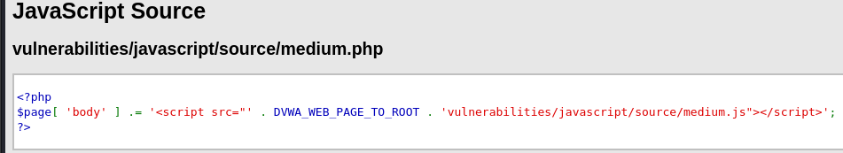
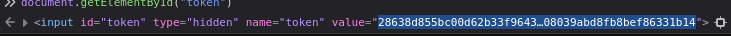

# JavaScript

JavaScript is a client-side scripting language used to make web pages interactive. It runs in the user's web browser and can control elements on the page like:
- Form validation
- Button clicks
- Pop-ups
- Dynamic content loading
- DOM manipulation (changing HTML/CSS)

JavaScript itself isn’t dangerous, but can be a serious vulnerability if not handled properly. Many web apps use JavaScript to handle security-related logic like **input validation**, **access control**, and **token generation**.

But JavaScript is not secure for such tasks because:
-	It is visible to the user (we can view all JavaScript in the browser).
-	It can be read, modified, or bypassed by anyone using browser tools (like the Developer Console).

---

## Low Difficulty

The objective is to submit the word “success”, but simply just type in the word will not work:


<br><br>

### Source Code

Looking at the source code, the `generate_token()` is called automatically. Then, it grabs the input value from the phrase input field and applies ROT13 encoding to it (`rot13(phrase)`). Next, it hashes the result with MD5 (`md5(rot13(phrase))`) and puts the MD5 hash into a hidden field called token. Thus, the web expect the matched hashes of the input “success” token, this is why simply submit the word will not work, because the token is not matched with the input:

<br><br>

### Solution

To solve this, we need to provide the valid token for the input “success”. We can show the hidden token by going to inspect the page element and disable the hidden type:


<br><br>

Using CyberChef, we can see that by applying the ROT13 encoding and MD5, the output is exactly the same with the hidden token. Now, we just need to do the same for the word “success” and put it back to the token field:

<br><br>

After inserting the ROT13 encoded and MD5 hashed value of the word "success", we have successfully submitted the word by manipulating the token:


<br><br>

### Alternative Approach

Another way to do this quicker is to directly call the `generate_token()` function using the web console since it is exposed to us. When the phrase is "ChangeMe", calling the function will generate the token for us:

<br><br>

In the same way, we type the phrase "success" and call the function, then the token is automatically generated and we are good to submit:


<br><br>

---

## Medium Difficulty

In this difficulty, the JavaScript is moved into a separate .js file (`medium.js`). The logic is slightly obfuscated or minified and we need to analyze what it does and reverse-engineer the token generation:

### Source Code

This code simply loads the external JavaScript file into the page:



<br><br>

To have a better look at the `medium.js` code, we can inspect the page and go to the file in Debugger tool, then click on the Pretty Print Source button:

<br><br>

By examining the `medium.js`, we know that the `do_something` takes a string and reverses it, for example, if we input ‘abc’, this function will return ‘cba’. 

<br><br>

For the `do_elsesomething(“XX”)` function, it is called after a short delay (which is the `setTimeout(..., 300)`), giving time for the page to load. It prepends and appends "XX" to our input then reverses the whole result, which mean if we enter “success” in the phrase field, the token becomes `do_something(“XXsuccessXX”)` -> “XXsseccusXX”, and that is the token we needed when the form is submitted.

### Solution

To solve this, we can manually fill in both fields using the browser console again, with the command of `document.getElementById(“phrase”).value = “success”;` and `document.getElementById(“token”).value = “XXsseccusXX”;`:


<br><br>

---

## High Difficulty

In high difficulty, the token is now hidden inside a heavily obfuscated script. We have to deobfuscate the Javascript and see if we can find anything for a solution on this challenge:

<br><br>

### Source Code

We can find some online tools to deobfuscate the Javascript, here I used a deobfuscator tool that available on GitHub named `de4js`. The code include `eval()` based obfuscation, thus we need to specify ‘Eval’ for the encoding type:

<br><br>

At the bottom part of the code, we can find some functions that are similar to the previous difficulty, and they seems like the core logic of the whole script, let’s analyse them one by one:


<br><br>

1. `do_something(e)`
```html
function do_something(e) {
    for (var t = "", n = e.length - 1; n >= 0; n--) t += e[n];
    return t;
}
```
Like the previous difficulty’s function, it is for reversing a string like how “abcd” turns into “dcba”. This function is used in `token_part_1` function.
<br><br>

2. `token_part_1(a, b)`
```html
function token_part_1(a, b) {
    document.getElementById("token").value = do_something(document.getElementById("phrase").value);
}
```
This function takes the value of the input field with ID "phrase", reverses it, and puts it into the "token" field, and it is executed immediately at the bottom of the script.
<br><br>

3. `token_part_2(e = "YY")`
```html
function token_part_2(e = "YY") {
    document.getElementById("token").value = sha256(e + document.getElementById("token").value);
}
```
This is the second stage of transformation. It is scheduled to run after 300 ms via setTimeout and prepends "XX" to the reversed phrase (in token field), then SHA256-hashes the result and replaces the token with it.
<br><br>

4. `token_part_3(t, y = "ZZ")`
```html
function token_part_3(t, y = "ZZ") {
    document.getElementById("token").value = sha256(document.getElementById("token").value + y);
}
```
This function appends "ZZ" to the current token value, hashes it with SHA256, and updates the token again. 
<br><br>

So the execution flow is like this:

a. phrase is cleared ("") on load:

  - `document.getElementById("phrase").value = "";`
    
b. `token_part_1()` immediately runs:

  - It takes the (empty) value of phrase, reverses it (still empty), and sets `token.value = ""`.
    
c. After 300 ms, `token_part_2("XX")` runs:

  - It sets `token.value = sha256("XX")`
    
d. When user clicks "Send", `token_part_3("ABCD", "ZZ")` runs:

  - It sets `token.value = sha256(sha256("XX") + "ZZ")`
<br>

The formula: `final_token = sha256(sha256("XX") + "ZZ")` <br><br>

### Solution

#### Change to Deobfuscated Source Code

Now we need to specify the deobfuscated source code so we can use debugger tool to solve the challenge later on. To do this, let’s first copy the deobfuscated code into a file and save it somewhere:


Then, we start our HTTP server so we can specify the URL of the code file we just saved, in Burp Suite’s match and replace function:

<br><br>

Next, go to Burp Suite’s proxy setting and add a match/replace rule, choosing the type to "Response body", and specify the original Javascript file on Match, and the deobfuscated file on Replace:

> We can find the original Javascript file path using the Inspect element


> Copy the file path and put it in Burp Suite

<br><br>

After configuring the setting, we can start intercepting the request using Burp Suite, reload the page, and we will see that the deobfuscated code can be seen in Debugger:


<br><br>

#### Setting Breakpoint

First, let’s set the breakpoints (Ctrl + B) on each part of token function, so we can debug the logic and extract the final token before submitting the “success” word:

<br><br>

We can click on the four button to resume, step over, step in, step out of the code respectively:

<br><br>

#### Submit the Phrase

After submitting the phrase, we will stop at the first breakpoint (highlighted "document"), the token value is equal to SHA256 of the token value plus y which is ZZ:

<br><br>

<br><br>

We can check that on the Console tab:



Let’s step over that (F10).
<br><br>

Here we get down to the `token_part_1`, we step into it (F11):

<br><br>

The `getElementById(“token”).value` equals to do something of the “phrase” value:

<br><br>

Using the console to check again, there is no phrase value for now. Thus, we need to set that manually to “success”, then step into that (F11):

<br><br>

Now, it will start reversing the “success” to “sseccus”, we can keep clicking step in (F11) until the reversed value is generated:


<br><br>

After that, we can now Resume (F8) and it will stop at the `token_part_2` breakpoint. Let’s step in now (F11):

<br><br>

It gets the SHA256 of the token value plus YY, and we can keep stepping over (F10):

<br><br>

We have now reached the end of the breakpoint and we can check the final token value using `document.getElementByID("token")`:


<br><br>

Finally, we can click Resume and click submit the phrase. Now we have successfully submit the “success” word:

<br><br>

---

## Conclusion

This challenge shows how relying solely on client-side JavaScript for enforcing security mechanisms can be a serious flaw. All logic executed in the browser such as input validation, token generation, or authentication checks, can be fully inspected, modified, and bypassed by an attacker using browser developer tools.

Across all difficulty levels, we were able to reverse-engineer the logic and manipulate values like tokens to meet the application's requirements:
- In Low difficulty, we manually replicated the ROT13 and MD5 transformation.
- In Medium difficulty, we analyzed external JS functions and reversed the logic using browser console tools.
- In High difficulty, we deobfuscated obfuscated JavaScript, intercepted and replaced scripts, used breakpoints to follow the execution flow, and extracted the required token in real-time.

Through this challenge, we have learned the importance of not trusting any critical logic, especially security-related, to run solely in the client. Any data processed on the front end should always be validated and verified again on the server side.

---

### Skills Applied:

- Understanding and analyzing obfuscated JavaScript logic
- Using developer tools (Elements, Console, Debugger)
- Deobfuscating JavaScript with tools like de4js
- Intercepting and replacing JS with Burp Suite match/replace
- Setting and managing breakpoints in browser debugger
- Extracting and injecting values dynamically during execution

