# Authentication Bypass

Authentication Bypass is a vulnerability that allows attackers to bypass login mechanisms or access protected functionality without proper credentials. In this DVWA scenario, it involves using a regular user account to access admin-only pages, such as the one that displays the database of registered users. This challenge demonstrates a flaw in how access control (authorization) is implemented after authentication.

---

## Low Difficulty

If access control is properly implemented, this page should be accessible by admin only. The goal is to access this page using a regular user account. We are given an account of `gordonb` with the password of `abc123`:

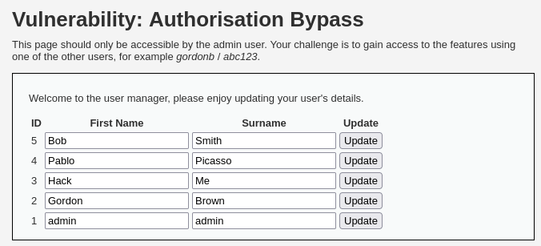

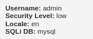  

Since our currently logged in page as admin will disappear if we use `gordonb` account to log in, we need to open a new private tab and login as `gordonb`:

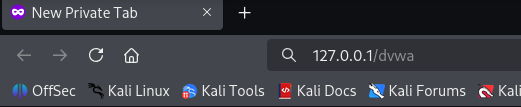

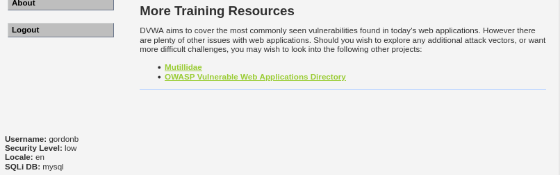  

We can see that the ‘Authentication Bypass’ page is not even showing as it is only accessible by admin:

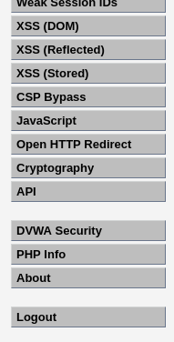  

To access the page using `gordonb`, we need to first reload the admin’s Authentication Bypass page and use Burp Suite to intercept the request. We should see the URL that is for admin access only and we can use that to paste on gordonb’s URL page:

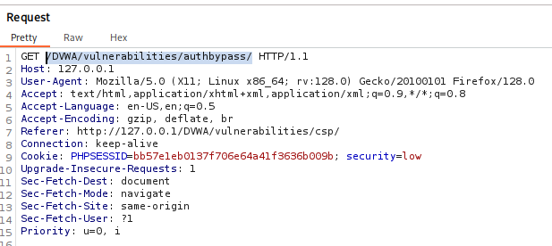  

We are now accessing the admin-only page using `gordonb` account, a regular user:

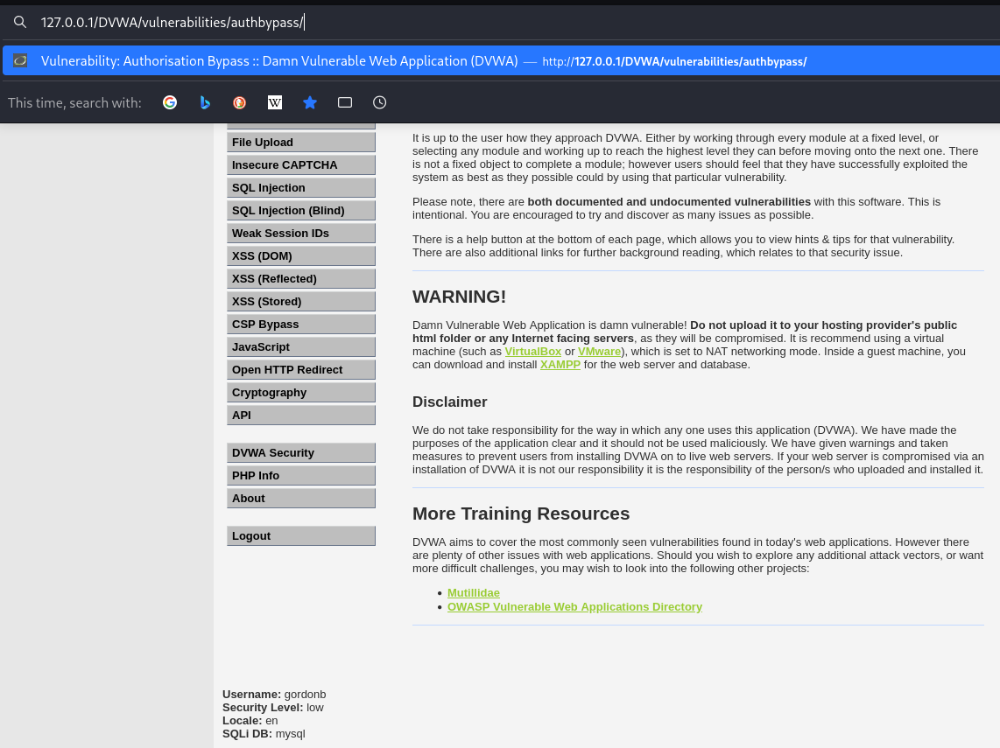

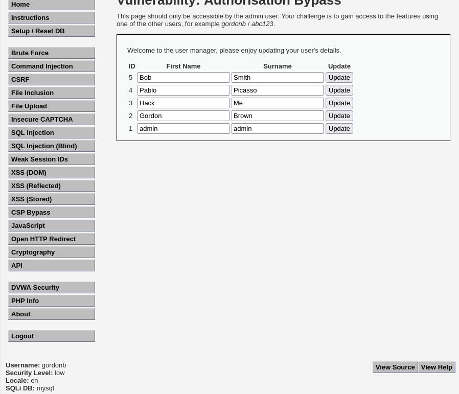  

---

## Medium Difficulty

In the Medium difficulty, if we use the same URL again, it will now fail to access the page and get an unauthorised message instead:

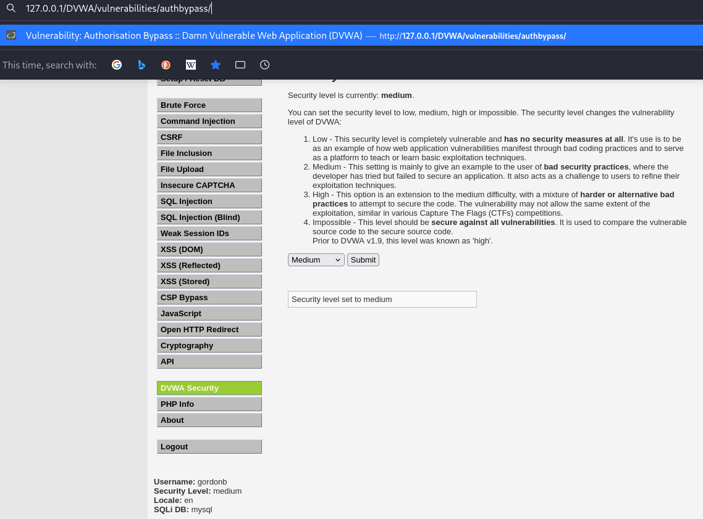

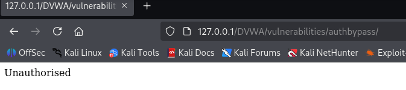  

### Admin's Page

In the admin’s perspective, the page is no longer showing the data, but instead stored in the `get_user_data.php` file:

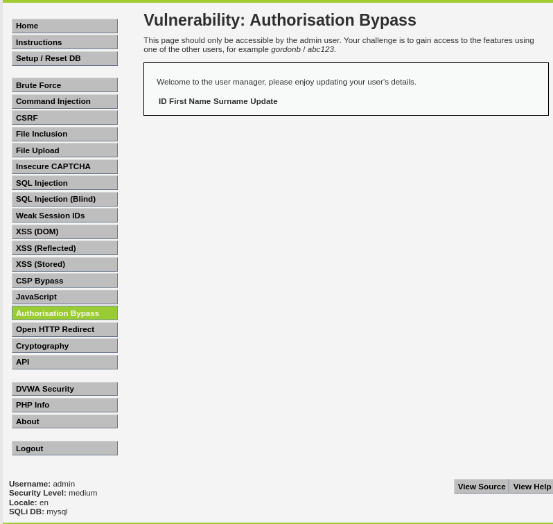

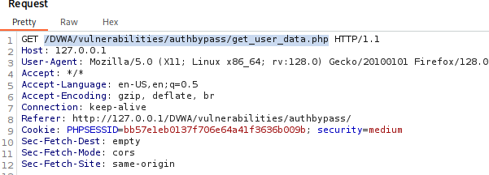  

### Access using gordonb account

If we use the URL on gordonb’s page, we can actually access the `.php` file and retrieve the data:

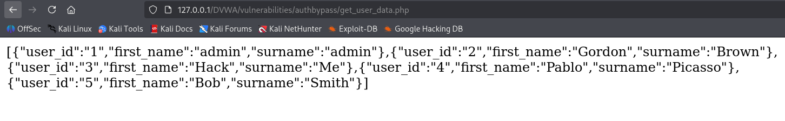  

---

## High Difficulty

