# Open HTTP Redirect

An Open Redirect is a vulnerability in a web application where an attacker can manipulate a URL in such a way that users are redirected to an external site, often without their knowledge or consent. This is typically a result of improper validation of user-supplied input, such as URLs or domain names within a web application. Open Redirects don’t generally compromise the system directly, but they are used maliciously in various social engineering attacks, like phishing or redirecting users to harmful websites.

---

## Low Difficulty

There are two URLs for user to click on, which will redirect to two different hacker quotes. In Low difficulty, the objective is to redirect page to move the user off the DVWA site or onto a different page on the site than expected: 

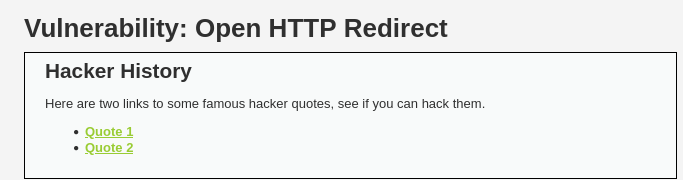

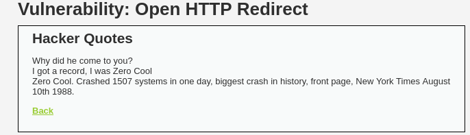

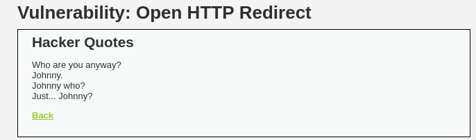  

The URLs have the respective ID of the quote, such as Quote 1 = ID 1 and Quote 2 = ID 2:

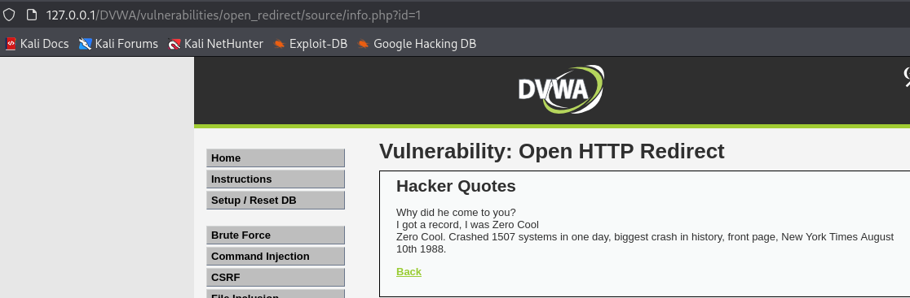

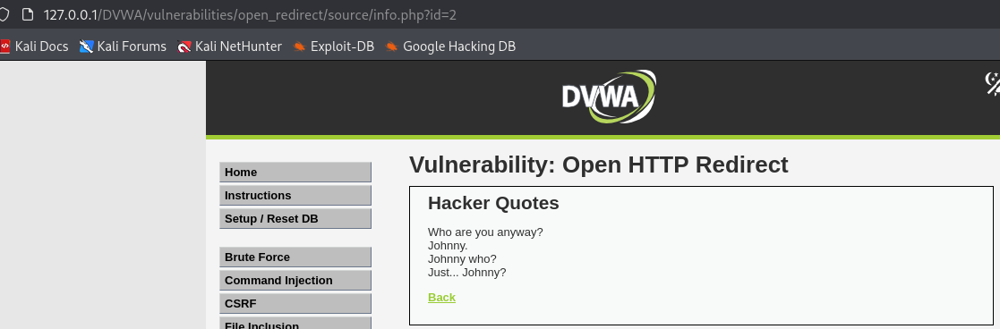  

### Exploit

If we change to ID = 3, it will redirect the user to a hidden page:

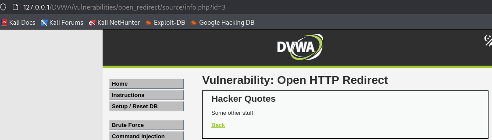  

If we try to put an external site URL for the ID value, it will not work and return a missing quote ID message instead:

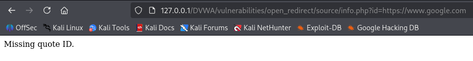  

### Intercept Request

Using Burp Suite to intercept the request when clicking on one of the quote, we will get a URL with a hidden `redirect` parameter, and this is where we suppose to put an external link to redirect user:

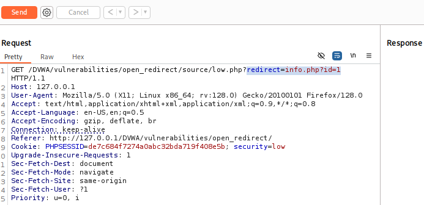  

By sending the request to Repeater and change the redirect URL to an external website, let's say `www.google.com`, we will receive a `302 Found` message which means there is a redirection that change the location to `www.google.com`:

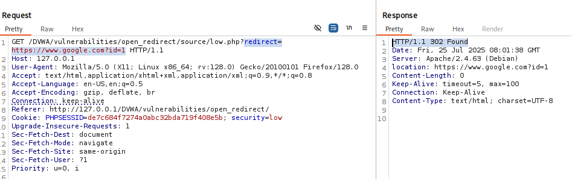  

Testing on the URL, we can see that the URL is actually redirecting us to `google.com`. In real life scenario, an attacker might put something like `www.g00gle.com` or `face3ook.com` to trick victim into their own malicious website for credential stealing:

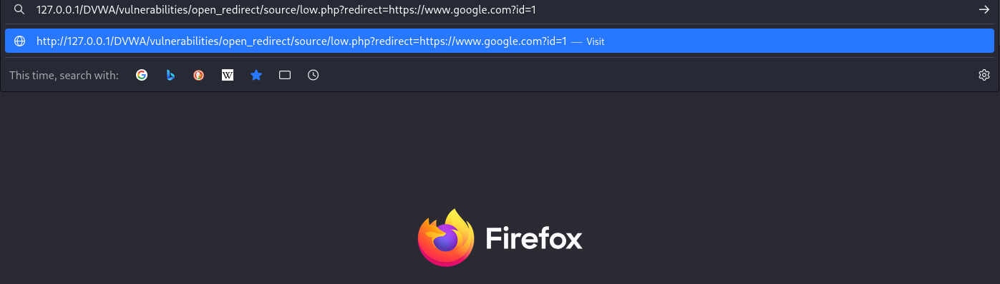

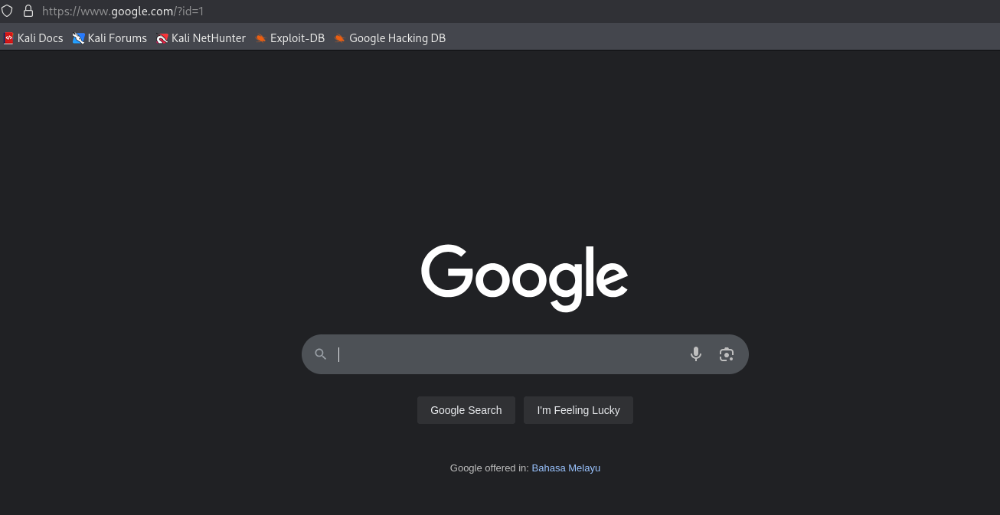  

---

## Medium Difficulty

In Medium difficulty, simply insert the URL will not work. Instead, we will get an absolute URLs not allowed message:

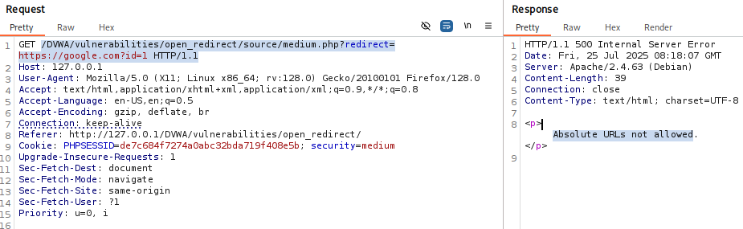  

Absolute URL means the URL includes full protocol (e.g., `http://` or `https://`), along with the domain and potentially a path or query string. From the hint, we are also advised to use a protocol-relative URL, which means we should insert `//google.com` instead of `https://google.com`.:

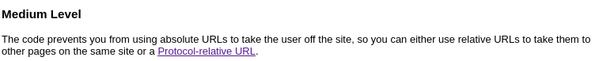

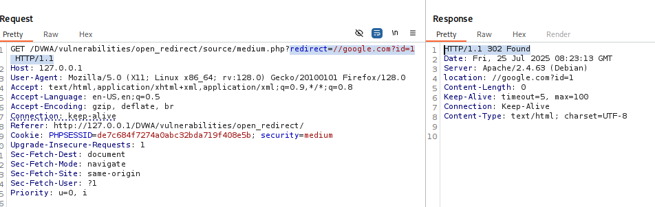  

### Using Absolute URL

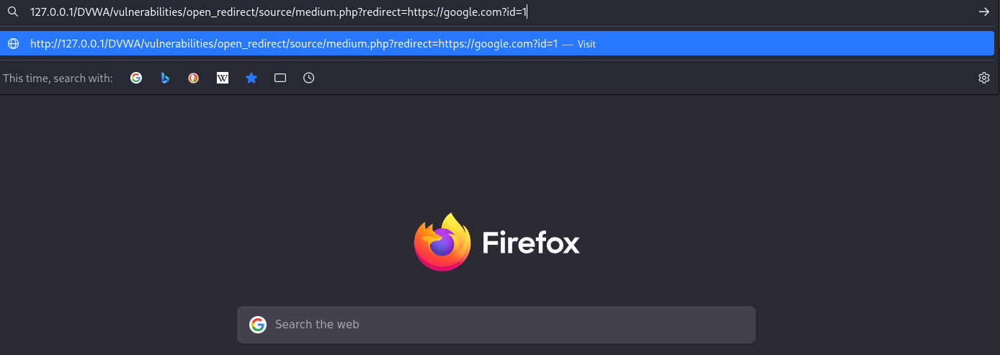

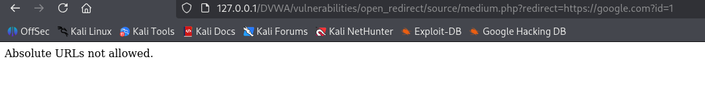  

### Using Protocol-Relative URL

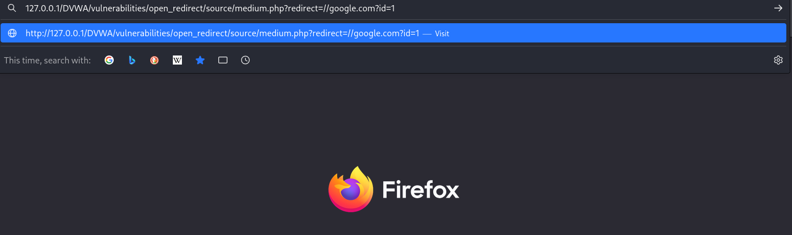

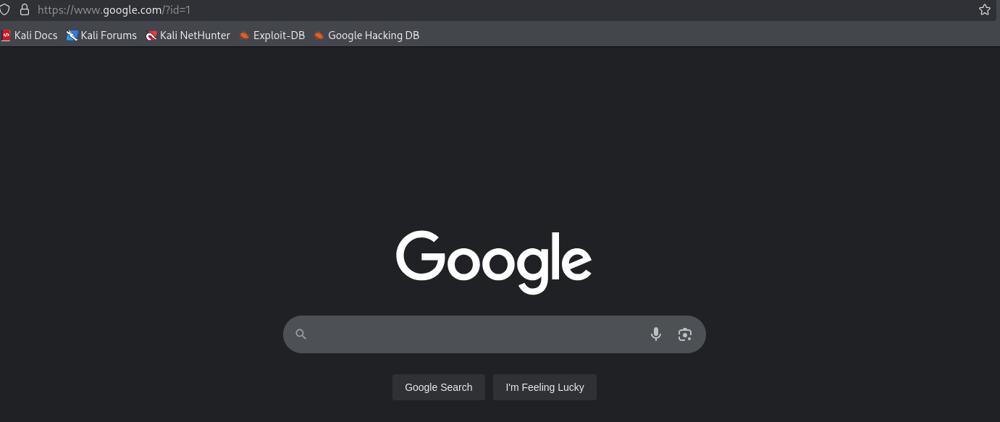  

---

## High Difficulty

In High difficulty, the website will now only us to redirect to the `info.php` page:

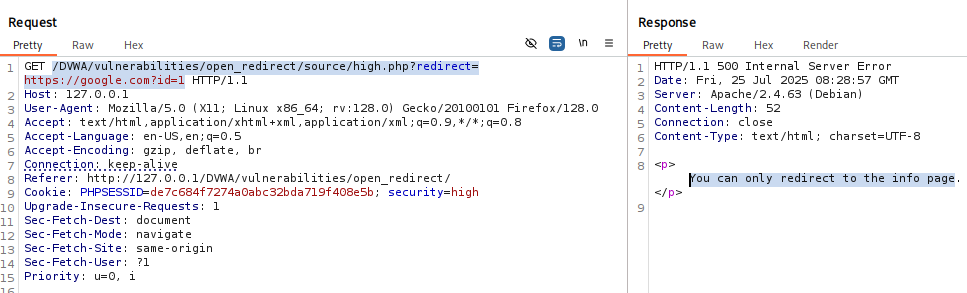  

We can bypass this by including the `info.php` using `&` (but need to be encoded, `Ctrl+U` = %26). The `&` symbol is interpreted as a delimiter between parameters, so it splits the string incorrectly. The `%26` represents the `&` character but tells the system to treat it as part of the query value rather than a separator:

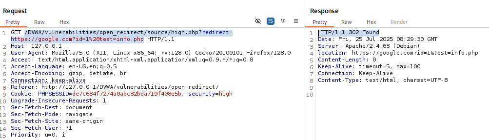  

Another way to do this is include the `info.php` right after `=`. `test=info.php` is a query parameter where test is the key, and `info.php` is the value passed with the key test. When the browser makes a request to `https://google.com?test=info.php`, it sends the request to `google.com` and includes `test=info.php` in the query string. Google (or any web server handling this request) will see the query string `test=info.php` and can choose how to handle it, such as it could redirect the user to a page (like `info.php`) or return a response based on that value. This will work as it follows the typical query parameter structure, where the `?` marks the start of query parameters and the `=` separates the key from the value:

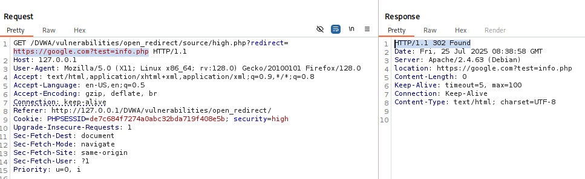  

---

## Conclusion

This challenge highlights how open redirects, although it might seem to have only low impact, still can play a significant role in phishing, social engineering, and credential theft attacks. Improper validation of user-controlled redirect parameters can allow an attacker to manipulate the flow of users and redirect them to malicious destinations disguised as trusted pages.

We have learned that:
- In Low difficulty, we discovered a hidden redirect parameter via Burp Suite and exploited it to redirect users to external domains.
- In Medium difficulty, the application blocked absolute URLs, but we bypassed this using a protocol-relative URL (`//domain.com`) which browsers still interpret correctly.
- In High difficulty, more filtering was applied. We used URL encoding (`%26`) and query string tricks (`?test=info.php`) to fool the validation logic and successfully redirect to external domains.

Each difficulty demonstrated how slight misconfigurations or assumptions about user input can undermine intended access controls and redirect safeguards.

---

### Skills Applied:

- Understanding how Open Redirects work and why they matter
- Identifying hidden parameters using Burp Suite’s Intercept & Repeater
- Testing for client-side and server-side redirect behavior
- Exploiting redirect logic using:
  - Absolute URLs
  - Protocol-relative URLs
  - Encoded characters (%26 for &)
  - Query string injection to bypass URL filters
