# Cryptography Problems

Cryptography is the science of securing communication and information by transforming it into an unreadable format, called ciphertext, which can only be deciphered back into its original form (plaintext) by someone with the correct key or method. It ensures privacy, integrity, and authenticity in digital communication and data storage.

There are some key Concepts in Cryptography:
1.	Encryption - The process of converting plaintext into ciphertext using an encryption algorithm and a key. The ciphertext is unreadable without the correct decryption key.
2.	Decryption - The reverse process of encryption, where the ciphertext is converted back into plaintext using the correct decryption key.
3.	Key - A piece of information used in the encryption and decryption process. It could be a password, a sequence of random bits, or a more complex cryptographic key.
4.	Cipher - A mathematical algorithm used to perform the encryption and decryption operations. Examples include AES (Advanced Encryption Standard) and RSA (Rivest-Shamir-Adleman).
5.	Hashing - A one-way process that converts data (like a file or a password) into a fixed-size string of characters, often a hexadecimal value. It’s typically used for data integrity checks and password storage. Examples include SHA-256 or MD5.
6.	Public Key Infrastructure (PKI) - A system of encryption and authentication using pairs of keys: a public key (used to encrypt) and a private key (used to decrypt). The most famous example of this is RSA.
7.	Symmetric vs Asymmetric Cryptography - 
    - Symmetric Cryptography: Both encryption and decryption use the same key. It’s fast but requires a secure way to exchange the key. Example: AES.
    - Asymmetric Cryptography: Uses a pair of keys, public and private. One key encrypts, and the other key decrypts. Example: RSA, ECC (Elliptic Curve Cryptography).
8.	Digital Signatures - A form of authentication where a sender signs a message with their private key, and the receiver verifies it using the sender’s public key. This ensures the authenticity of the sender and the integrity of the message.

---

## Low Difficulty

The goal in this challenge is to exploit weak cryptographic implementations. In Low difficulty, we are given a ciphertext and need to decode it:

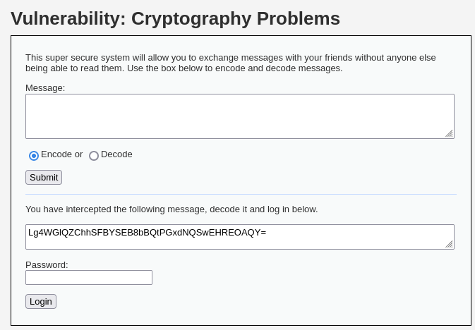<br><br>

After decoding the message, it turns out that the password is `Olifant`, and we are able to use that password to login:

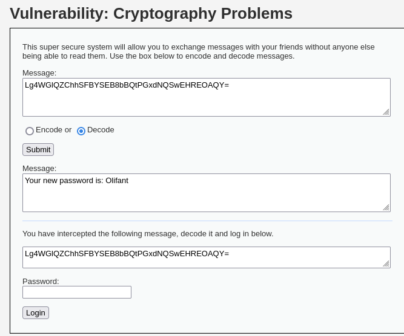

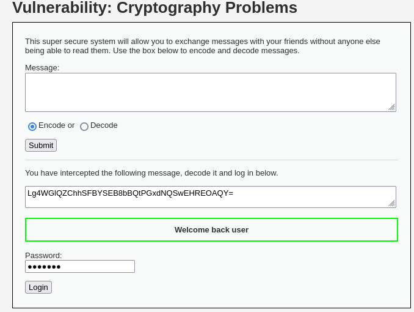<br><br>

But how does it work? Let's try to recover the key here. We can first simply type any message and encode it:

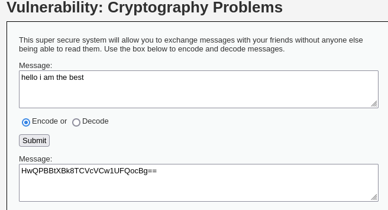<br><br>

Then, we go to `CyberChef.com`, a free online encrypting and decrypting tool:

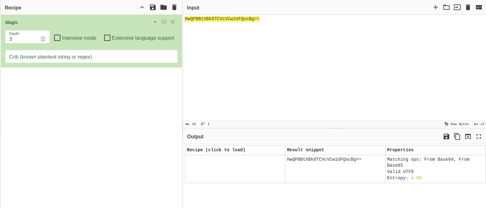<br><br>

We can use the `Magic` recipe to find the possible matches for the encoding algorithm. In this case, the results show possible matches of From Base64 and From Base85:

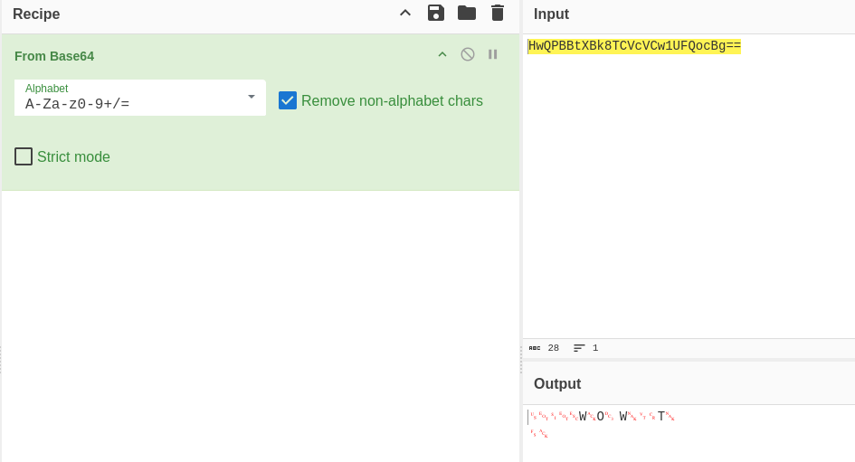<br><br>

Now we can use the `From Base64` recipe, the output becomes something very weird.

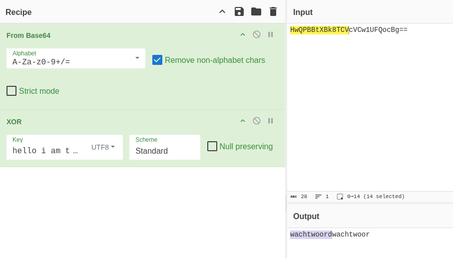<br><br>

But no worries, we will use XOR operations to recover the key. In the XOR operations, we put the original message as the key with UTF8 format, and we will get an output that will repeating itself, so the key is `wachtwoord`:

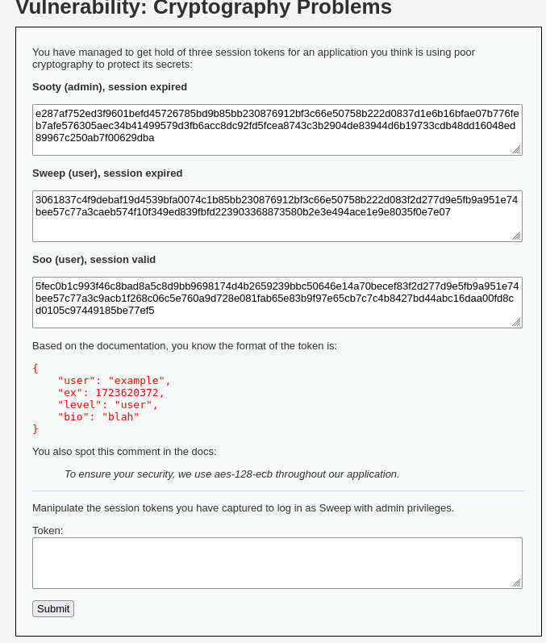<br><br>

### Why do we need the XOR operation to recover the key?

The encryption method used in this challenge is XOR encoding, where each byte of the plaintext is XORed with a repeating key to produce the ciphertext. XOR is used here because it's simple, reversible, and often mistaken for actual encryption, making it a common but weak method in poorly implemented cryptographic systems.

XOR has a unique property:
If `A + B = C`, then `C + A = B` and `C + B = A`.

This means if we know the plaintext and the resulting ciphertext, we can simply XOR the two to recover the key:

```
plaintext + ciphertext = key
```

In this case, we:
1.	Typed a known message (`hello I am the best`) and encoded it through the system.
2.	Base64-decoded the resulting ciphertext using CyberChef.
3.	XORed the decoded ciphertext with the original plaintext using UTF-8 format.

Because the key is repeated across the message, the XOR output revealed a repeating pattern: `wachtwoord`, which is Dutch for "password". This means the system was using a weak, hardcoded, and easily recoverable XOR key to "encrypt" all its messages.

---

## Medium Difficulty

In medium difficulty, we are given several clues here. There are 1 admin and 2 users session tokens, we need to login as `Sweep` with admin privileges. Since the algorithm used is `AES-128-ECB`, we know that AES-128 is operates on fixed-size blocks of 128 bits and ECB stands for Electronic Codebook Mode that divides plaintext into 16-byte blocks and encrypts each block independently using the AES algorithm:

<br><br>

We can copy these tokens and visualize them in a better way using the expression `([0-9a-f]{32})` which is basically grabs digits from 0-9 and a-f hex characters and split them with 32 chunk characters each, as 32 hex characters x 4 bits = 128 bits:

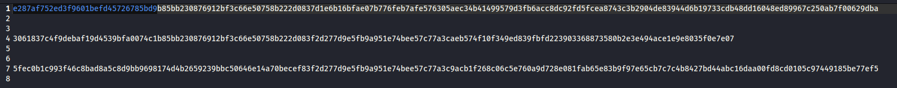

<br><br>

After organizing the tokens, based on the given format of token, we know that first line of the split token is `user`, second line is `expiry`, third line is `level` and fourth line is `bio`. 

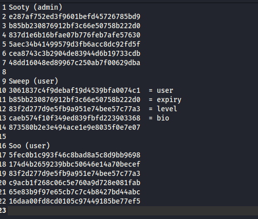<br><br>

Since we need to login as `Sweep` with admin privileges, we need to change the `expiry` to a valid session and `level` line to the same as admin’s:

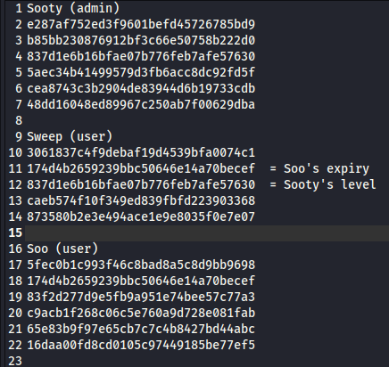<br><br>

After that, copy the whole modified token and we are able to login as `Sweep` with administrator role:

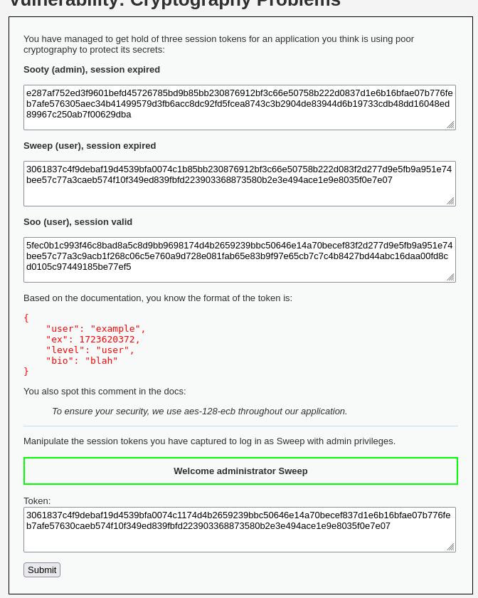<br><br>

---

## High Difficulty

In High difficulty, we will need to decrypt the token and generate a new one that has the access to the admin privilege:

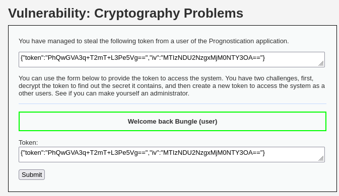<br><br>

First, we decrypt the IV using `From Base64` and we will get `1234567812345678`:

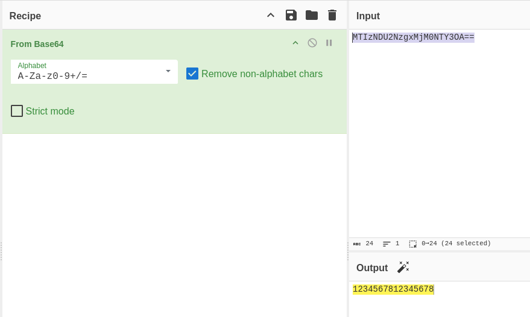<br><br>

From the hint, we also know that the system is using `AES-128-CBC`: 


which means that:
  - Plaintext is split into 16-byte blocks.
  - If the plaintext doesn't perfectly fill the final block, it's padded (e.g., using `PKCS#7` padding).
  - On decryption, if the padding is incorrect, the system typically returns an error.

If the application responds differently to valid vs invalid padding, it becomes a padding oracle. It tells us whether a modified ciphertext has valid padding after decryption. So we can exploit this to decrypt data without knowing the key.

### Solution

To solve this, we can intercept the request and send to Repeater. An extension named `Hackvertor` can come in handy as it allow us to trial and errors with the Base64 encoding:

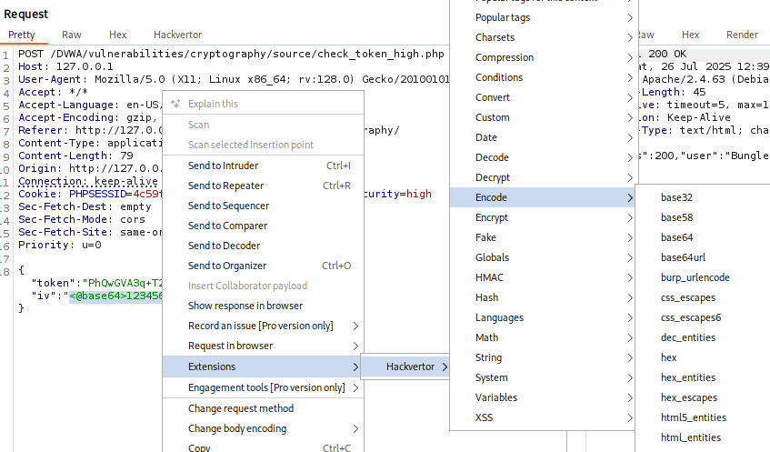<br><br>

Notice the difference when I change the last number of the IV, which is `8` to `0`? It returns different message to us. This is how the vulnerability works, allowing attackers to do brute force on the token:

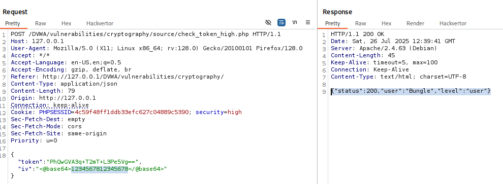

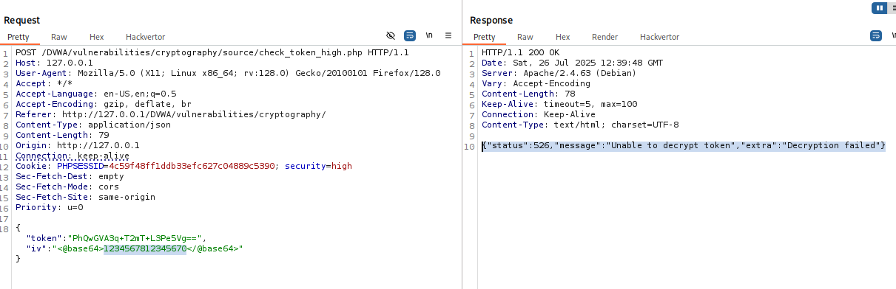<br><br>

### Result

After doing some trials and errors, the final result of the IV is `1234567;12345678`:

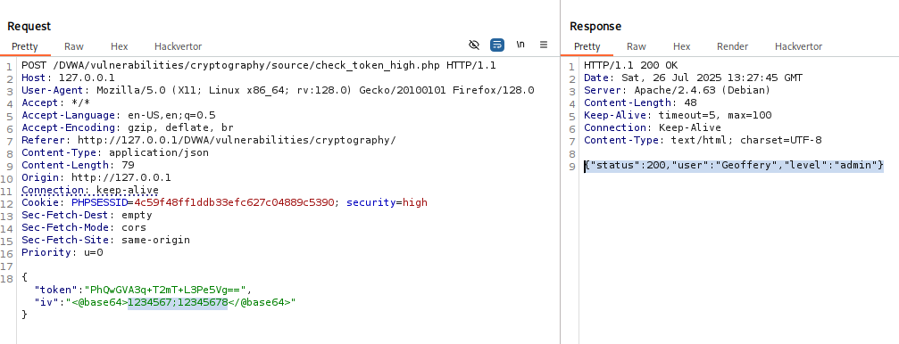<br><br>

Next, we convert it back to Base64 and submit along with the token, we are able to login as Geoffery (admin):

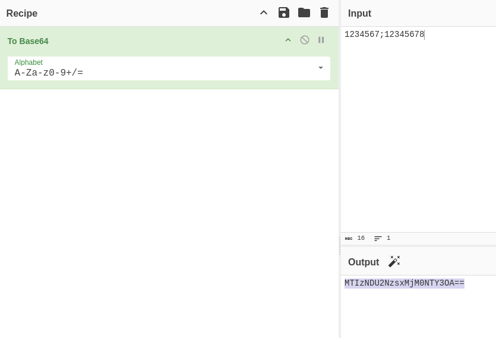

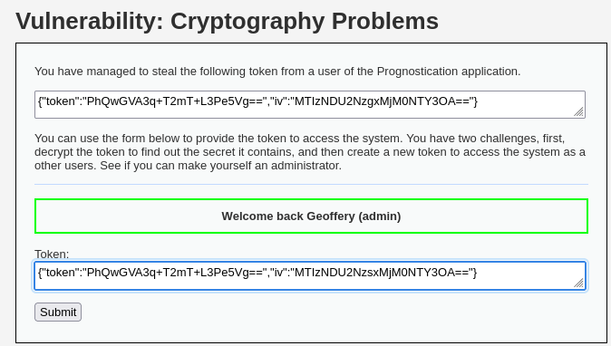<br><br>

### Alternative

While brute forcing the token helps, this is definitely not effective and will take a long time. We can use the `oracle_attack.php` script which came by default in the DVWA installation file (`/DVWA/vulnerabilities/cryptography/sources`) to automate the process and have a more in depth understanding of the brute forcing.

---

## Conclusion

This challenge shows how weak or misused cryptographic implementations can be broken to gain unauthorized access. We learned that:

- In Low difficulty, XOR "encryption" with a hardcoded, repeating key (`wachtwoord`) was trivially reversed using known plaintext and XOR operations.
- In Medium difficulty, we exploited the deterministic nature of AES-128 in ECB mode, which encrypts identical plaintext blocks into identical ciphertext blocks. By observing and swapping block positions, we escalated user privileges.
- In High difficulty, the system used AES-128 in CBC mode. We exploited a padding oracle vulnerability through error-based feedback, allowing us to manipulate the Initialization Vector (IV) and forge a valid admin token.

All levels showcased how poor implementation choices, even when using strong algorithms like AES, can be devastating when things like key reuse, ECB mode, or improper error handling are involved.

---

### Skills Applied:

- Identifying and reversing XOR encryption using known plaintext and CyberChef
- Analyzing AES-128-ECB block patterns to manipulate encrypted tokens
- Crafting and testing modified ciphertext blocks to elevate access
- Exploiting padding oracle flaws in AES-128-CBC via response differences
- Using Burp Suite & Hackvertor extension to manipulate base64-encoded IVs


