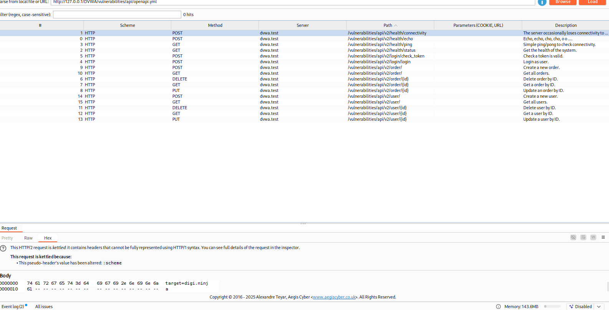

# API Security

An API (Application Programming Interface) is a set of rules that allows different software components to communicate with each other. In the context of web applications, APIs often serve as the backend endpoints that send and receive data between the client (like a browser or mobile app) and the server.

For example, when a user logs in, submits a form, or retrieves data on a web app, those actions often trigger API calls behind the scenes that handle the actual logic and data processing.

In modern web development that with Single Page Applications (SPAs) or even traditional apps, APIs are critical. They:
  - Handle sensitive data (e.g., user credentials, payment info)
  -	Control business logic
  -	Interact with databases
  
Because APIs typically operate behind the scenes, some developers might assume they’re less visible to attackers. This false sense of security can lead to cutting corners in essential areas such as:
  -	Authentication: Ensuring only legitimate users can access the API.
  -	Authorization: Ensuring users can only perform actions or access data they’re permitted to.
  -	Data validation: Checking inputs to prevent injection attacks, data corruption, or misuse.
  
This mindset creates vulnerabilities. For example, if an API doesn't properly check who is making a request, an attacker might bypass the UI and directly call the API to:
  -	Access or modify other users’ data
  -	Perform unauthorized actions (like elevating privileges)
  -	Trigger hidden functionality

---

## Setup and Troubleshooting

When accessing the API challenge page in DVWA, you are required to install Composer and have a2enmod rewrite enabled. You can refer to the DVWA github page for installation guide (https://github.com/digininja/DVWA/tree/master/vulnerabilities/api)

Once you installed them, you should see the Low difficulty page as below, then you are good to proceed to the Low difficulty solution:

<br><br>

However, you might as well encounter the problem where no user data was presented like mine:

<br><br>

**Here is the workaround: ([Skip](#low-difficulty) this if you don't have such problem)**

### What was happening?

This happened because when accessing the Low difficulty API Security challenge in DVWA, the browser attempted to fetch `/vulnerabilities/api/v2/user/` which resulted in a 404 Not Found error:

<br><br>

### Why didn't this work?

DVWA’s API backend is structured so that the actual API handler (PHP routing logic) lives inside a folder named `public`. Specifically `/var/www/html/DVWA/vulnerabilities/api/public/index.php`

<br><br>

But the browser was trying to call the API at `/vulnerabilities/api/v2/user/`. This URL skips the required `/public/` subdirectory, so Apache tried to look for a file or folder named `/v2/user/` directly inside `/api/`, which doesn’t exist and resulting in a 404.

Apache requires two things to handle clean URLs:
1.	`mod_rewrite` (which we have already enabled using the a2enmod rewrite command)
2.	A `.htaccess` file with rewrite rules to internally redirect pretty URLs to a front controller (the `index.php`)
   
Without a valid `.htaccess` file (which I don’t have one in the public folder for my case) and permission to use it, Apache can’t rewrite requests like `/v2/user/` to `index.php`, and thus fails to serve the API. 
<br><br>

### How to fix?

Create a `.htaccess` file at `/var/www/html/DVWA/vulnerabilities/api/public/` and includes the four lines:

```
RewriteEngine On
RewriteCond %{REQUEST_FILENAME} !-f
RewriteCond %{REQUEST_FILENAME} !-d
RewriteRule ^ index.php [QSA,L]
```


This tells Apache:
- If the URL isn’t a real file (!-f) or directory (!-d), rewrite the request to `index.php`, so PHP can route it.

<br><br>

Next, edit the Apache’s default site config located at `/etc/apache2/sites-available/000-default.conf`, add these lines inside the `<VirtualHost *:80>` block:

```
<Directory /var/www/html/DVWA/vulnerabilities/api/public>
    AllowOverride All
    Require all granted
</Directory>
```


<br><br>

Then, use `sudo systemctl restart apache2` to reload Apache.

Finally, edit the `/DVWA/vulnerabilities/api/source/low.php` file:


Change the URL inside the `get_users` function to `DVWA/vulnerabilities/api/public/v2/user/` and save it.

<br><br>

Back to browser and reload the DVWA page, it should be working fine now:

<br><br>

---

## Low Difficulty

Low difficulty is about the vulnerability of different versions of API existing in the web application. If we use `F12` to open the Network developer tools and refresh the page, we will see what calls have made to the API:

<br><br>

Here we have the `vulnerabilities/api/public/v2/user/` calls which clearly indicates that it's version 2 (v2) of the user API. The call returns a JSON object containing a list of user data in the Response tab:

<br><br>

However, the data returned here doesn’t seem particularly sensitive, we can try to change the version and see if we can find anything. Right click on the calls made and select `Edit and Resend` option:


<br><br>

Change the `v2` to `v1` and send the request again:

<br><br>

Here we go, a list of user data with hashed passwords. We can grab those hashes and use tool like CrackStation to crack the passwords:

<br><br>

Now we manage to crack the passwords of those users, which are `letmein`, `TonyHart`, and `Hartbeat` respectively:

<br><br>

---

## Medium Difficulty

**For those who have the Setup problem**

Before proceed to start the Medium difficulty challenge, remember to change the `Medium.php` URL just like how we did for the `Low.php` if you have encountered the same problem. (`get_user` & `update_name function`):


<br><br>

### Wrong Configuration

<br><br>

### Correct Configuration

The page should load with the ‘morph’ user in the input field and its details:

<br><br>

### Solution

In Medium difficulty, we need to elevate the user privilege to admin. We can use Burp Suite to intercept the request and see how it goes. From the PUT request, it took the name from the input field and return with its ID and privilege level. What if we try to add a level value with 0 (admin) in the PUT request then forward it:

<br><br>

We can see that in the Repeater, if adding another attributes `level` with value 0 on the request side, the response do actually update its level to 0 as well. So, what we need to do here is first intercept the PUT request and modifying the attributes before forwarding the request:

<br><br>

With Burp Suite proxy on, click on submit from the DVWA page and intercept the request:

<br><br>

Add a `level` attribute with 0 as the value, which is the admin privilege:

<br><br>

Click forward in the Burp Suite and we have successfully elevated the privilege:

<br><br>

---

## High Difficulty

In High difficulty, we are given a OpenAPI document which is the `openapi.yml` file. We need to test the health functions inside the file and see if we can find any vulnerability:


<br><br>

Here I installed the `OpenAPI Parser` extension in Burp Suite to list out the API details easily:


<br><br>

### Echo Function

Let’s try the echo function. First browse to the function and intercept the request, then send to repeater:


<br><br>

It says 404 Not Found, so what we can do here is change the request method to POST:


<br><br>

Now it says ‘words not specified’. We need to include the word `Hello World` that we saw in the echo calls body:

<br><br>

Remember to convert it to JSON format:

<br><br>

Now we have successfully got the reply:

<br><br>

We can try to insert a single quote in the body, hopefully can break the SQL syntax and get back errors to verify SQL injection vulnerability:


Unfortunately, it does not.<br><br>

### Connectivity Function

Next, let’s try the connectivity function:

<br><br>

Change the URL from `echo` to `connectivity` in the Request body and we are good to go for trials and errors. Here we get a target not specified error as we need to specify a target in the JSON body:

<br><br>

Testing with `target:localhost`, we are able to get a HTTP 200 OK status:

<br><br>

Now, we host a HTTP server to verify if there is vulnerability when trying to inject command:

<br><br>

Using curl command, we are able to communicate with our HTTP server:


<br><br>

let’s try injecting some command:

#### `whoami`


<br><br>

#### `ls`


<br><br>

#### `pwd`


<br><br>

This verifies that we are able to execute commands and export the results to our own local web server, so we have found the vulnerability in `connectivity` function API calls.

---

## Conclusion

This challenge highlighted the importance of securing APIs at all levels but not just the frontend.

- In Low difficulty, we exploited API versioning to access outdated and more sensitive endpoints that exposed hashed passwords.
- In Medium difficulty, we demonstrated an insecure API that didn’t enforce server-side access controls, allowing us to escalate privileges by modifying the request body directly.
- In High difficulty, we used an OpenAPI specification to identify and test available endpoints. We discovered that the connectivity function was vulnerable to command injection, allowing full remote code execution via crafted API payloads.

APIs often handle core application logic and sensitive operations, assuming they are hidden from users is a dangerous mindset. Attackers can analyze and manipulate API traffic directly, so strong validation, authorization, and input sanitization are important.

---

### Skills Applied:

- API enumeration via version control abuse (v1 vs v2 endpoints)
- Editing raw HTTP requests using Burp Suite to modify or inject JSON payloads
- Privilege escalation via unvalidated input in PUT/POST requests
- Parsing and leveraging OpenAPI (Swagger) documentation to identify hidden or undocumented endpoints
- Command injection via API input fields, validated by triggering external callbacks with a custom HTTP listener
