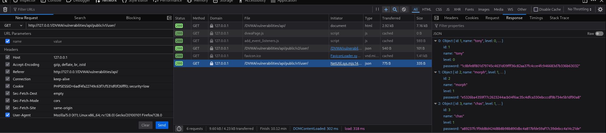

# API Security

An API (Application Programming Interface) is a set of rules that allows different software components to communicate with each other. In the context of web applications, APIs often serve as the backend endpoints that send and receive data between the client (like a browser or mobile app) and the server.

For example, when a user logs in, submits a form, or retrieves data on a web app, those actions often trigger API calls behind the scenes that handle the actual logic and data processing.

In modern web development that with Single Page Applications (SPAs) or even traditional apps, APIs are critical. They:
  - Handle sensitive data (e.g., user credentials, payment info)
  -	Control business logic
  -	Interact with databases
  
Because APIs typically operate behind the scenes, some developers might assume they’re less visible to attackers. This false sense of security can lead to cutting corners in essential areas such as:
  -	Authentication: Ensuring only legitimate users can access the API.
  -	Authorization: Ensuring users can only perform actions or access data they’re permitted to.
  -	Data validation: Checking inputs to prevent injection attacks, data corruption, or misuse.
  
This mindset creates vulnerabilities. For example, if an API doesn't properly check who is making a request, an attacker might bypass the UI and directly call the API to:
  -	Access or modify other users’ data
  -	Perform unauthorized actions (like elevating privileges)
  -	Trigger hidden functionality

---

## Setup and Troubleshooting

When accessing the API challenge page in DVWA, you are required to install Composer and have a2enmod rewrite enabled. You can refer to the DVWA github page for installation guide (https://github.com/digininja/DVWA/tree/master/vulnerabilities/api)

Once you installed them, you should see the Low difficulty page as below, then you are good to proceed to the Low difficulty solution:

<br><br>

However, you might as well encounter the problem where no user data was presented like mine:

<br><br>

**Here is the workaround: ([Skip](#low-difficulty) this if you don't have such problem)**

### What was happening?

This happened because when accessing the Low difficulty API Security challenge in DVWA, the browser attempted to fetch `/vulnerabilities/api/v2/user/` which resulted in a 404 Not Found error:

<br><br>

### Why didn't this work?

DVWA’s API backend is structured so that the actual API handler (PHP routing logic) lives inside a folder named `public`. Specifically `/var/www/html/DVWA/vulnerabilities/api/public/index.php`

<br><br>

But the browser was trying to call the API at `/vulnerabilities/api/v2/user/`. This URL skips the required `/public/` subdirectory, so Apache tried to look for a file or folder named `/v2/user/` directly inside `/api/`, which doesn’t exist and resulting in a 404.

Apache requires two things to handle clean URLs:
1.	`mod_rewrite` (which we have already enabled using the a2enmod rewrite command)
2.	A `.htaccess` file with rewrite rules to internally redirect pretty URLs to a front controller (the `index.php`)
   
Without a valid `.htaccess` file (which I don’t have one in the public folder for my case) and permission to use it, Apache can’t rewrite requests like `/v2/user/` to `index.php`, and thus fails to serve the API. 
<br><br>

### How to fix?

Create a `.htaccess` file at `/var/www/html/DVWA/vulnerabilities/api/public/` and includes the four lines:

```
RewriteEngine On
RewriteCond %{REQUEST_FILENAME} !-f
RewriteCond %{REQUEST_FILENAME} !-d
RewriteRule ^ index.php [QSA,L]
```


This tells Apache:
- If the URL isn’t a real file (!-f) or directory (!-d), rewrite the request to `index.php`, so PHP can route it.

<br><br>

Next, edit the Apache’s default site config located at `/etc/apache2/sites-available/000-default.conf`, add these lines inside the `<VirtualHost *:80>` block:

```
<Directory /var/www/html/DVWA/vulnerabilities/api/public>
    AllowOverride All
    Require all granted
</Directory>
```


<br><br>

Then, use `sudo systemctl restart apache2` to reload Apache.

Finally, edit the `/DVWA/vulnerabilities/api/source/low.php` file:


Change the URL inside the `get_users` function to `DVWA/vulnerabilities/api/public/v2/user/` and save it.

<br><br>

Back to browser and reload the DVWA page, it should be working fine now:

<br><br>

---

## Low Difficulty

Low difficulty is about the vulnerability of different versions of API existing in the web application. If we use `F12` to open the Network developer tools and refresh the page, we will see what calls have made to the API:

<br><br>

Here we have the `vulnerabilities/api/public/v2/user/` calls which clearly indicates that it's version 2 (v2) of the user API. The call returns a JSON object containing a list of user data in the Response tab:

<br><br>

However, the data returned here doesn’t seem particularly sensitive, we can try to change the version and see if we can find anything. Right click on the calls made and select `Edit and Resend` option:


<br><br>

Change the `v2` to `v1` and send the request again:

<br><br>

Here we go, a list of user data with hashed passwords. We can grab those hashes and use tool like CrackStation to crack the passwords:

<br><br>

Now we manage to crack the passwords of those users, which are `letmein`, `TonyHart`, and `Hartbeat` respectively:

<br><br>


