# Command Execution

Command execution occurs when a web application has the vulnerability of allowing attackers to run system level command on the web servers. It passes user input directly to the system shell due to improper validation or sanitization.

---

## Low Difficulty

### Ping Command
Starting with Low difficulty, we can see there is an input field for pinging a specific IP address. I'll try pinging my own IP address here:

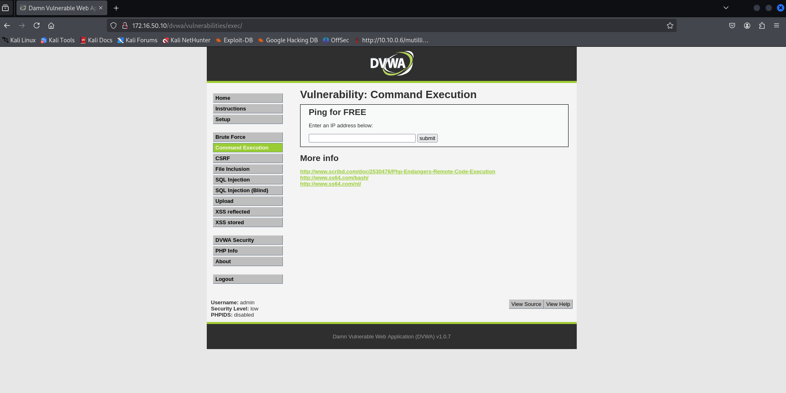  

The results show 3 successful packets transmitted:

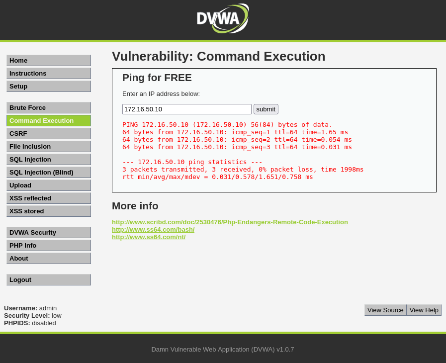  

How does it work? It is basically inserting the user input to the shell and executing It as a command just like the screenshot below:

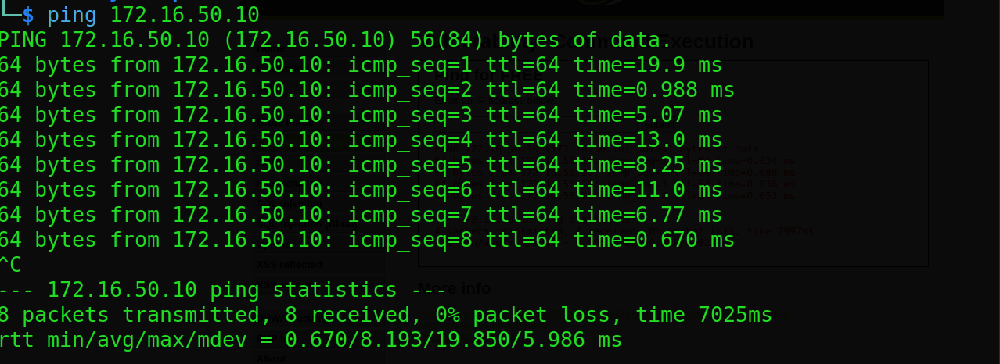  

### Command Injection

So what can we inject here to execute other command and get more information? Let’s think about the command line here once again. If we use shell operators like `;` (semicolon) and `&&` (Logical AND) right after the ping command, it will run the first command then run the second one:

> Semicolon

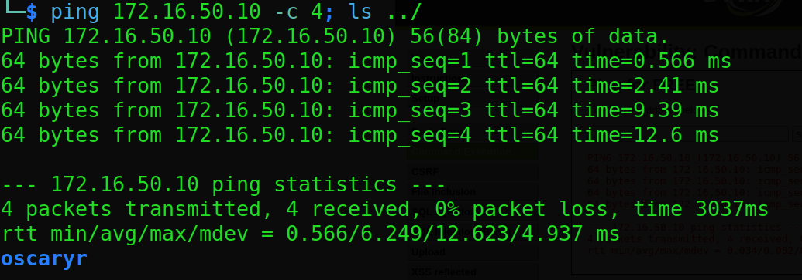  

> Logical AND

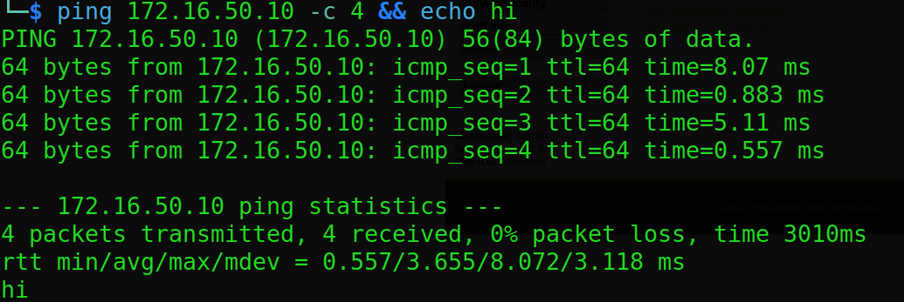  

If we apply this to the DVWA, the results are as below:

> Semicolon

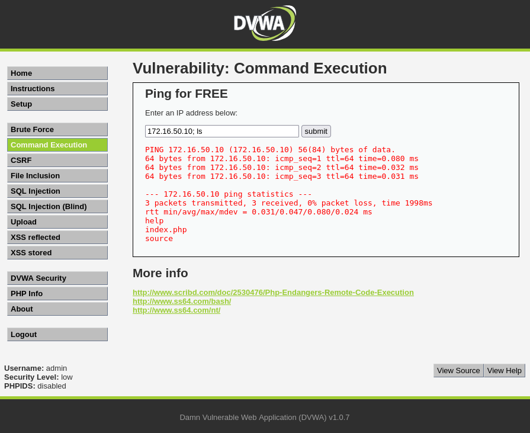  

> Logical AND

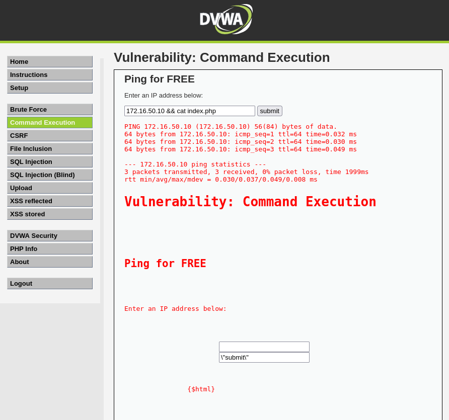  

> Multiple Commands

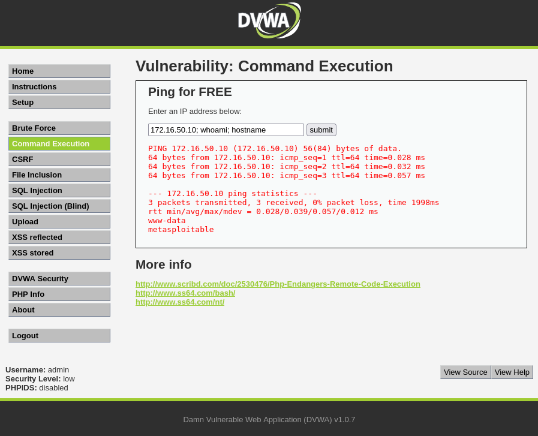  

The vulnerability allows us to run several commands after using the shell operators to enumerate the system information.
  

---

## Medium Difficulty

In Medium difficulty, we can see that using the operators `;` and `&&` will not work, as nothing shows up after submitting the command on the web application, this could be due to these operators having been sanitized. 

> Semicolon

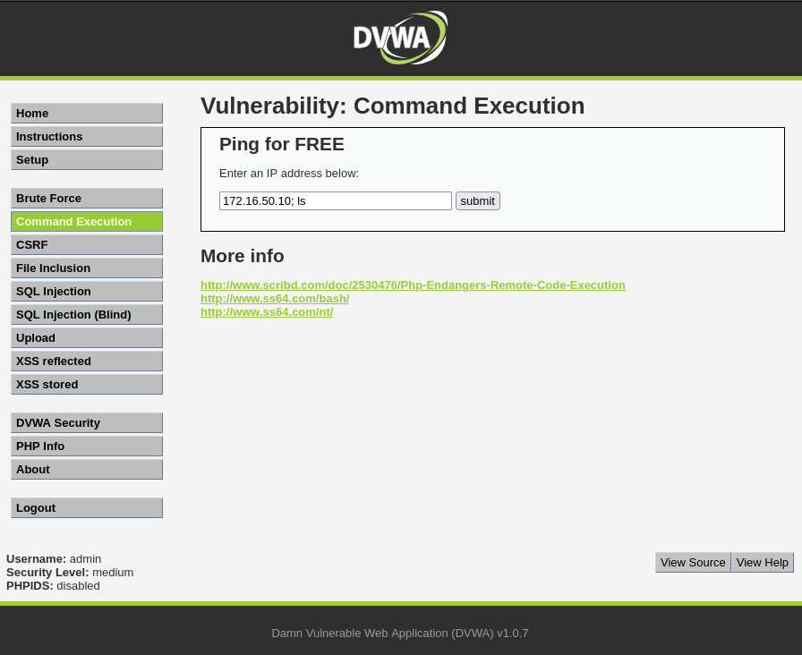  

> Logical AND

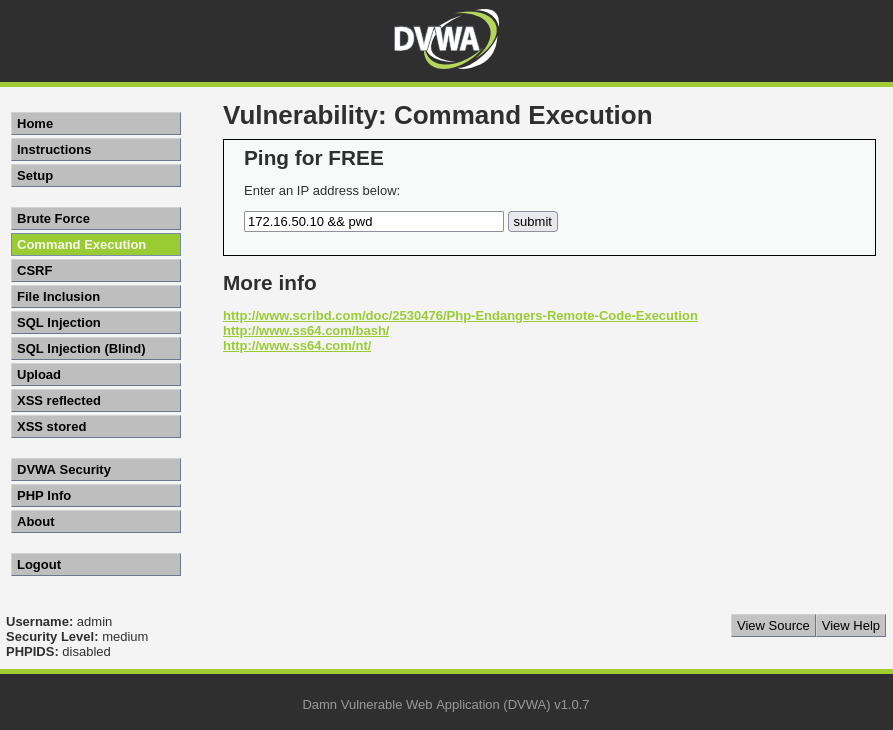  

What if we try other operators like `|` (Pipe) and `&`? The pipe operator will send the output of first command as input to the second, while the single `&` will run the first command in background:

> &

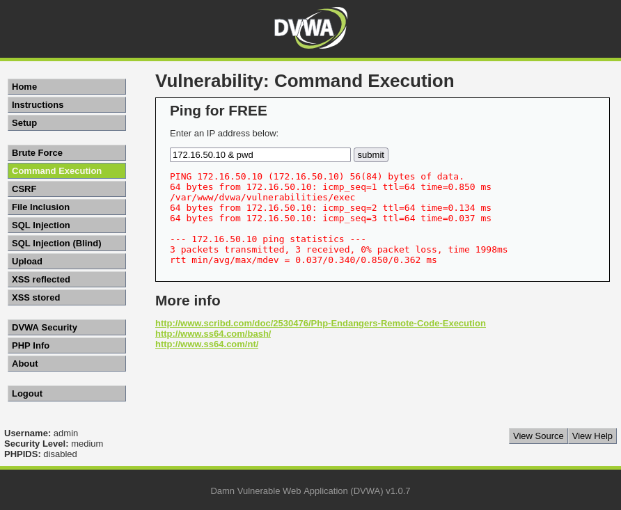  

> Pipe

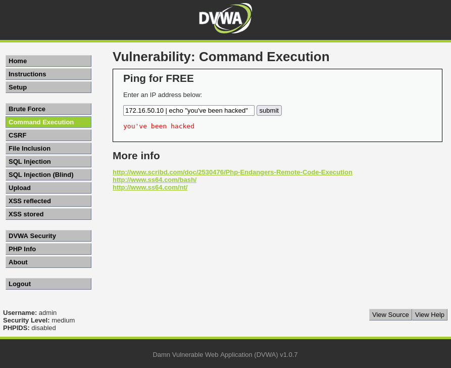  

After testing, we can use the `|` and `&` operators to execute the command. If we look at the source code, it has blacklisted the `;` and `&&` operators, that’s why we were unable to run the command on the first try. Hence, operators other than the two blacklisted can be used to inject command:

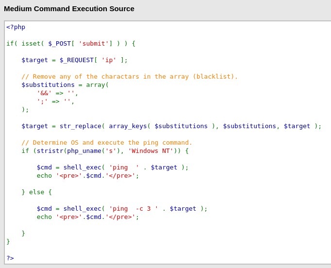  

---

## High Difficulty

In High difficulty, all the previous used operators will not work:

> Semicolon

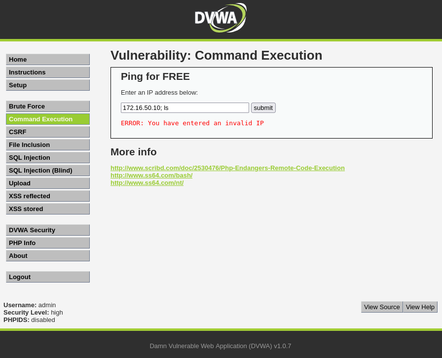  

> Pipe

  

> Logical AND

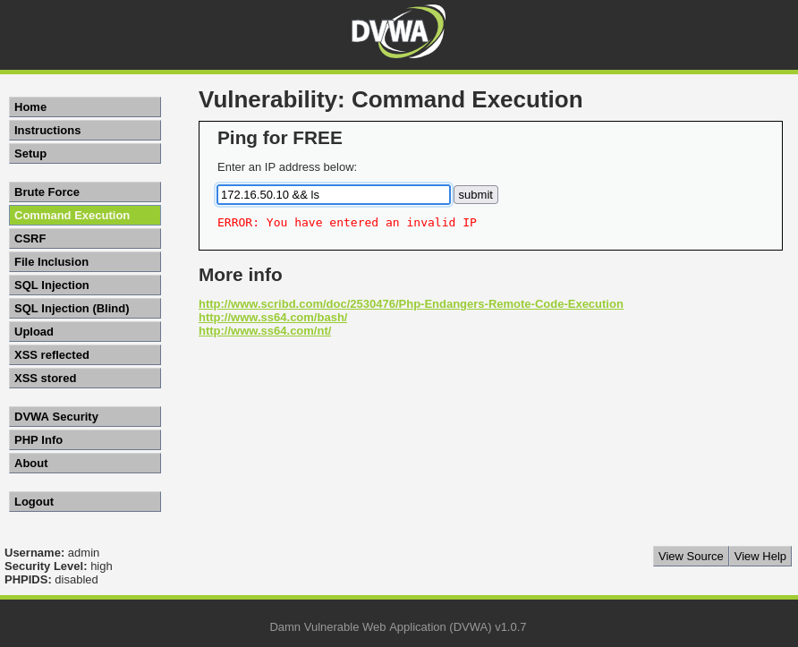  

If we look at the source code, it is impossible for command execution to work on this level as:

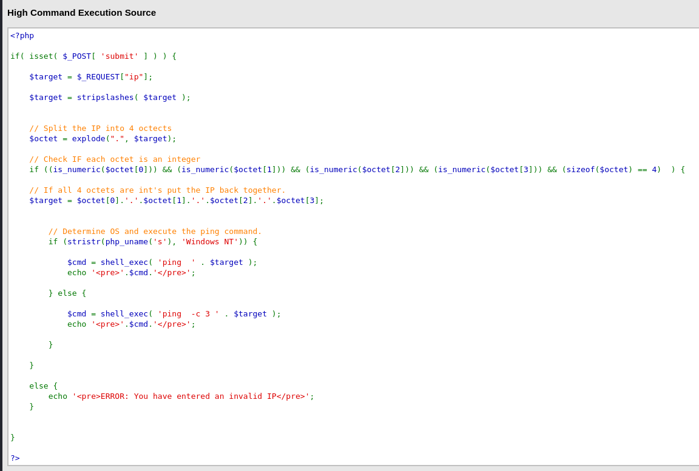  

Strict Validation:
- The IP address is split using explode(`.`), and the code ensures there are exactly four parts.
- Each part must pass is_numeric() — meaning only digits are allowed, disallowing any special characters such as `;`, `&&`, `|`, etc.
  
Input Rebuilding:
- Even if malicious input is supplied (e.g., 172.16.50.10; whoami), it is discarded when the IP is rebuilt using only the validated numeric values.
  
No Direct Use of Raw Input:
- The command is constructed after sanitization and uses a sanitized $target, not the original $_REQUEST["ip"].

Bypass Attempts like Newline Injection (%0a) Fail:
- Shell metacharacters or encoded characters are not preserved after the validation and reconstruction process.

> **Note**: This level can't be solved because the DVWA hosting on Metasploitable2 was an old version, it can later be solved when the code was redesigned for the newer version (direct download from GitHub and host on local machine).

---

## Conclusion

This challenge demonstrates how **unsanitized user input** in system-level commands can lead to command injection vulnerabilities. By leveraging various shell operators (`;`, `&&`, `|`, `&`), we were able to manipulate the server to execute arbitrary commands in **Low** and **Medium** difficulties.

While the **High** difficulty level blocks traditional payloads through strict input validation and reconstruction, this is a good reminder of how secure input handling and avoiding direct shell command usage is crucial in real-world applications.
  

### Skills Applied:
- Identifying and exploiting command injection vulnerabilities
- Using shell operators to chain or inject system commands
- Understanding input validation and sanitization methods
- Reading and analyzing PHP source code to identify blacklist/whitelist filtering
- Learning how input reconstruction breaks malicious payloads
