# Cross Site Request Forgery

Cross-Site Request Forgery (CSRF) is a type of attack where an attacker tricks a user into performing unwanted actions on a web application where they are authenticated. It takes advantage of the trust a web application has in the user's browser. 

In simpler terms, CSRF exploits the fact that the browser automatically includes authentication information (like cookies or session data) in requests sent to a web server. If an attacker can convince a user to perform a request on a website they are already authenticated on (e.g., through a link or form submission), the request may be processed with the user's privileges, even though the user didn't intend to perform that action.

For instance, when a website like online banking is under the logged in status by victims, attackers can craft a malicious link or script that embedded on a website such as in an image that says “Click here to get special promotion” (e.g, ). Once being clicked, the script will then be executed and transferred the money to attackers, and victim won’t even realize that. This is because CSRF utilize the “logged in” status, making the bank believes that the request is made by trusted user, thus allowing the transfer occurred.
<br><br>

### How it works?

1. Victim Logs In:
The victim logs into a website, like an online banking or social media site, which maintains the session (usually in the form of cookies).

2. Victim Visits Malicious Website:
The attacker sends the victim a link or embeds a malicious script on a website. This link or script is crafted to make a request to the target web application where the victim is authenticated.

3. Request Made on the Victim’s Behalf:
Since the victim is still authenticated on the target site (their session cookie is still valid), the browser sends the authentication cookies with the malicious request. As far as the web application is concerned, the request is coming from the authenticated user, and it performs the action as if the user intended it.

4. Action is Executed:
The action the attacker wants to perform (such as transferring funds, changing email, or updating account settings) gets executed without the victim’s knowledge or consent.
<br><br>

### CSRF Vulnerability Conditions:

1.	User is authenticated: The victim must be logged into the target website, as the attack leverages the victim's active session.

2.	Sensitive actions are performed by HTTP requests: The target application must allow sensitive actions (like changing passwords or transferring money) to be triggered by a simple request (e.g., GET or POST).
  
3.	Absence of CSRF protection mechanisms: The target web application must not have security measures in place (like anti-CSRF tokens) to validate that the request is legitimate.
<br><br>
---

## Low Difficulty

The objective here is to make the current user change their own password, without them knowing about their actions:

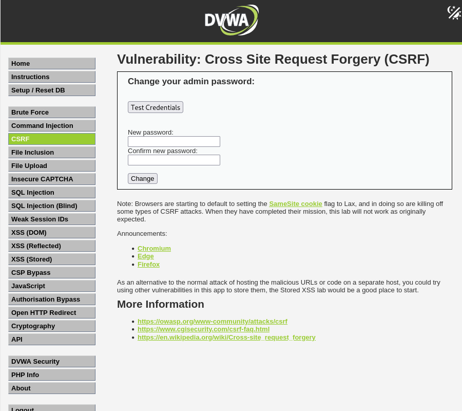<br><br>

### Analyze Password Changing Request

If we try to change the password to ‘test’, we will see the GET request sent off this `password_new=test` and `password_conf=test`. We can then craft a link based on this for changing the user password:

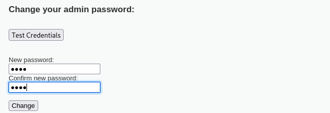

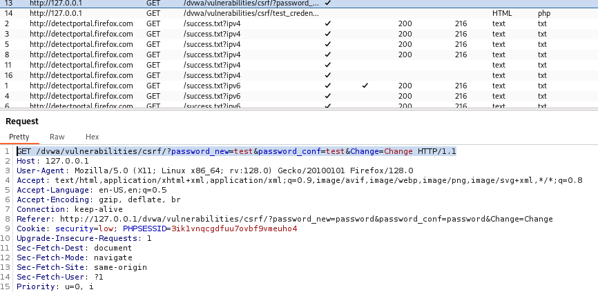<br><br>

### Modify Link

> Before

<br><br>

> After

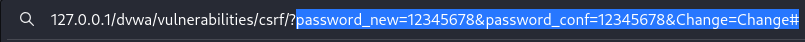<br><br>

#### Result

The password has been successfully changed by just modifying the request link to `12345678` for new password and confirm password:

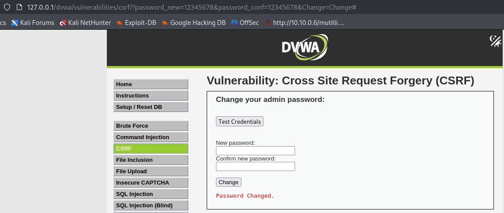

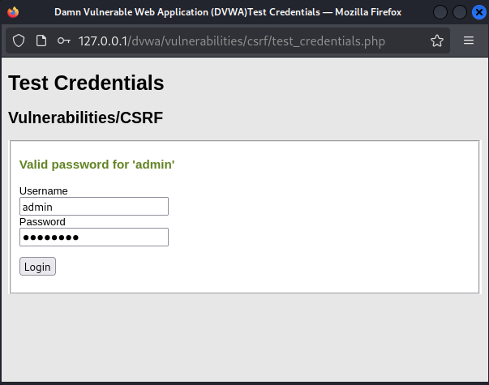<br><br>

> Tips: In terms of real world scenario, an attacker will craft this link and use social engineering to send the email for tricking victim into clicking on the link, the password will then be changed without the victim realizing it.
---

## Medium Difficulty

### Analyze Password Chaning Request

Using the previous method, which is directly modifying the value in the URL, will not work now:

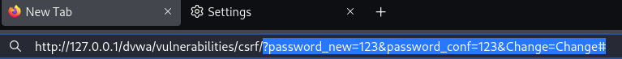

<br><br>

Let's try changing the password from the website to see what's different here:

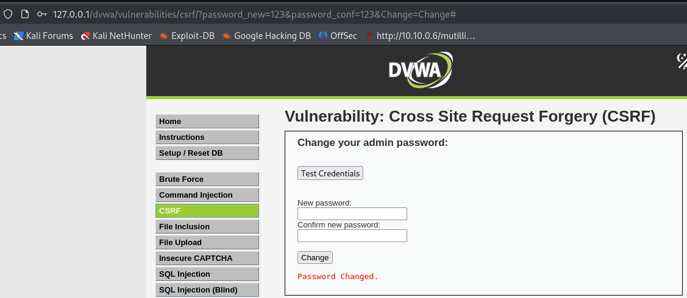<br><br>

In Burp Suite, the requests are as below:

> Modifying URL

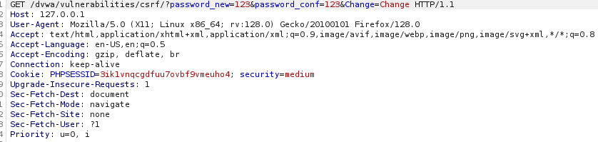<br><br>

> Changing Password on Website

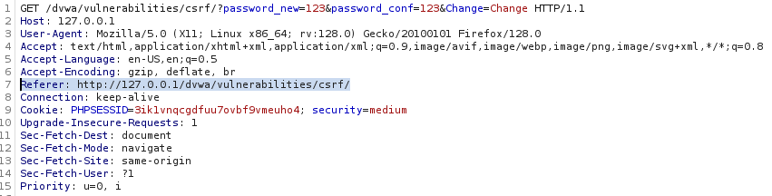<br><br>

### What's the Difference?

When changing password on website, it now includes the Referer header in the request. This will tell the server which page the request came from. In a CSRF attack, a malicious site (like `https://evil.com`) tries to trick the browser into sending a request to `https:// bank.com`. That request might look valid to the bank (with session cookie is included), but the Referer would be `Referer: https://evil.com`. In this way, the bank server checks the Referer header of incoming requests. If the Referer is not from `bank.com`, the request is rejected, just like our case now as there is no Referer header include in the request thus the message 'That request didn’t look correct' will show up and fail to change the password.
<br><br>

### Solution

To bypass this, we can combine CSRF with a stored XSS (Cross-Site Scripting) vulnerability. How it works? First, we know that Referer-based CSRF defense relies on checking the Referer header to ensure requests come from the legit own website, not from another site like `evil.com`. Then, Stored XSS occurs when an attacker manages to inject JavaScript into the website (e.g., a comment field), and that script runs inside the website for other users.

Thus, the process of using XSS to break Referer-based CSRF defense is finding a stored XSS vulnerability in the website, such as blog comment or user bio field. Next, inject JavaScript like:

#### Example

```bash
fetch("https://bank.com/transfer", {
  method: "POST",
  credentials: "include",
  body: "amount=1000&to=attacker"
});
```

Now, when a logged-in user views the infected page on the own domain, this script runs from within the website. Since the malicious request originates from the own website, the browser sends a Referer like `Referer: https://bank.com/some-page`. The server sees a valid Referer and accepts the request, causing the CSRF protection bypassed.
<br><br>

Using the same concept, we will try to insert a script in the XSS section page that change the password to `test123`:

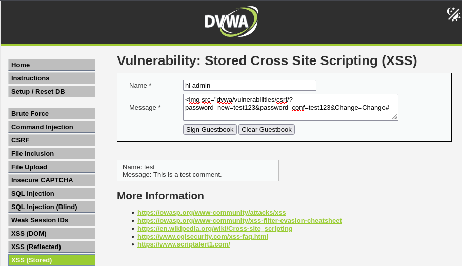

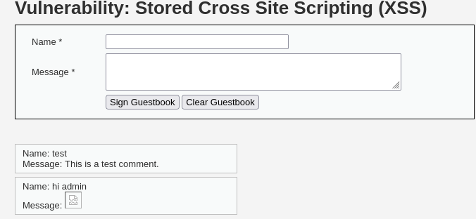<br><br>

In Burp Suite, we can see that the request has now included the referrer from the same website and executed the javascript. 

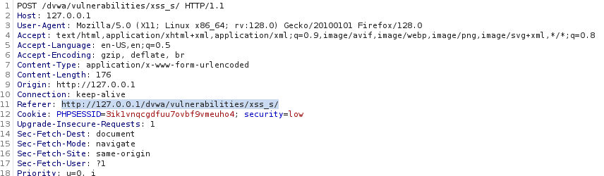<br><br>

#### Result

When we test the credentials, the `password` is not working now, instead, the newly changed password `test123` is now the current password:

> `password`

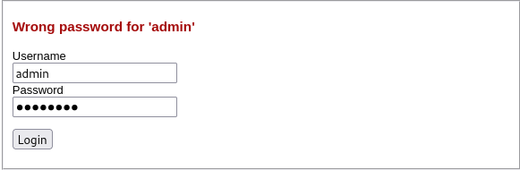<br><br>

> `test123`

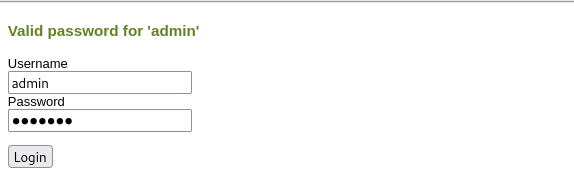<br><br>

---

## High Difficulty

### Analyze Password Chaning Request

Let’s try the normal change password process first once again to see what’s the difference from the previous difficulty:

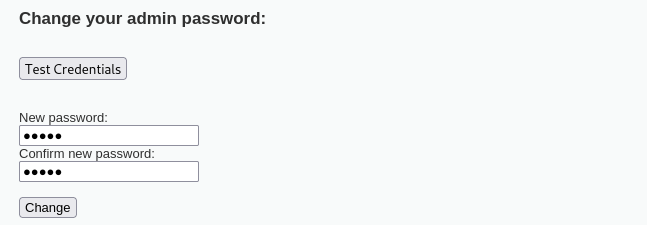<br><br>

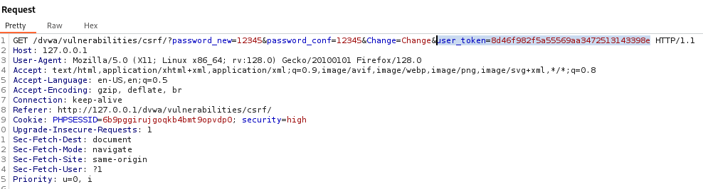<br><br>

We can see that when changing the password to ‘12345’, the request now not only include Referer header but also a user token.
<br><br>

### What is a User Token?

A user token (often called a CSRF token or anti-CSRF token) is a unique value that is associated with a user session and is included in HTTP requests made by the client. It is not automatically included by the browser like cookies or headers. Instead, it must be explicitly added (e.g., in the request body or a custom header).
<br><br>

### How it prevents CSRF?

1. Token Generation:
- When the user loads a page, the server sends a CSRF token as part of the HTML (e.g., in a hidden form field or as a JavaScript variable).
2. Token Submission:
- The client (browser) must include this token in every state-changing request (like POST or DELETE).
3. Token Validation:
- The server checks if the token matches the one associated with the session.

If it doesn’t match (or is missing), the request is rejected.
> Because an attacker cannot read the page (due to Same-Origin Policy), they can't know the correct token and cannot forge a valid request.

### Attempt

While Referer header + CSRF token is a powerful combination of defense mechanism against CSRF, they will be ineffective when XSS vulnerability still presents. This is because with XSS, attacker can:
- Read the CSRF token from the DOM.
- Use JavaScript to send a valid forged request with the token included.
- Bypass CSRF protection completely.

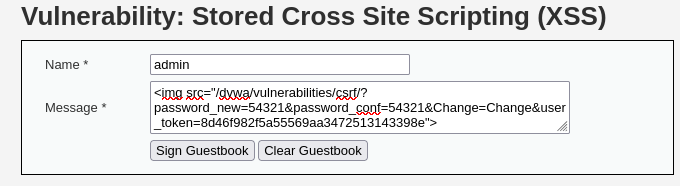

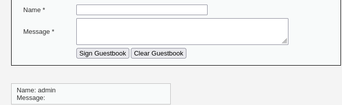<br><br>

If we try to use the same method by inserting a `` script, it will not work as the CSRF token is generated randomly every time a request is made:

> Current Session

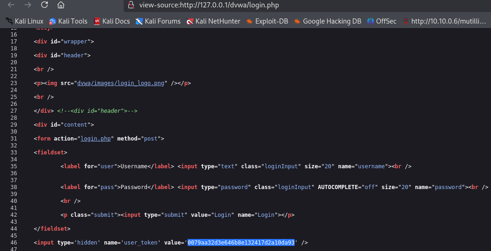<br><br>

> After Refreshing

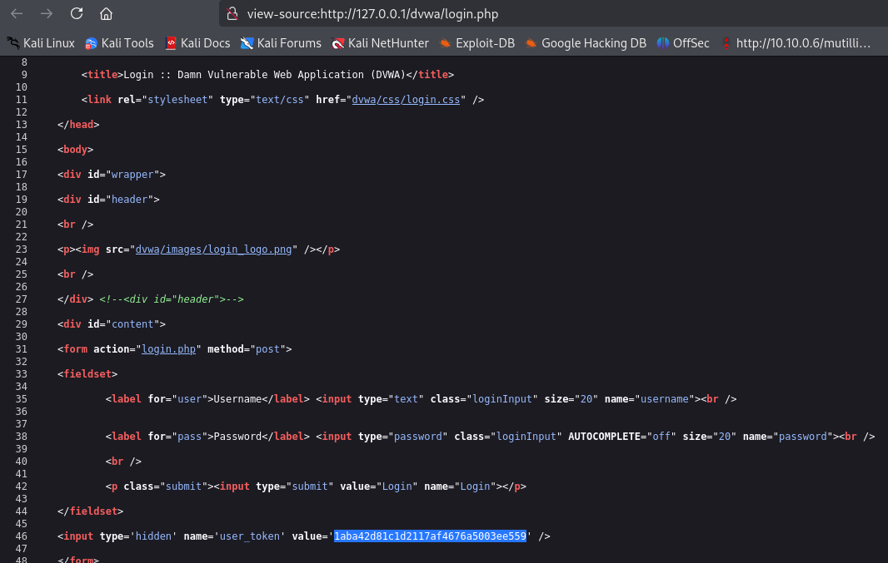<br><br>

### Solution

Tested using the browser console, we can grab the user token value using (document.getElementsByName("user_token")[0].value):

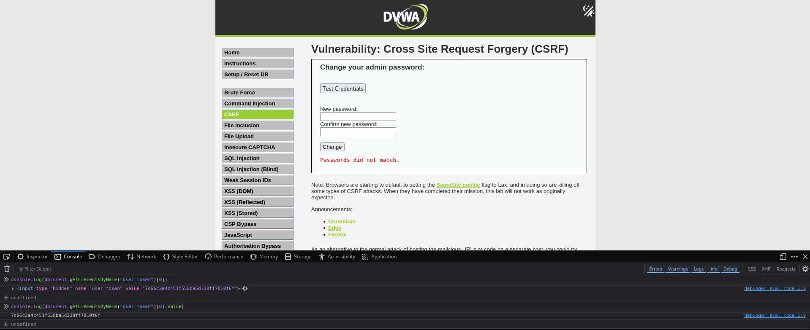<br><br>

We can then add the command into the img src script:

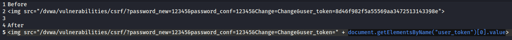<br><br>

We are now successfully changed the password back to ‘password’ using this method:

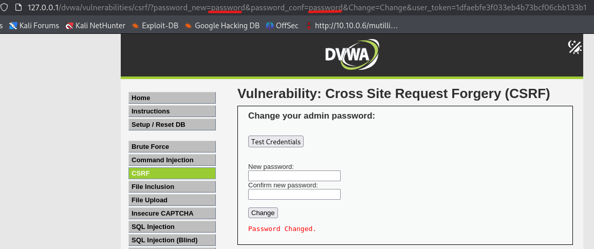<br><br>

---

## Conclusion

This challenge introduces the mechanics of Cross-Site Request Forgery (CSRF) and how varying levels of security measures affect the ability to exploit it.

At **Low** difficulty, we demonstrated a successful password change via a simple manipulated link, no CSRF token or validation was involved.

At **Medium** difficulty, **Referer header validation** blocked the attack unless it originated from the same site. We bypassed this defense by combining CSRF with **Stored XSS**, allowing malicious JavaScript to run within the application's context and mimic a legitimate request.

At **High** difficulty, the system implemented **CSRF tokens**, which randomly generated and unique per request. However, due to the presence of XSS, we extracted the token using DOM manipulation and successfully forged a valid request. This highlights the real-world danger of combining **multiple vulnerabilities**, and why XSS must be eliminated even when CSRF protections are in place.
<br><br>

### Skills Applied:

- Understanding CSRF attack flow and exploitation vectors
- Crafting CSRF payloads using GET and POST requests
- Using Burp Suite to intercept and analyze request differences
- Identifying and leveraging Referer header validation
- Combining **Stored XSS + CSRF** for advanced exploitation
- Extracting CSRF tokens using JavaScript from the DOM
- Real-world insights on **chained vulnerabilities** and bypassing layered defenses
