# Insecure CAPTCHA

When we try to login or signup on a website, we often get a little "test" of choosing specific images to match the provide keyword or type out the distorted text at the bottom of web registration forms. This little test is called CAPTCHA and it is to determine if a user is a human or computer. CAPTCHAs are used by many websites to prevent abuse from "bots", or automated programs usually written to generate spam. No computer program can read distorted text as well as humans can, so bots cannot navigate sites protected by CAPTCHAs.

An insecure CAPTCHA can undermine the very protection it’s meant to provide. If the CAPTCHA validation is poorly implemented, such as relying on client-side checks, using predictable tokens, or exposing bypass mechanisms in source code, automated bots and attackers can easily bypass it. This opens the door to brute force attacks, spam submissions, and unauthorized actions, rendering the CAPTCHA functionally useless.
  

## Setup

Before we can start doing the challenge, we need to setup the reCAPTCHA API Key for it to function properly:

1. Go to https://www.google.com/recaptcha/admin/create
2. Choose reCAPTCHA v2 > ‘I’m not a robot’ checkbox
3. Domains: Your DVWA hosting address (127.0.0.1)
4. Copy the generated Public and Private Key
5. Open the `/var/www/html/DVWA/config/config.inc.php` file
6. Paste into the `$_DVWA[ 'recaptcha_public_key']` and `$_DVWA[ 'recaptcha_private_key']`
7. Save & Exit
8. Restart Apache2 service

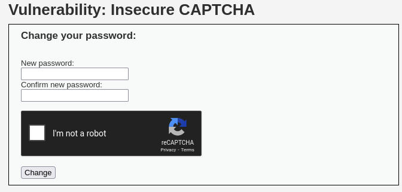

> Ref. https://youtu.be/But-uBPdsKk

---

## Low Difficulty

### Intercept Request

Let's go through the CAPTCHA process once and use Burp Suite to intercept the traffic while changing the password. Here I changed the password to `111`:

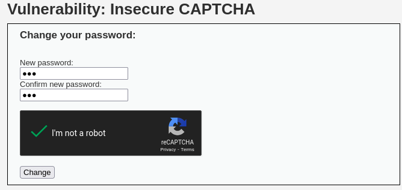

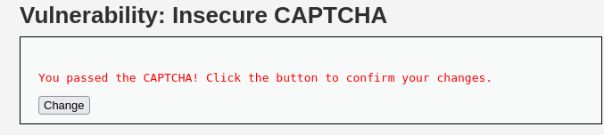

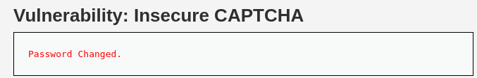  

We will get two requests for the password changing process. The two requests are the two steps of password changing process respectively. The first step is where the CAPTCHA occurs, and the second step is the password changes confirmation:

> Step 1

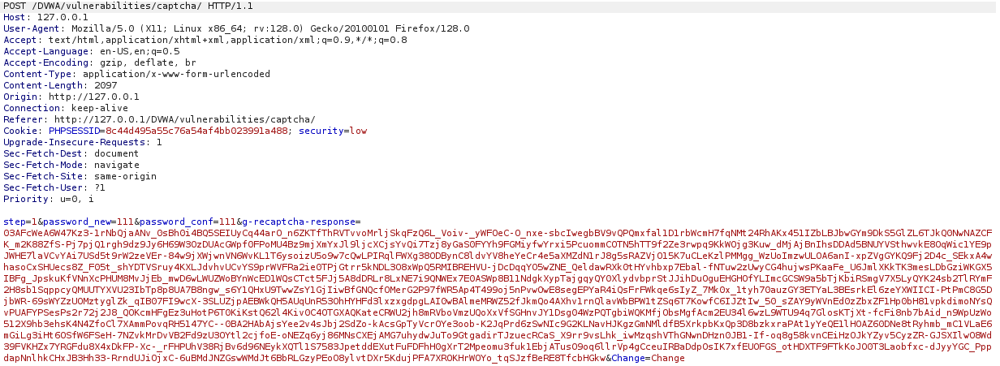  

> Step 2

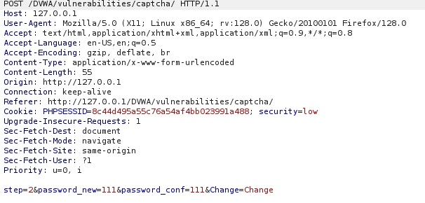  

### Bypass CAPTCHA

We can send the step 2 process to Repeater and modify the request then forward it, here the new password is `2222`. We can see that the captcha has been bypassed and the response returns 'Password changed.':

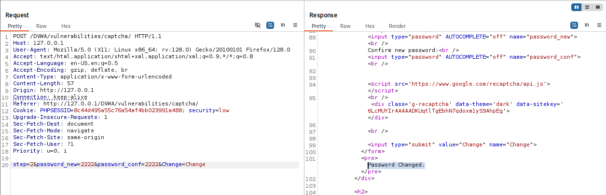  

### Login Test

Now we go back to the login page, the `111` password will not work, instead the newly changed password `2222` will allow us to login:

> `111`

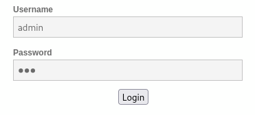

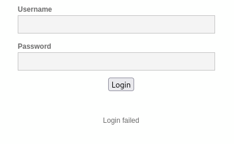  

> `2222`

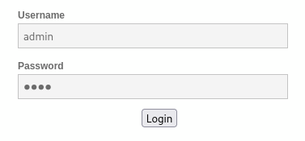 

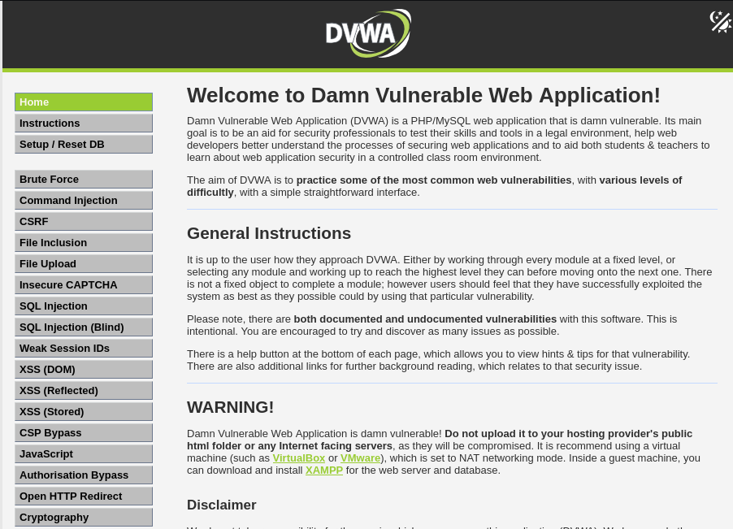  

---

## Medium Difficulty

### Intercept Request

Let's run through the process once again and analyze the captured traffic in Burp Suite. This time the password is `12345`:

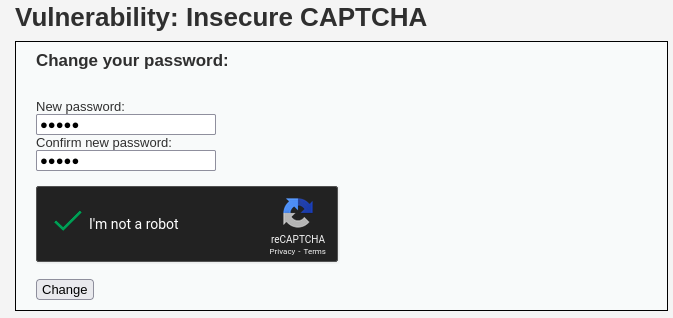

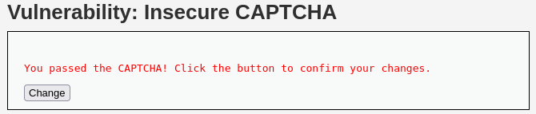

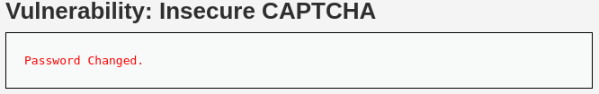  

The step 1 process remains the same, while the step 2 process has added a `passed_captcha` equals to `true` condition:

> Step 1

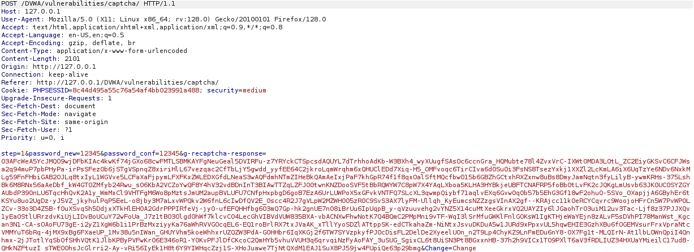  

> Step 2

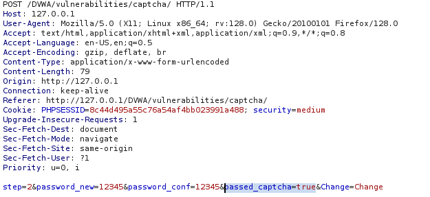  

### Bypass CAPTCHA

It doesn’t really help to enhance the security. This is because we can still simply modify the request and include the `passed_captcha` equals to `true` condition. As long as the condition is true, we are able to change the password. Here the new password is `654321`:

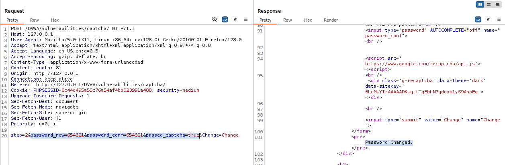  

### Login Test

Now if we try the password `12345`, it is failed to login but the newly changed password `654321` will login successfully:

> `12345`

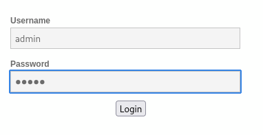

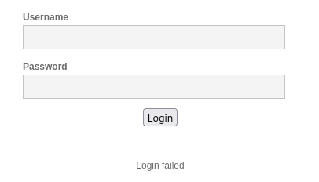  

> `654321`

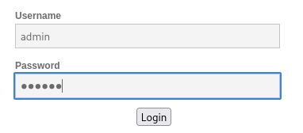

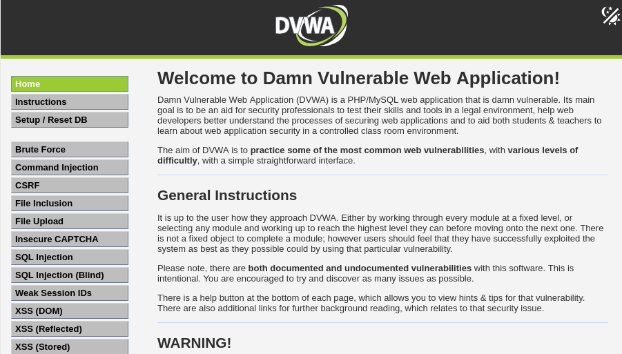  

---

## High Difficulty

### Intercept Request

As usual, we run through the process once again and see what's different. The password now is set to `00000000`:

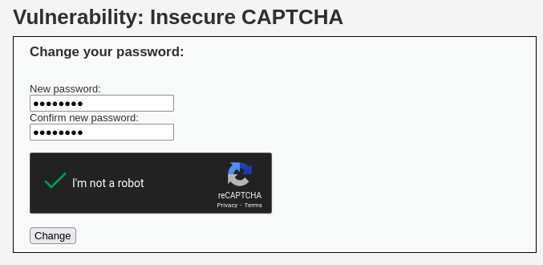

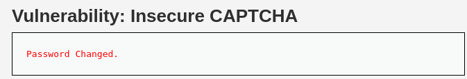

> It doesn't provide another page for user to confirm the password this time. 

  

In High difficulty, we will only get one request as the step 2 process has been removed. We can see that the whole process has been combined into one and requires a `user_token`:

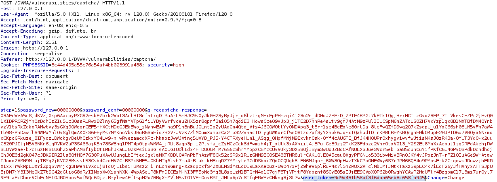  

### Trials and Errors

If we dig into the page source, we can find a developer note stating that Response is `hidd3n_valu3` and User-Agent is `reCAPTCHA`. We can use this information to do trials and errors and see if we can bypass the user token:

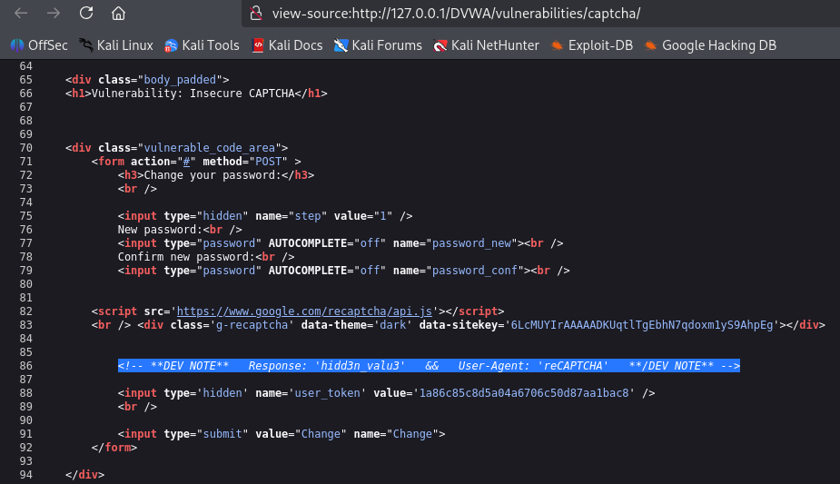  

#### Scenario 1

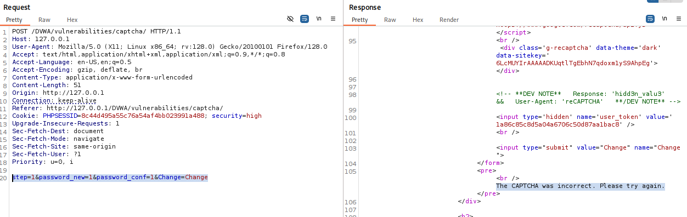  

> -	Removed the whole `g-recaptcha-response` value
> -	Changed the password to `1`
> -	Result: CAPTCHA was incorrect

  

#### Scenario 2

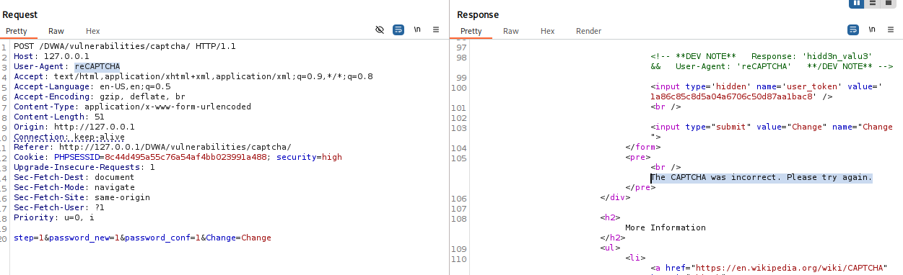  

> -	Removed the whole `g-recaptcha-response` value
> -	Changed the password to `1`
> -	Changed the User-Agent to `reCAPTCHA` as stated in dev note.
> -	Result: Still can’t bypass the CAPTCHA

  

#### Scenario 3

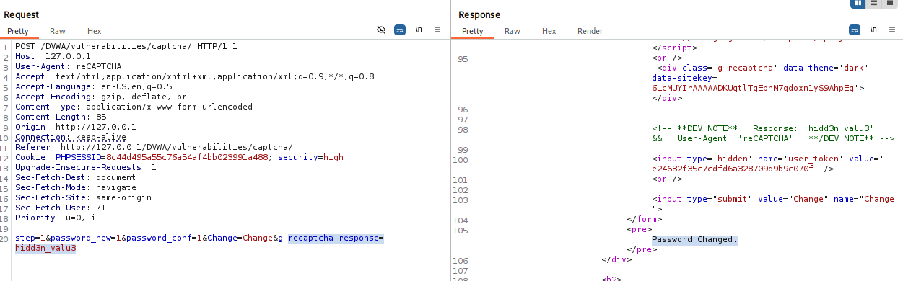  

> -	Removed the whole `g-recaptcha-response` value
> -	Changed the password to `1`
> -	Change the value of User-Agent to `reCAPTCHA`
> -	Added `g-recaptcha-response=‘hidd3n_valu3’` in the request body to bypass the CAPTCHA. (as stated in the dev note)
> -	Result: Password changed.

  

### Login Test

Login failed with the password `00000000` but login successful with the password `1`:

> `00000000`

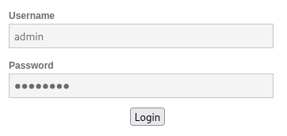

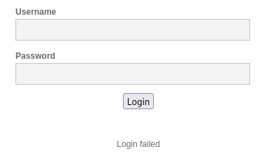  

> `1`

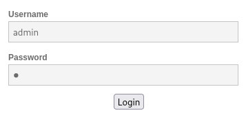

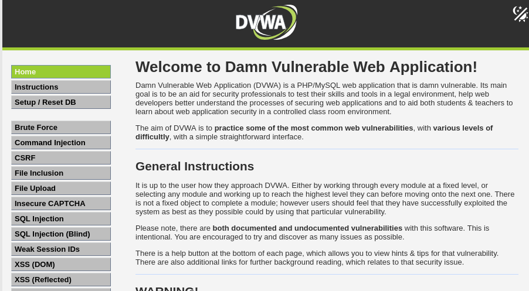  

---

## Conclusion

This challenge shows how improperly implemented CAPTCHA mechanisms can be bypassed by manipulating request parameters, skipping validation steps, or using hardcoded bypass values. Despite being a common defense mechanism, CAPTCHA is not effective when:

- Its validation is only done **client-side** (or easily spoofed server-side).
- **Flags, tokens, or headers** are exposed or weakly verified.
- Developers leave clues or hardcoded bypasses in source code (e.g., `hidd3n_valu3` in the Developer Note).

In all three difficulty levels, we managed to bypass CAPTCHA by:
- Skipping steps using **Burp Suite’s Repeater**
- Forging parameters like `passed_captcha=true`
- Emulating server-expected behavior using **User-Agent spoofing**
- Inserting crafted `g-recaptcha-response` values

These techniques highlight the importance of securing CAPTCHA validation **strictly server-side**, combined with secure token handling and behavioral anomaly detection.

---

### Skills Applied:

- Burp Suite Interception & Repeater usage
- Manual HTTP request crafting and replay
- CAPTCHA logic and validation understanding
- Manipulating request bodies and headers
- Bypassing front-end and weak back-end protections
