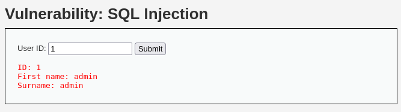

# SQL Injection

SQL Injection is a type of security vulnerability that allows attackers to interfere with the queries that an application makes to its database. It occurs when an application uses user input to construct SQL queries without proper validation or sanitization. If the input is not sanitized, malicious users can manipulate the query, potentially gaining unauthorized access to the database, retrieving sensitive data, or even altering or deleting data. This attack can also be called as **‘SQLi’**.

---

## Low Difficulty

### Analyzing Source Code

In Low difficulty, the website processes user inputs without proper validation or sanitization, that means we can craft SQL queries that interact with the databases to gain sensitive information:

  

In a normal process, the web application will return the respective user ID information based on the user input:

  

### Exploitation

We can insert `‘ or ‘1’ = ‘1` to get all the user information from the database:

  

#### How it works?

How does this happen in the backend? Let's talk about normal process first, when user types the user ID, the query that interacts with the database behind the process, for example, will be `SELECT first_name, last_name FROM users WHERE user_id = ‘$id’;` (the $id is the user input). So in this case, if we insert the `or ‘1’ = ‘1`, it will become `WHERE user_id = ‘’ or ‘1’ = ‘1’;`, that means we don’t even need to specify a user ID and due to the `‘1’ = ‘1’` is always true condition, the web application will return all the user information as it is a valid query.
  

### Retrieve Passwords

If we insert the `' UNION SELECT user, password FROM users#` for the input, the query will now become `SELECT first_name, last_name FROM users WHERE user_id = '' UNION SELECT user, password FROM users#';`. The UNION operator is used to combine the results of two SELECT queries into a single result set, and using `#` can effectively comments out the rest of the original query (`AND user_id = '$id'`), meaning that part of the query will not be executed. 

  

With all the password hashes have been returned, we can use tools like `hashid` to check the possible algorithms and crack them:

  

---

## Medium Difficulty

### Analyzing Source Code

In Medium difficulty, `mysql_real_escape_string()` has been used to prevent malicious characters (like `'`, `--`, `;`, etc.) from being interpreted as part of the SQL query structure. Instead, these characters are escaped (like turning `'` into `\`), so they can be safely used as part of a string value in the query. However, the hint is it doesn’t wrap the user input in quotes ("However due to the SQL query not having quotes around the parameter...") so we can utilize this to exploit.

  

The form also uses a dropdown list, which means the user can only select predefined values from the list, rather than entering arbitrary text. From the source code, POST is used to submit the form, meaning the value from the dropdown list is sent to the server as part of the HTTP request body (rather than the URL, like GET requests). Thus, we need to figure out how the attacker can manipulate the query by selecting a value from the dropdown list. Even though the input is more constrained than a free text box, SQL Injection can still be done if the user input is not properly enclosed in quotes:

  

### Exploitation

Since the page is using drop down list, we can try to modify the value by inspecting the page element and insert the query:

  

Using the same `UNION` query and submit, we are able to retrieve passwords from the database:

  

We can also do the same using Burp Suite:

  

---

## High Difficulty

### Analyzing Source Code

In High difficulty, the input will now be processed in another page with the use of session variables to transfer the input value, rather than using a direct user input in a URL or form (such as GET or POST). However, the `$id` is still directly embedded in the SQL query string. Since no prepared statements or escaping mechanisms are used, the query is vulnerable to SQL injection:

  

This is how the normal process looks like in High difficulty:

  

### Exploitation

Due to the lack of proper input validation and the use of unescaped user input in the SQL query, we can still inject a `UNION` query similar to the previous challenges to manipulate the query and retrieve unauthorized data. Specifically, the session variable (`$_SESSION['id']`) is directly inserted into the SQL query without being properly sanitized or enclosed in quotes. This allows us to bypass the intended filtering and execute arbitrary SQL commands:

After we have gathered all the passwords, we can crack the hashes using tools like John the Ripper, Hashcat, or Crackstation.com to simplify the process.

---

## Conclusion

SQL Injection remains one of the most dangerous web application vulnerabilities. As demonstrated in all three difficulty levels of DVWA. 

Low Difficulty showed how unvalidated user inputs could directly manipulate queries to extract sensitive data using simple payloads like `' OR '1'='1` or `UNION SELECT`.

Medium Difficulty implemented basic filtering with mysql_real_escape_string() but was still vulnerable due to the lack of proper input quoting. This highlights how partial security measures can create a false sense of safety.

High Difficulty tried to obscure input handling using session variables, but without using parameterized queries or prepared statements, the backend remained injectable.

Through this challenge, we are able to understand SQLi from different angles reinforces the importance of secure coding practices, such as:

- Always using parameterized queries (prepared statements).
- Never trusting user input — sanitize and validate consistently.
- Avoiding direct insertion of variables into query strings.
- Minimizing error disclosure that may aid attackers.

---

### Skills Applied:
- Manual SQL injection exploitation
- UNION-based data extraction
- Intercepting and modifying HTTP requests using Burp Suite
- HTML source and form manipulation (e.g., editing <select> values)
- Understanding of secure query design and common developer mistakes
