# Blind SQL Injection

It is still SQL Injection, except that the attacker can’t directly see the result of their injected query. For example, we might get a valid username and password after injecting `‘ or ‘1’ = ‘1`, but in Blind SQL Injection we will only get informational message such as ‘This user exists’ etc. It's called "blind" because unlike regular SQL injection, the database errors or query results are not visibly returned to the attacker.

- Both are forms of SQL injection, which exploit vulnerabilities in how user input is passed to SQL queries.
- Regular SQL Injection gives immediate, visible feedback (like dumping a table or showing an error message).
- Blind SQL Injection happens when the app hides errors or doesn't return query output, so attackers rely on true/false responses, timing, or indirect clues.
  

## Types of Blind SQLi

Since Blind SQL Injection is based on application behaviour or timing, attackers usually rely on one of the two methods:

### 1. Boolean-based Blind SQLi

- They send input that results in true/false logic conditions.
- Based on app behavior (e.g., redirects, error messages, success messages), they infer whether the condition was true or false.

#### Example:

> `' OR 1=1 --` → Might return "User exists"

> `' OR 1=2 --` → Might return "Invalid user"

 

### 2. Time-based Blind SQLi

- Used when there’s no visible behavioral change.
- The attacker injects a query that causes a delay if a condition is true.
- They measure the response time to infer true/false.

#### Example:

> `' OR IF(ASCII(SUBSTRING(password,1,1))=97, SLEEP(5), 0) –`

> Grabs the first character of the password field from the database. Converts that character to its ASCII code. Checks if the ASCII code equals 97 (which is 'a').

> If true, SLEEP(5) causes a 5-second delay. If false, it does nothing (0).

---
 

## Low Difficulty

First, let's try some queries to examine the database structure:

### Number of Query Result Columns

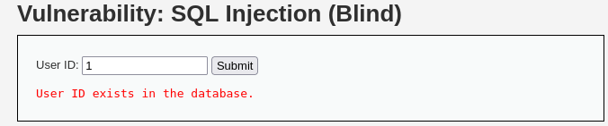

> `1` → User ID exists in the database.

  

> `1' order by 1#` → User ID exists in the database.

  

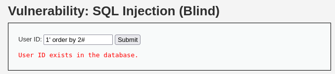

> `1' order by 2#` → User ID exists in the database.

  

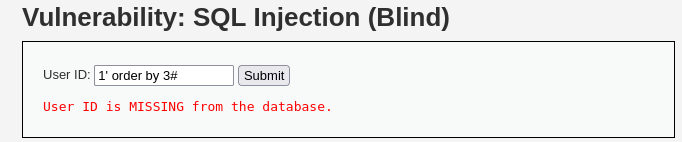

> `1' order by 3#` → User ID is missing from the database.

 

Thus, we can confirm that the query result has 2 columns.
  

### Length of Database Name

Using `length(database())=1#` query, we can check if the database name is 1 character long. If it shows 'MISSING`, then we keep incrementing the number until the condition is true:

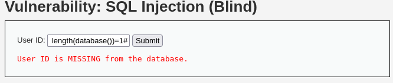

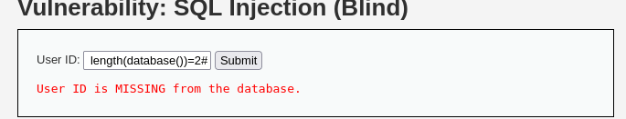

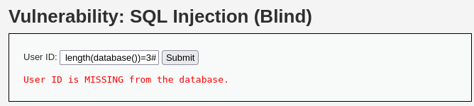

We can confirm that the database name has 4 characters.
  

### Extract Username

Using `1' AND SUBSTRING((SELECT user FROM users LIMIT 0,1),1,1) = 'a'#`, will help to check if the first letter of first username is ‘a’. Here we can see that it returns User ID exists, that means it starts with ‘a’, this might be the ‘admin’ account:

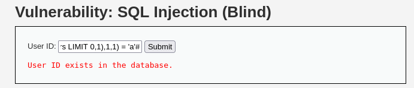  

Now let's try for the second letter, we can confirm the second letter is ‘d’, then we repeat doing this until we get the full username:

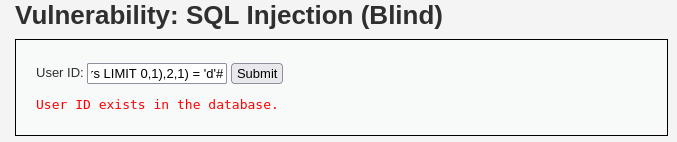  

The rest of letters:

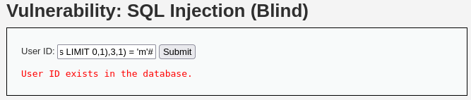

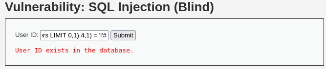

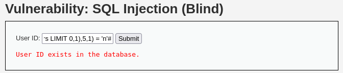  

In real life scenario, doing this manually is ineffective. Using tools like `SQLMap` can help to automate the process:

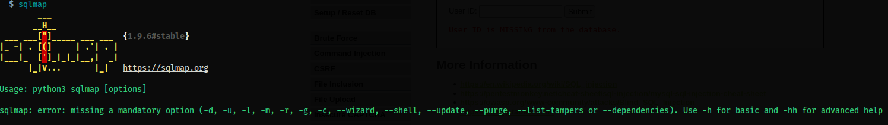  

---

## Medium Difficulty

Like the previous challenge (Regular SQL injection), the Medium difficulty now use a drop down list and apply the function `mysql_real_escape_string()`, but the SQL query still not having quotes around the parameter, which means it is still vulnerable to SQLi:

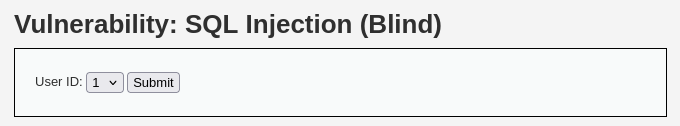  

If we use Time-Based Blind SQLi method and the response did take 5 seconds for us to get, that means the injection is working and we can inject queries just like previous difficulty:

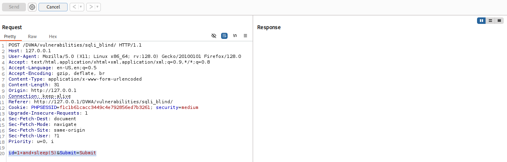

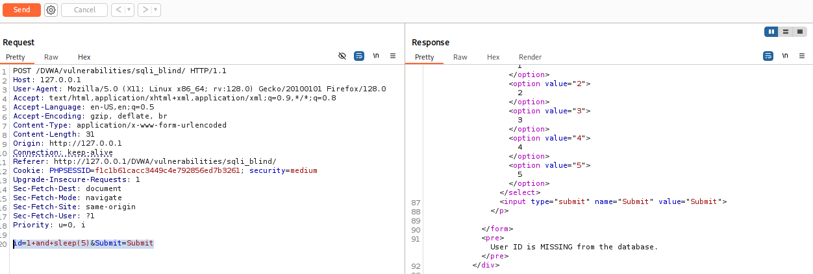  

