# Brute Force

Brute force attack is a hacking method that uses trial and error to crack passwords, login credentials, or encryption keys. It can be automated using password cracking tools such as hydra and John the Ripper that comes with different wordlists and customizable options, making the cracking process faster and easier.

## Low Difficulty

In this case, since we already know the credential is ‘admin’ and ‘password’ as they are the one that we used for login, we will pretend that we don’t know the credential and try to brute force it.

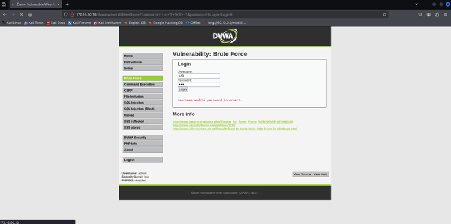  

### Brute Forcing Admin Credential

To start, we will have to setup the burp suite and intercept the request. Burp Suite is a popular security testing tool used for web application vulnerability scanning. It provides several features for testing and analyzing web apps such as Intruder, Repeater, Scanner, and more.

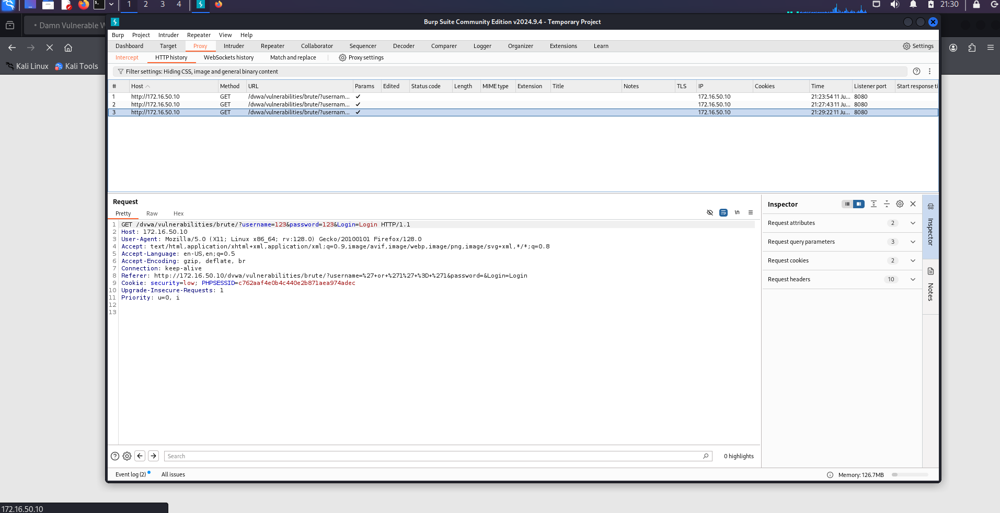  

Intruder helps to automates attacks like brute force or fuzzing to find vulnerabilities, such as weak login credentials. We will go to the Intruder tab, then select cluster bomb attack, which is for specifying multiple payload positions. Since we need the username and password, the former will be payload position 1, and the latter will be payload position 2:

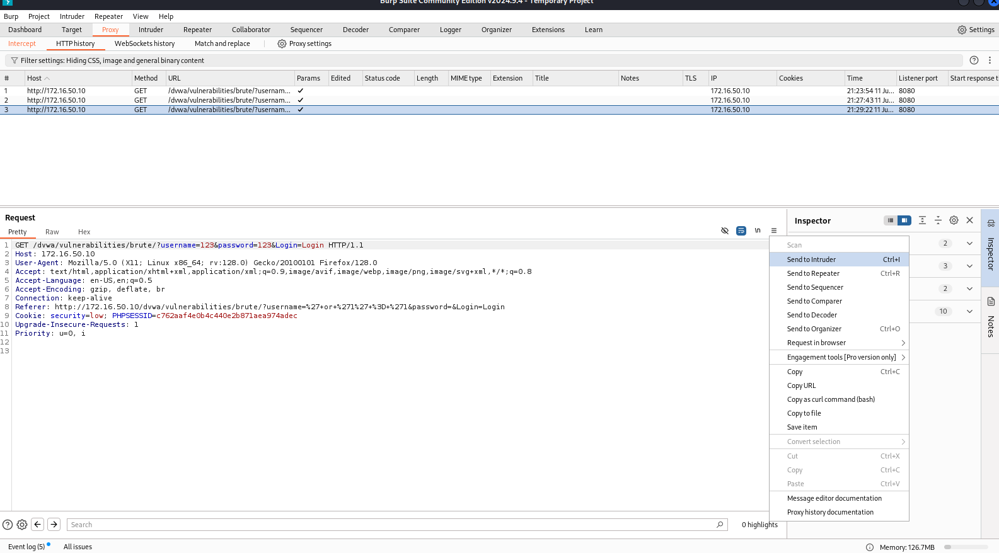

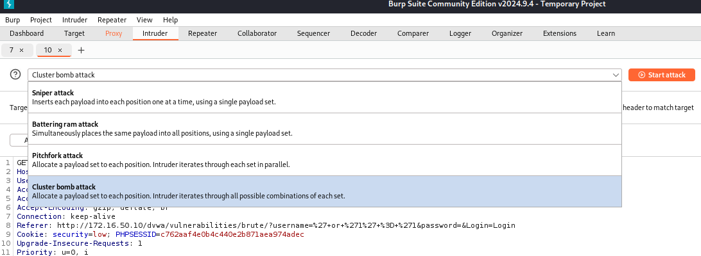

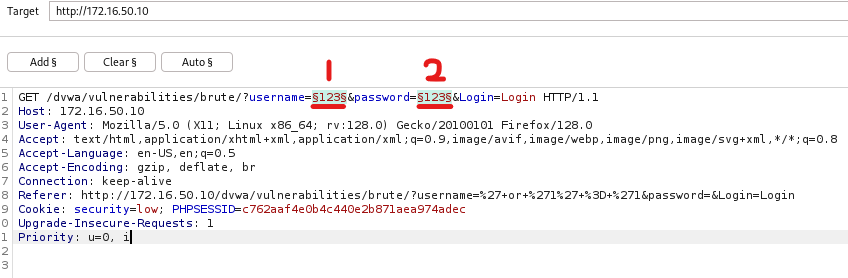  

Then, we can choose any password lists for the payload. In this case, I will choose http_default_pass.txt that is contained in the metasploit directory. Set it up and we are good to start the attack:

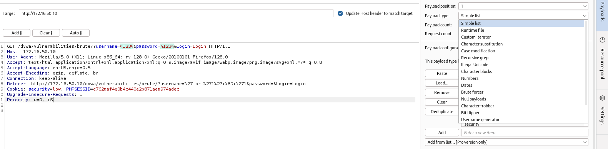

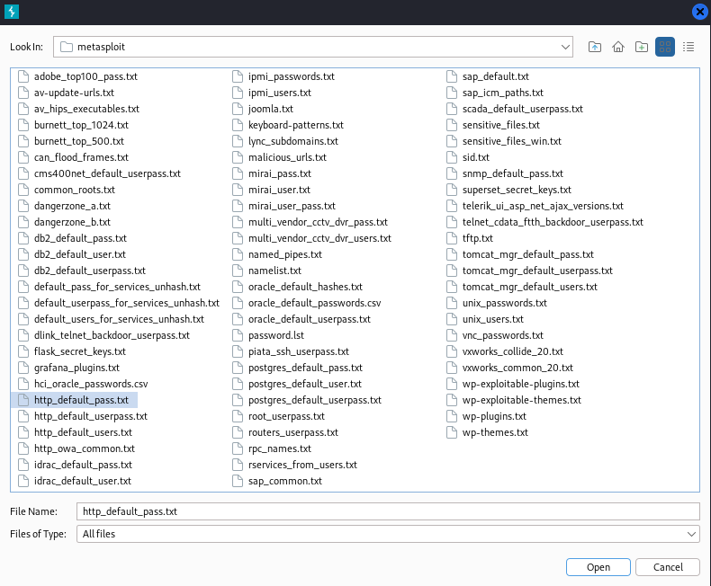

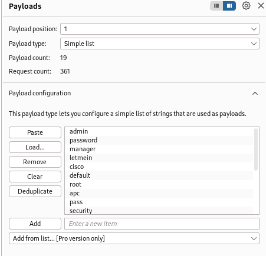

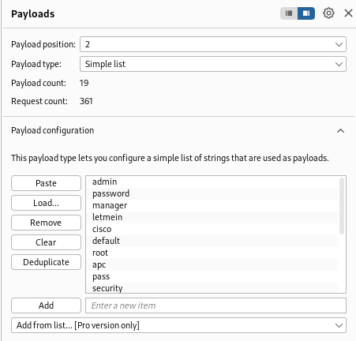  

From the Intruder attack output, we can see different length of the HTTP response. Most of them are 4919, which might indicate the username and password are wrong in place. The 4920 gives a little clue about the credential since we know in advance that the password is ‘password’, and the word ‘password’ is correctly in place of the payload 2 position, so that means the web page responded with an either username or password is incorrect message. Lastly, we get a 4985 length which is totally different from what we got like the 4919 and 4920, this could indicate that it returns a valid login. When we check on it, it is indeed the ‘admin’ at the position 1 (username field) and ‘password’ at the position 2 (password field):

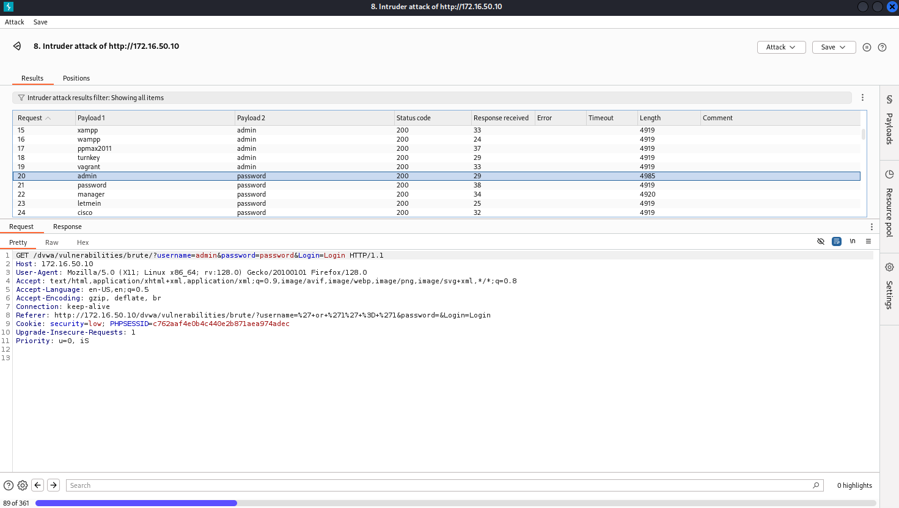  

#### Tips
> Searching for different lengths of these responses and analyzing them could be overwhelming. There is a little configuration that can be made to make life easier by highlighting the specific keywords or response patterns. Since the web page will show the ‘Welcome’ keyword once successfully logged in, we can go to the Burp Suite settings page and add the keyword under the ‘Grep – Match’ section. So if a result is flagged, we can quickly know that the combination is correct for the credential:

> 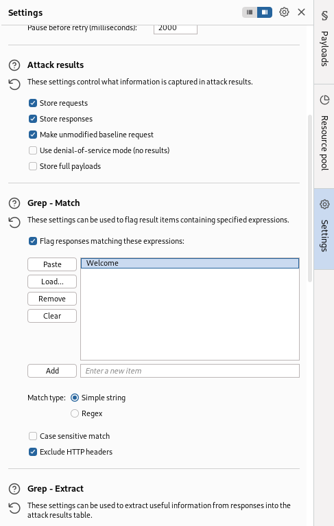  

> Notice how there is a new column of ‘Welcome’ and will be flagged as ‘1’ if the matched credential is found and the webpage returns with the keyword:

> 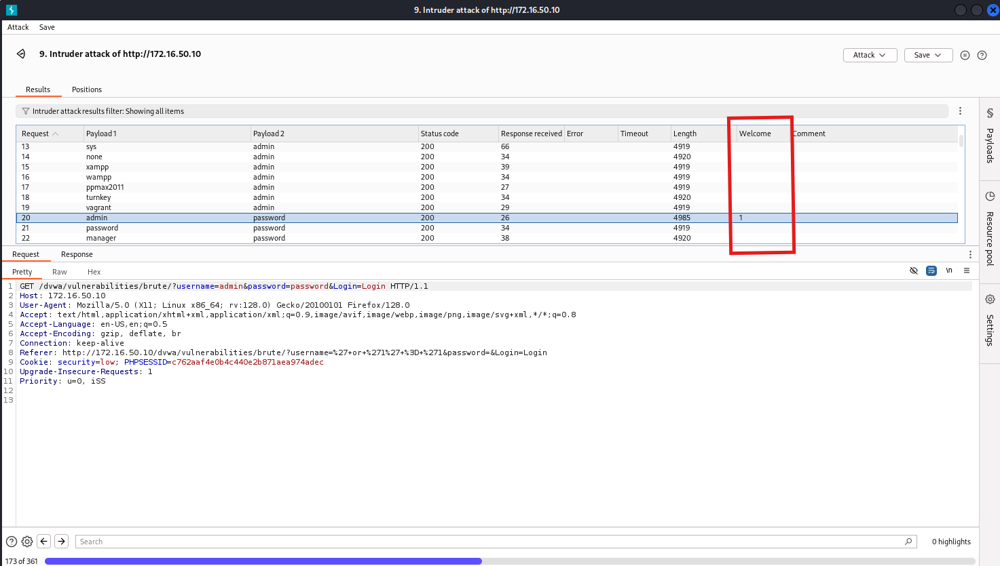
> 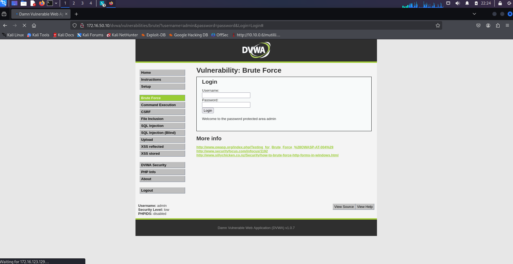  

### Brute Forcing Other User Credentials

There is an image under the input field once login, if we go to the link, we can see the picture. However, we can change the link by removing the admin.jpg and we will get a list of hackable users. They are 1337, gordonb, pablo, smithy and admin:

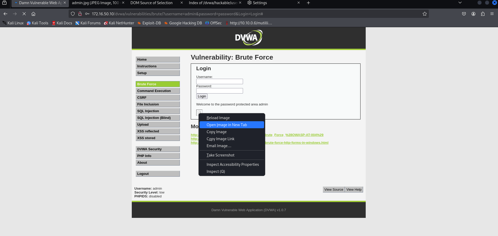
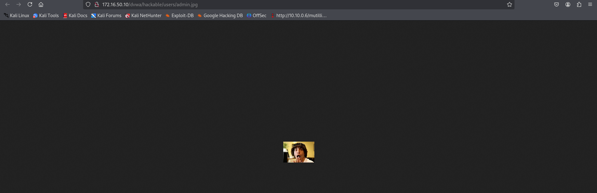
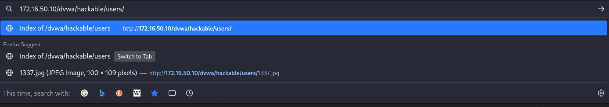
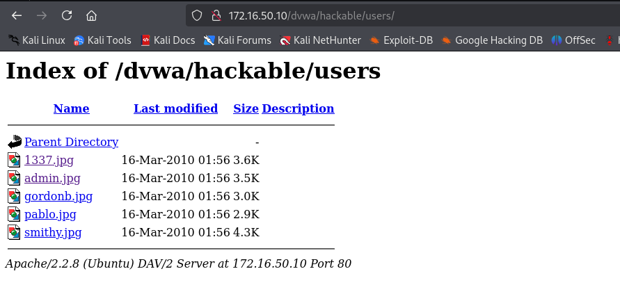  

Now we will try to brute force the other user accounts. Using the same method in Burp Suite, we will highlight the two payload position. Then, we add the found usernames into the payload position 1 field and use a password list called probable-v2-top1575.txt which contains 1575 most common password that real users choose. This will narrow down the range of passwords and increase the efficiency of brute forcing comparing to using a large password list like rockyou.txt:

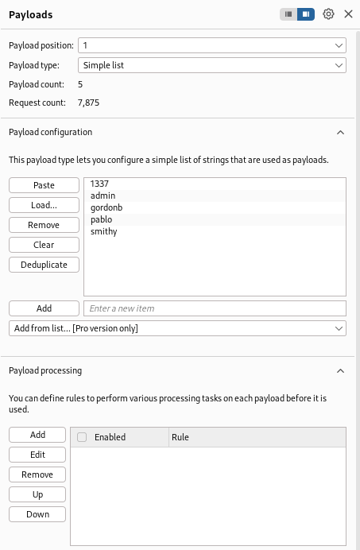
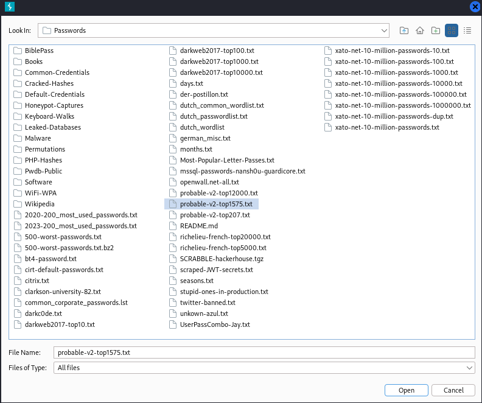
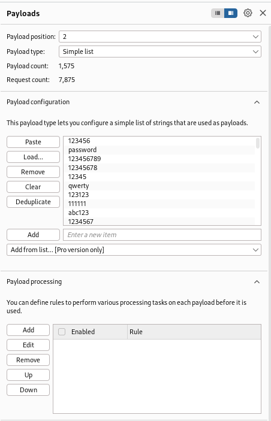  

After spending some time brute forcing, we manage to find the password for smithy (password), gordonb (abc123), and pablo (letmein):

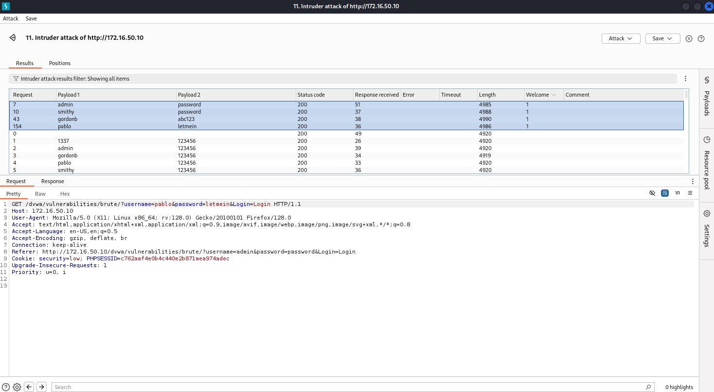  

## Medium Difficulty

> **Note**: The attack method used for both Medium and High difficulty is the same as Low difficulty. Only minimal changes are made on the backend (e.g., input sanitization and artificial delays), which do not prevent the attack — they merely slow it down. Therefore, I will not repeat screenshots or tool setup steps for these levels.

If we look at the source code of both low and medium difficulty, we can still easily brute forcing the credentials as only basic SQL injection sanitization was applied using the ‘mysql_real_escape_string()’. There are no changes in terms of brute force protection given the fact that ‘if( isset( $_GET['Login'] ) ) {’ still being used, which implies the process as below:
- We send username/password in the GET parameters
- The source code:
    1. Hashes the password with md5()
    2. Queries the database for a match
    3. Returns different responses for success/failure
       
So the Burp Suite Intruder sees a consistent pattern:
- One specific request gives a different length or status or content, revealing the correct password.

### Low
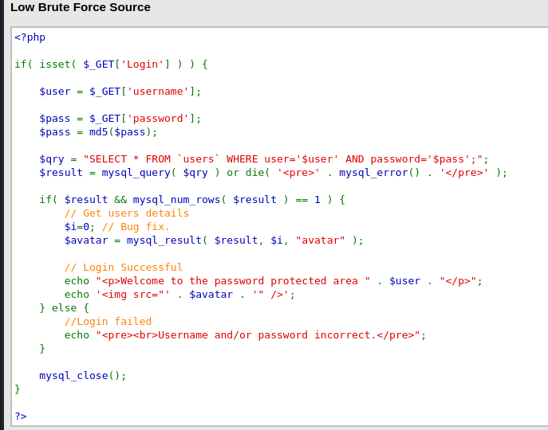  

### Medium
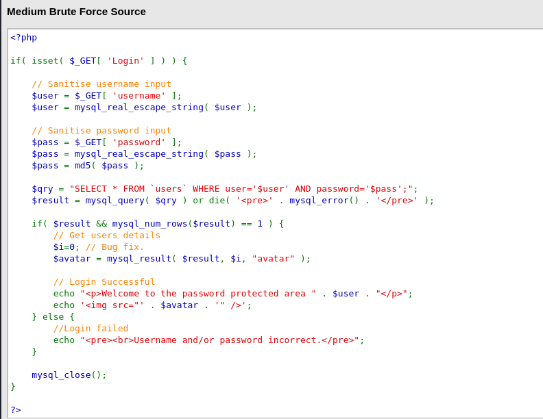  

## High Difficulty

The high difficulty not only further enhances the SQL injection protection by adding the ‘stripslashes()’ but also introduces brute force protection using the sleep(3) delay. It will add a 3 second delay on failed login attempts, which greatly slowing down the attacks. However, this is still considered insecure as what it does is just only slowing down instead of blocking the attack. Thus, in high difficulty, the credentials still can be brute forced but it will cost a lot of time. 

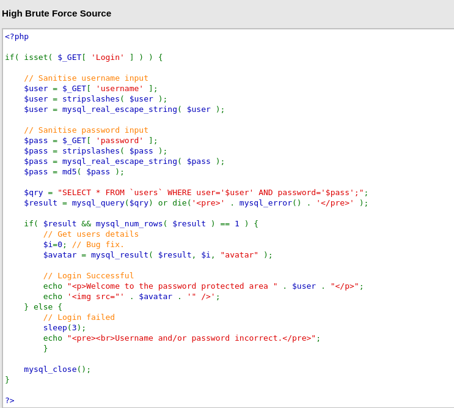  

## Conclusion

This challenge demonstrates how brute force attacks can exploit weak authentication systems using tools like **Burp Suite Intruder**. Even though DVWA increases its difficulty from Low to High, the underlying logic remains vulnerable due to poor brute force protection.

### Skills Applied:
- HTTP request/response analysis
- Burp Suite Intruder configuration
- Response length and keyword pattern recognition
- Wordlist-based credential enumeration
- Adapting attack methods to bypass weak protections
