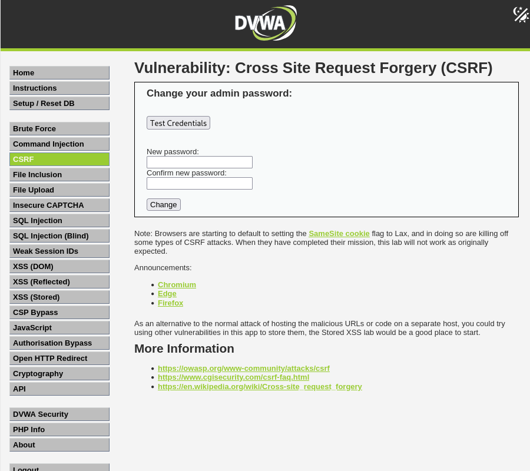
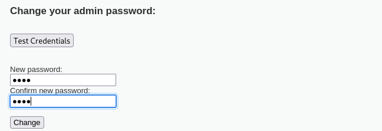
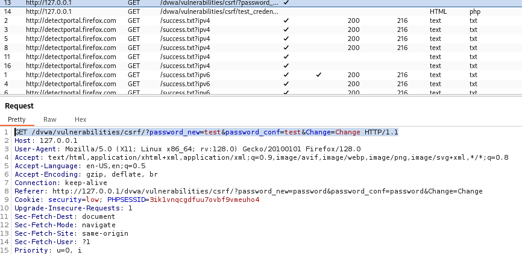

# Cross Site Request Forgery

Cross-Site Request Forgery (CSRF) is a type of attack where an attacker tricks a user into performing unwanted actions on a web application where they are authenticated. It takes advantage of the trust a web application has in the user's browser. 

In simpler terms, CSRF exploits the fact that the browser automatically includes authentication information (like cookies or session data) in requests sent to a web server. If an attacker can convince a user to perform a request on a website they are already authenticated on (e.g., through a link or form submission), the request may be processed with the user's privileges, even though the user didn't intend to perform that action.

For instance, when a website like online banking is under the logged in status by victims, attackers can craft a malicious link or script that embedded on a website such as in an image that says “Click here to get special promotion” (e.g, ). Once being clicked, the script will then be executed and transferred the money to attackers, and victim won’t even realize that. This is because CSRF utilize the “logged in” status, making the bank believes that the request is made by trusted user, thus allowing the transfer occurred.
  

### How it works?

1. Victim Logs In:
The victim logs into a website, like an online banking or social media site, which maintains the session (usually in the form of cookies).

2. Victim Visits Malicious Website:
The attacker sends the victim a link or embeds a malicious script on a website. This link or script is crafted to make a request to the target web application where the victim is authenticated.

3. Request Made on the Victim’s Behalf:
Since the victim is still authenticated on the target site (their session cookie is still valid), the browser sends the authentication cookies with the malicious request. As far as the web application is concerned, the request is coming from the authenticated user, and it performs the action as if the user intended it.

4. Action is Executed:
The action the attacker wants to perform (such as transferring funds, changing email, or updating account settings) gets executed without the victim’s knowledge or consent.
  

### CSRF Vulnerability Conditions:

1.	User is authenticated: The victim must be logged into the target website, as the attack leverages the victim's active session.

2.	Sensitive actions are performed by HTTP requests: The target application must allow sensitive actions (like changing passwords or transferring money) to be triggered by a simple request (e.g., GET or POST).
  
3.	Absence of CSRF protection mechanisms: The target web application must not have security measures in place (like anti-CSRF tokens) to validate that the request is legitimate.
  

## Low Difficulty

The objective here is to make the current user change their own password, without them knowing about their actions:

  

### Analyze Password Changing Process

If we try to change the password to ‘test’, we will see the GET request sent off this `password_new=test` and `password_conf=test`. We can then craft a link based on this for changing the user password:

  

### Craft Changing Password Link

> Before

  

> After

  
