# File Upload

A file upload vulnerability occurs when an application improperly handles files uploaded by users, allowing attackers to upload malicious files such as web shells, scripts, or executables that can be executed on the server or used to exploit the system. This can lead to remote code execution (RCE), data leakage, defacement, or server takeover.

Uploaded files represent a significant risk to web applications. The first step in many attacks is to get some code to the system to be attacked. Then the attacker only needs to find a way to get the code executed. Using a file upload helps the attacker accomplish the first step.
  

---

## Low Difficulty

### File Creation and Upload

Low difficulty code will not check the contents of the file being uploaded in any way. It relies only on trust. Based on this, we can create a simple PHP file with script that can execute command. After that, we upload the PHP file and access to the directory through URL.

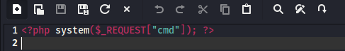

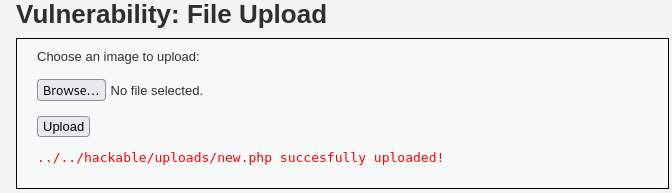  

### Exploit

After accessing the directory, we are given a blank page. But don’t forget earlier that we have specified the cmd command:

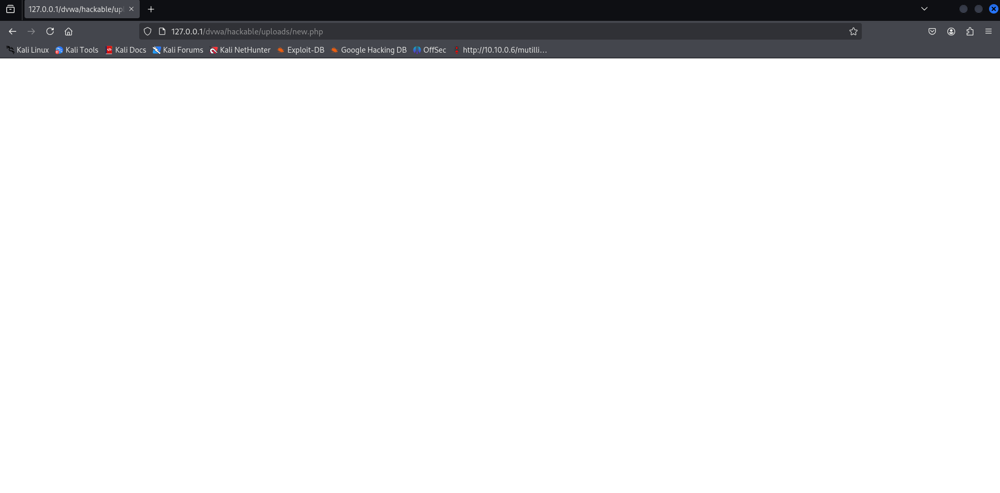  

We can use different command to enumerate the server by just inserting to the URL:

> Command 1

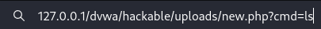

  

> Command 2

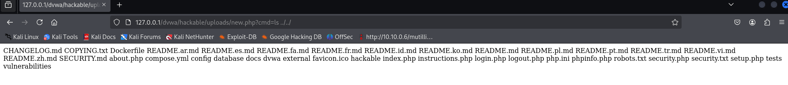  

### Simplify using Burp Suite's Repeater

We can even send the intercepted request to Repeater using Burp Suite to simplify the process of executing different command:

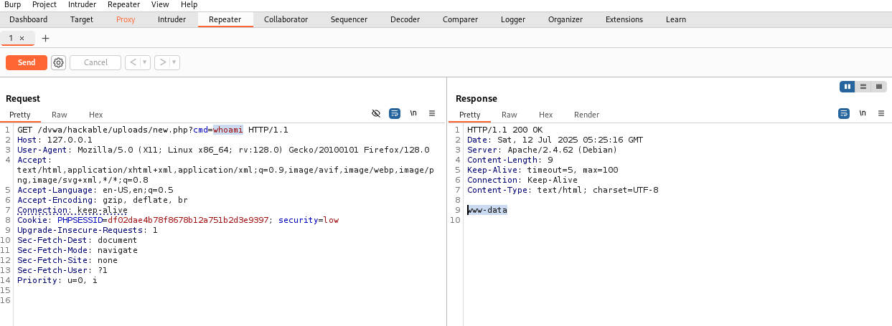

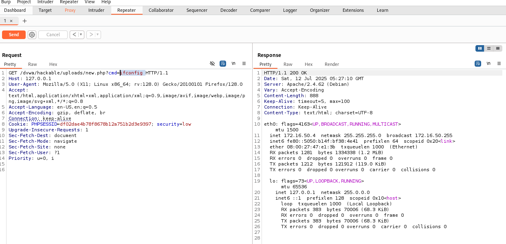  

### Bonus #1 (Weevely)

Weevely is a web shell tool designed for post-exploitation on compromised web servers. It allows user to upload a small, stealthy PHP file (called an agent) to a vulnerable server. Once uploaded, this file acts as a backdoor, and the user can connect to it using the Weevely client to control the server remotely:

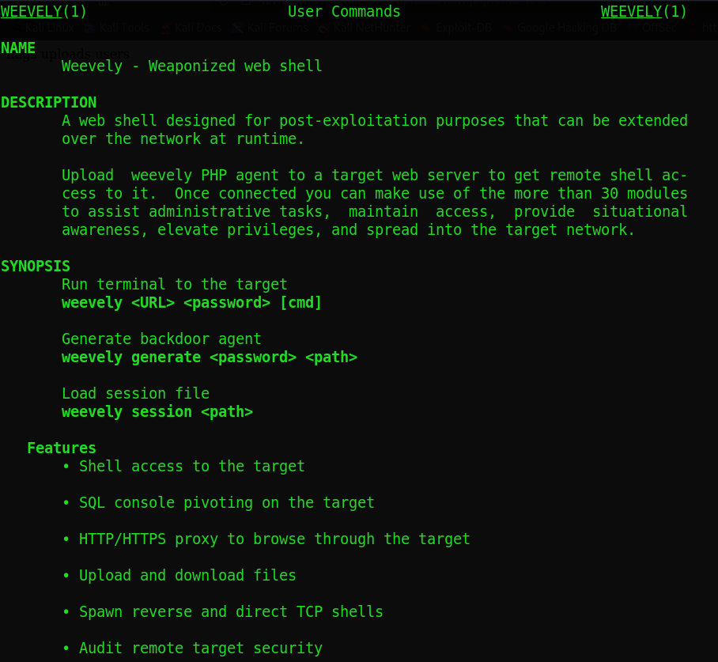  

We can create a PHP file using the `generate` command and provide a password. The password will then be used to access the remote connection:

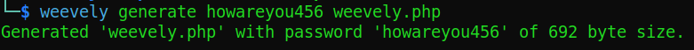  

Upload the generated PHP file and access it using URL:

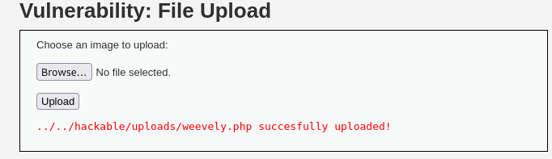

  

After that, we head back to Weevely and connect to the web shell using the password we created just now:

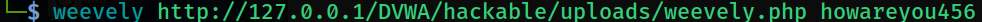

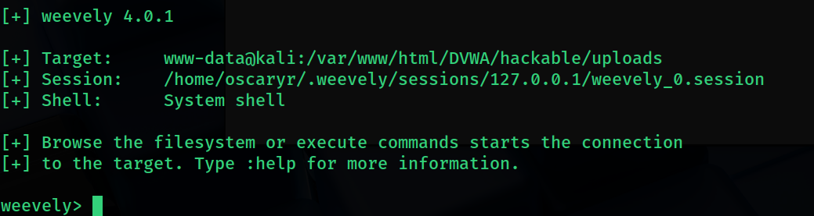  

We now can enumerate through the system and execute many actions using Weevely:

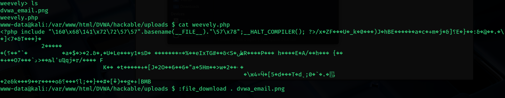

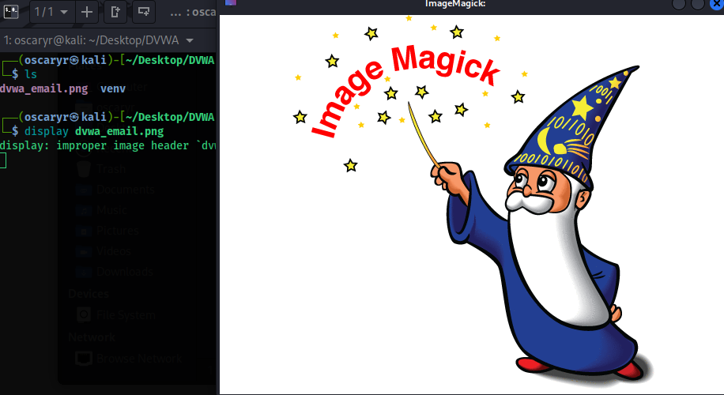

> Tips: Use `:help` to see more about the commands can beused in Weevely.

  

### Bonus #2 (Msfvenom)

We can also use Msfvenom, a popular payload generator for reverse shell to penetrate the DVWA in Low difficulty:

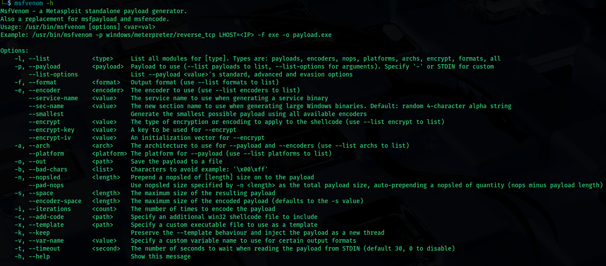  

Here we create a raw PHP reverse tcp file and upload to the server:

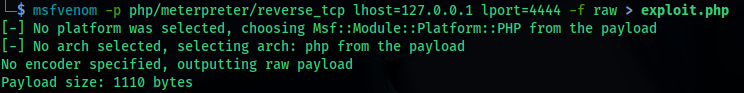

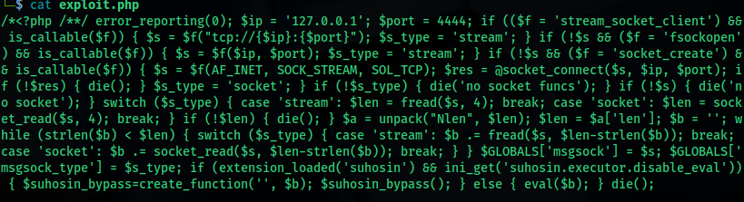

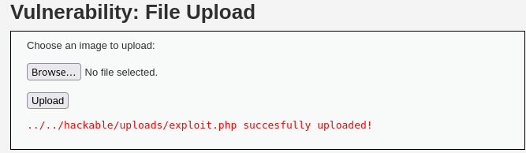  

Next, we launch Msfconsole and set up the reverse tcp listener. Go back to the browser and access the file:

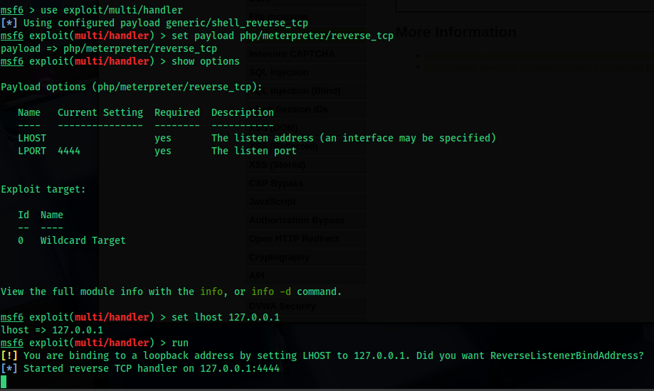

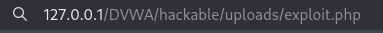  

Now, we have an interpreter shell opened and able to enumerate the system using different commands:

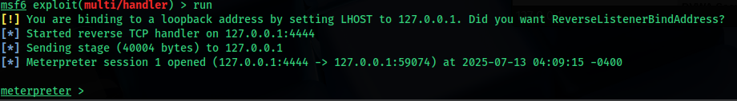

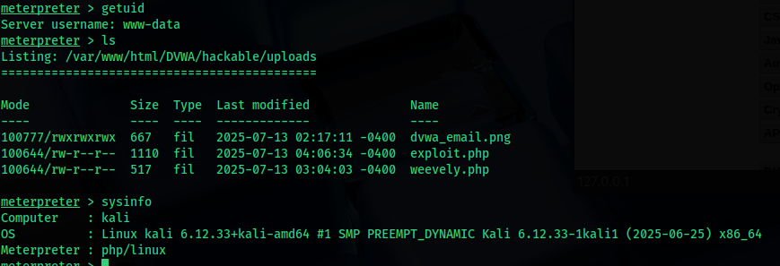  

In short, if file upload vulnerability presents, not only the attacker can access sensitive information of the web server or system but also use malicious script to further exploit the system.
  

---

## Medium Difficulty

In Medium difficulty, the code will check the reported file type from the client when its being uploaded. That is why our created PHP file can’t be uploaded since it only accepts JPEG or PNG files:

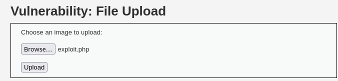

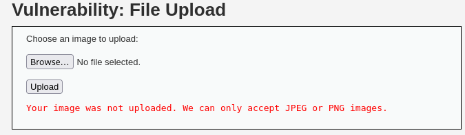  

### Analyzes Request

Let’s intercept the traffic. We can see that the content type is `application/x-PHP`, which used as an indicator for deciding if the upload can be accepted:

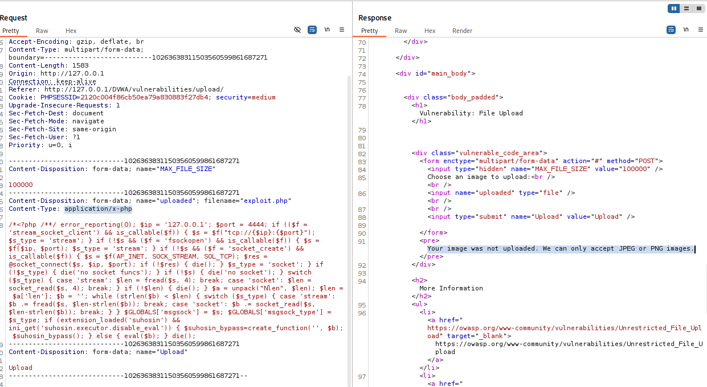  

If we just simply change the file extension, it won’t work as it is based on the `content-type` condition:

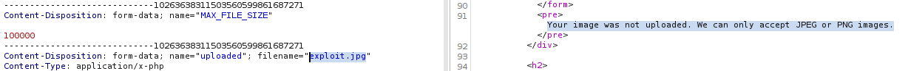

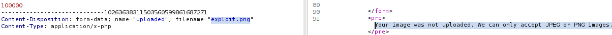  

### Solution

If we change the `content-type` to `JPEG` or `PNG`, it will then be accepted by the web server:

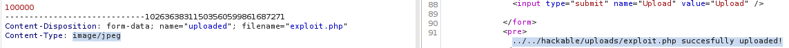

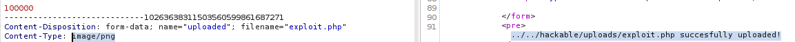  

Forward the modified request, and we are able to established a reverse shell connection in Medium difficulty:

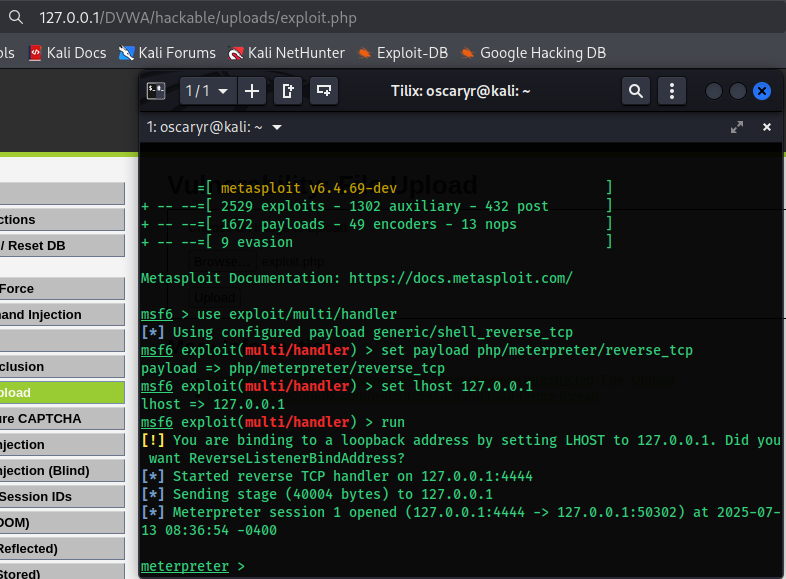  

---

## High Difficulty

In high difficulty, once the file has been received from the client, the server will try to resize any image that was included in the request. it means the server isn't just checking file extension or magic bytes. Instead, it likely uses a library (e.g., GD, ImageMagick, or getimagesize() in PHP) to actually process or resize the image and fail if the image isn't real.

### Hex Editing

To bypass this, we can hex edit our PHP meterpreter file to include PNG file signatures, so the server will process it as a valid image:

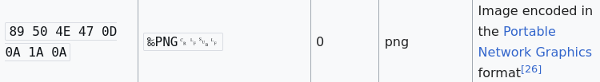

> Ref. https://en.wikipedia.org/wiki/List_of_file_signatures

  

First, we do an eight bytes space on top of the line for the PHP file, so we can fill the hex values later:

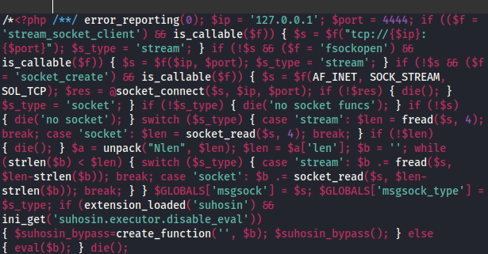  

Then, we use the tool `Hexeditor` to edit the hex value, replace the top bytes of spaces (they are a bunch of 20s’) with the PNG signature value and save it:

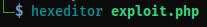

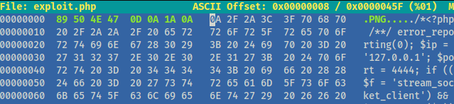  

Next, we copy the modified PHP file and make it a new one with `.jpg` extension so it will be processed by the server:

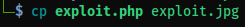  

We are now able to upload the file:

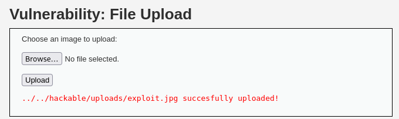  

The last thing we need to do is using another vulnerability which is `File Inclusion` to access the uploaded file:

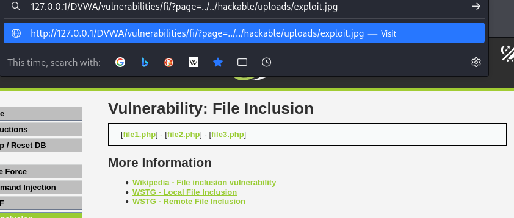  

A reverse shell connection has been successfully established:

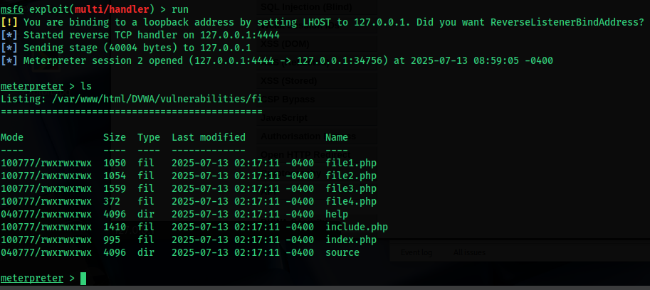  

### Bonus #1 (Exiftool)

"What if we just use a real `JPEG` or `PNG` file then insert the PHP reverse shell payload into the image?" you might ask. Yes, we can do that by using `Exiftool`.

ExifTool is a powerful tool to read, write, and edit metadata in a wide range of file types especially images (like `JPG`, `PNG`, `TIFF`), but also videos, PDFs, etc. We can use exiftool to insert PHP payloads and evade the file upload filters. 

First, we can simply get any image. Then, use `Exiftool` to embed a PHP reverse tcp script into the image:

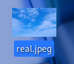

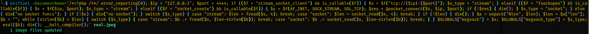

> Ref. https://spencerdodd.github.io/2017/03/05/dvwa_file_upload/

  

Now we are able to upload the `JPEG` file with embedded script:

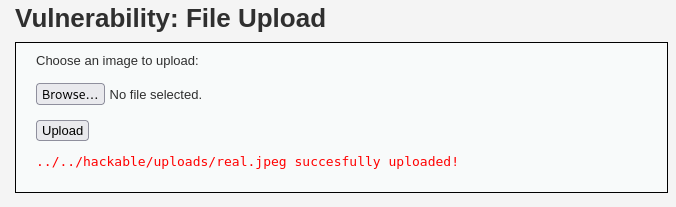  

Remember to setup the listener, then use the same way to access the uploaded file (File Inclusion vulnerability, with low difficulty). Now we have an active meterpreter session opened:

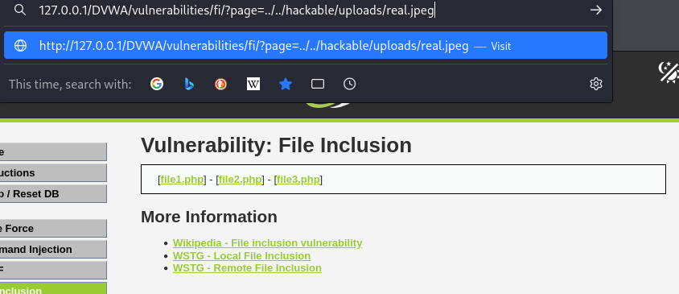

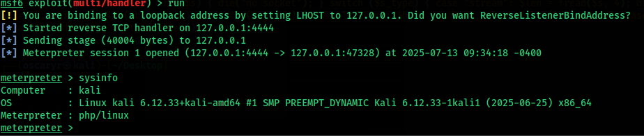  

---

## Conclusion

This challenge shows how improperly validated file uploads can lead to severe consequences such as **remote code execution**, **reverse shells**, and **server compromise**.

At **Low difficulty**, we uploaded malicious PHP scripts directly and executed them for command injection and shell access.

At **Medium difficulty**, we bypassed MIME-type checking by manipulating the `Content-Type` header during upload, demonstrating that trusting client-side file types is insecure.

At **High difficulty**, the challenge introduced image processing checks to detect fake images. We successfully bypassed this by:
- Injecting **PNG magic bytes** via hex editing
- Embedding payloads in image metadata using **ExifTool**
- Leveraging **File Inclusion** to trigger execution

These techniques are commonly used by attackers in real-world web attacks and highlight the need for **multi-layered file upload defenses**.
  

### Skills Applied:

- Web shell creation using PHP (manual, Weevely, Msfvenom)
- Reverse shell setup with `nc` and `msfconsole`
- Burp Suite request manipulation
- MIME-type header bypass techniques
- Basic binary manipulation using **hex editors**
- Exploiting image libraries' validation assumptions
- Metadata injection via **ExifTool**
- Combining **File Upload + File Inclusion** vulnerabilities
